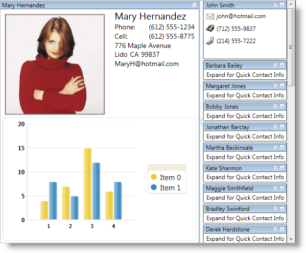

////

|metadata|
{
    "name": "wpf-whats-new-in-2010-volume-1",
    "controlName": [],
    "tags": ["Getting Started","How Do I"],
    "guid": "{F6858E6F-F48C-4274-B009-1DEE65B6D427}",  
    "buildFlags": [],
    "createdOn": "2012-01-30T19:39:51.6996931Z"
}
|metadata|
////

= What's New in 2010 Volume 1

The {ProductName} 2010 Vol. 1 release includes a number of powerful new features to allow you to take even more advantage of our WPF controls.

Below is a list of the features that we added for the 2010 Volume 1 release. Click the links to see a list of the features being offered.

* <<xamDataCards,xamDataCards Control>>
* <<xamDockManager,xamDockManager Enhancements>>
* <<xamEditor,xamEditor Spin Buttons>>
* <<xamTilesControl,xamTilesControl>>

[[xamDataCards]]

== xamDataCards Control

The xamDataCards™ control displays flat data using "cards" similar to the Contacts folder in Microsoft® Outlook 2007. Since the xamDataCards control derives from the link:{ApiPlatform}datapresenter{ApiVersion}~infragistics.windows.datapresenter.datapresenterbase.html[DataPresenterBase] class, it inherits the core functionality found in the DataPresenter controls. However, the xamDataCards control does not support the following features:

* Hierarchical Data
* Fixed Records
* Grouping
* Summaries
* Fixed Fields

image::images/xamDataCards_About_xamDataCards_01.png[]

[[xamDockManager]]

== xamDockManager Enhancements

== Drag Behavior

You can modify the drag behavior of panes within a tab group (insertion bar or preview) and the drag behavior of floating panes (immediate, deferred, or system settings).

== FileMenuOpening Event

You can handle the xamDockManager control's FileMenuOpening event to add custom menu items to a tab group's file menu.

== Hide Content Pane Buttons

You can hide the buttons in a content pane's header by setting visibility properties exposed by content panes instead of re-templating the header.

== Unpinned Pane Flyout Behavior

You can prevent unpinned panes from flying out automatically when your end users hover over their headers.

== Use All Available Space for Panes

The xamDockManager control can distribute all its available space to panes instead of reserving space for documents (DocumentContentHost).

[[xamEditor]]

== xamEditor Spin Buttons

The xamMaskedEditor™ control and the controls derived from xamMaskedEditor can display spin buttons that enable your end users to increment or decrement the editor's value.

[[xamTilesControl]]

== xamTilesControl

The xamTilesControl™ displays content using rectangular tiles, which are arranged sequentially creating multiple rows of tiles. Your end users can maximize one or more tiles, which automatically minimizes the remaining tiles. However, the minimized tiles will remain in view along an edge of the control, so your end users can quickly maximize and shift their attention to new content.

The xamTilesControl includes the following features:

* *Animations* - The xamTilesControl has built-in animations that play during state transitions. You can supply your own animations to customize this experience.
* *Data Binding* - Since the xamTilesControl is derived from the ItemsControl class, you can set its link:http://msdn.microsoft.com/en-us/library/system.windows.controls.itemscontrol.itemssource.aspx[ItemsSource] property to automatically create Tile objects for your data items.
* *Drag-and-Drop* - Your end users can drag tiles and rearrange them at run time.
* *Explicit Tile Layout* - You can arrange tiles into explicit columns and rows using concepts already found in the Grid panel (Column, Row, ColumnSpan and RowSpan).
* *Saving and Loading Layouts* - After your end users modify the layout at run time, you can save the changes and restore them between application sessions.
* *State-Based Item Templates* - You can define item templates based on the state of the tiles. The xamTilesControl will automatically apply the proper item template as your end users change the state of a tile.
* *State-Based Size Constraints* - You can restrict the size of tiles based on their state.
* *Tile Resizing* - Your end users can resize tiles using resizing indicators.