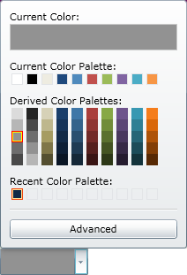

////

|metadata|
{
    "name": "wpf-whats-new-in-2010-volume-2",
    "controlName": [],
    "tags": ["Getting Started","How Do I"],
    "guid": "fe5be400-2111-4191-a16a-37923a13e613",  
    "buildFlags": [],
    "createdOn": "2012-01-30T19:39:51.7016935Z"
}
|metadata|
////

= What's New in 2010 Volume 2

The {ProductName} 2010 Vol. 2 release contains a powerful set of line of business controls.

Click the links below to see a list of the controls and features being offered in this release.

* <<NET4Builds,.NET 4.0 Builds>>
* <<VSMSupport,VisualStateManager Support>>
* <<SSolution,Startup Solution>>
* <<SmartTags,Design-time SmartTags>>
* <<ColorPicker,xamColorPicker Control>>
* <<ContextMenu,xamContextMenu Control>>
* <<DialogWindow,xamDialogWindow Control>>
* <<Menu,xamMenu Control>>
* <<Slider,xamSlider Control>>
* <<SpellChecker,xamSpellChecker Control>>
* <<TagCloud,xamTagCloud Control>>
* <<XamRibbon,Scenic Ribbon Theme for xamRibbon>>

[[NET4Builds]]

== .NET 4.0 Builds

Starting with the 10.2 release, the {ProductName} product will include .NET 4.0 builds of all WPF control assemblies in addition to the .NET 3.0 builds previously included.

The 10.2 product installer will install the .NET 3.0 builds and then look for the presence of VS2010 on the target system. If VS2010 is installed on the system, the installer will then also install the .NET 4.0 builds of the control assemblies.

These are the folder locations for the two versions of the control assemblies:

[cols="a"]
|====
|C:\Program Files\Infragistics\NetAdvantage 2010.2\WPF\CLR3.0

|Contains the .NET 3.0 assemblies

|====

[cols="a"]
|====
|C:\Program Files\Infragistics\NetAdvantage 2010.2\WPF\CLR4.0

|Contains the .NET 4.0 assemblies

|====

[cols="a"]
|====
|C:\Program Files\Infragistics\NetAdvantage 2010.2\WPF\DefaultStyles

|Contains the default styles shared between the two versions of the controls

|====

[cols="a"]
|====
|C:\Program Files\Infragistics\NetAdvantage 2010.2\WPFCommon

|Contains .NET 4.0 shared assemblies between the WPF LoB (Line of Business) and WPF DV (Data Visualization) products, which includes: 

* {ProductName} common controls assembly 

* {ProductName} XamChart control 

* {ProductName} Excel Engine 

|====

The assemblies names have been changed - the prefix *Infragistics3.Wpf* is now changed to *InfragisticsWPF3*. Also the .NET 4.0 assemblies are using the *{ApiPlatform}* prefix. For more information see the link:developers-guide-upgrading-your-project.html[Upgrading section].

[[VSMSupport]]

== VisualStateManager Support

With the introduction of .NET 4.0, Microsoft has added support for link:http://msdn.microsoft.com/en-us/library/system.windows.visualstatemanager(VS.95).aspx[VisualStateManager] to WPF (prior to .NET 4.0, VisualStateManager was only supported in Silverlight). To leverage this new capability, we have added VisualStateManager support to all of our WPF controls 10.2. VisualStateManager provides a much simpler model for applying visual states to controls.

As part of our VSM support, all of our WPF controls (as well as their ‘siginificant’ child elements) now expose a series of link:http://msdn.microsoft.com/en-us/library/system.windows.visualstate(VS.95).aspx[VisualStates] which are dynamically and automatically selected as the ‘current state’ by the control at runtime based on interaction with the end user. You can ‘react’ to state changes by modifying your custom templates for our control elements to kickoff storyboards whenever the element transitions from one state to another and/or whenever a particular state becomes active.

While the default templates for our existing WPF controls will continue to use link:http://msdn.microsoft.com/en-us/library/system.windows.trigger.aspx[Triggers], the developer is now free to choose between Triggers and VisualStateManager when creating custom Templates for any element in any of our controls. In fact, you can use both Triggers and VisualStates/VisualTransitions in the same template if/when the need arises.

VisualStateManager is a simple but flexible way to apply visual states to NA/WPF controls. It provides a mechanism for easily customizing both the look and feel of a control by exposing a way to transition property values whenever the state of the control changes. It automatically generates the transitions between visual states so you spend less time writing code and more time on the visual states that are defined in the template. Using Expression Blend, you can easily see what the supported states are for a given element, and just as easily write and attach link:http://msdn.microsoft.com/en-us/library/ms742868(VS.85).aspx[Storyboards] that produce the desired effects when element states change.You can read more about VisualStateManager on the link:http://msdn.microsoft.com/en-us/library/system.windows.visualstatemanager(VS.95).aspx[MSDN Web Site]

[[SSolution]]

== Startup Solution

Starting with the 2010 volume 2 release, the {ProductName} product will include a Startup Solution for Visual Studio 2010. The solution contains several unfinished examples, which will quickly give you a hands-on learning experience regarding the basic for our main controls and their most common scenarios.

We recommend looking at the Visual Studio’s “Task List” window and try to uncomment some of the commented code together with reading the guidance provided within the code comments. This will allow you to see and experiment with different aspects of the controls’ features and behaviors.

The examples show the essential functionality of the controls and don’t cover more advanced scenarios. Many more finished samples are available at: link:http://samples.infragistics.com[http://samples.infragistics.com]. More detailed and advanced guidance and code examples are also available through the online documentation.

The Startup Solution is available just after installing the {ProductName} product.

[[SmartTags]]

== Design-time SmartTags

For {ProductName} 10.2, we are starting to add SmartTag-like support to our controls to improve the design-time experience and enable developers to quickly configure the key properties of the control. This support will be exposed in our VS2010/Blend3/Blend4 compatible designer assemblies, so it will not increase the size of the control assemblies you ship with your applications.

SmartTags have been supported in VS2008 and earlier by the WindowsForms Designer, but never for the WPF designer. We have built our own SmartTag Framework to extend this popular Windows Forms designer functionality to our WPF controls.

Using these SmartTags is easy – when you select one of the SmartTag enabled {ProductName} controls, an adorner (the small rectangular button with a right-pointing triangle) will appear in the upper right corner of the control:

Press this button to open the SmartTag panel. It will display a series of Properties and/or tasks that apply to the selected element or control. Simply click on the hyperlink to execute a task or select the property to edit its value in much the same way you would in the VS Property Window. All properties display a little blue question mark graphic at its right edge which displays additional descriptive information for the property in a tooltip when the mouse is hovered over the graphics.

Adorners and SmartTags will appear on other ‘significant’ child elements of the control when they are selected on the VS design surface, as shown with the ButtonTool in the image below. Note that SmartTags will only be available for the larger more complex controls in the initial 10.2 release. We will be rolling out SmartTag support for the remaining controls in follow-on service releases, with all controls supported in the next full version release – i.e., 10.3. Note also that with the release of VS2010 Microsoft has now unified the designer frameworks for Visual Studio and Blend. Since we have built our SmartTag framework on top of this unified designer support, Smart Tags are only available when using the {ProductName} controls in VS2010, Blend3 and Blend 4.

Here is an example of an Infragistics SmartTag on a button in the XamRibbon control:

[[ColorPicker]]

== xamColorPicker Control

In the {ProductName} 2010 volume 2 release, we have added a new and exciting control to our already vast collection of controls. The new xamColorPicker™ control is one of the Editors controls and provides you with an interactive interface that allows you to select colors from a professionally designed palette or your own custom palettes.

== Related Topics

link:xamcolorpicker-about-xamcolorpicker.html[About xamColorPicker]

link:xamcolorpicker-adding-xamcolorpicker-to-your-page.html[Adding xamColorPicker to Your Page]

link:xamcolorpicker-using-xamcolorpicker.html[Using xamColorPicker]

[[ContextMenu]]

== xamContextMenu Control

The xamContextMenu™ control allows you to create context menus for your Microsoft® WPF™ applications. Since the xamContextMenu control and the xamMenu control both share a common base class (xamMenuBase), you can leverage many of the same practices across both controls.

Just like the xamMenu control, the xamContextMenu control displays a list of items that represent application-specific commands or tasks. Typically, clicking a menu item opens a submenu or executes application logic.

Some of the important features for this control are listed below.

* *Check Boxes* - Add check boxes to allow end users to select multiple items.
* *Configurable* - You can configure xamContextMenu so that it opens when your end users right or left-click. You can even use the Infragistics Commanding Framework to open xamContextMenu.
* *Hierarchical Menu Items* - Bind to hierarchical data or add menu items to display hierarchical menu items.
* *Icons* - Add icons to help illustrate the purpose of each menu item.
* *Placement* - You can set the context menu's placement so that it appears in the specified location when your end users open the context menu.

image::images/xamContextMenu_About_xamContextMenu_01.png[]

== Related Topics

link:xamcontextmenu-getting-started-with-xamcontextmenu.html[Adding xamContextMenu to Your Application]

link:xamcontextmenu-using-xamcontextmenu.html[Using xamContextMenu]

[[DialogWindow]]

== xamDialogWindow Control

The xamDialogWindow™ for the {ProductName} product is a new and exciting control replicates the functionality of a traditional, standard Windows Forms dialog window and allows you to easily pop up both modal and non-modal dialog windows within your WPF based applications.

The following is a list of key features of the xamDialogWindow control:

* Modal or Modeless- The xamDialogWindow control allows you to open the dialog in a modal or modeless fashion to control the flow of your application.
* Customizable Header and Content - The header and content of the xamDialogWindow control is 100% templatable which allows you to style the dialog window to maintain consistency with the rest of your web application.
* Resizable – Your end users can drag the borders on the xamDialogWindow control to resize it.
* Location – You can set the xamDialogWindow control to open anywhere you want within your application, and you can even set it to minimize to anywhere you want.

== Related Topics

link:xamdialogwindow-about-xamdialogwindow.html[About xamDialogWindow]

link:xamdialogwindow-using-xamdialogwindow.html[Using xamDialogWindow]

[[Menu]]

== xamMenu Control

The xamMenu™ control displays a list of items that represent application-specific commands or tasks. Typically, clicking an item on a menu opens a submenu or executes application logic.

Some of the important features for this control are listed below.

* *Icons* - Add icons to help illustrate the purpose of each menu item.
* *Templates* - Extensive templating capabilities lead to deep customization options and an enjoyable user experience.
* *Checkboxes* - Add checkboxes to allow end users to select multiple items.
* *Menu Orientation* - Customize the orientation and position as well as how menu items display themselves.
* *Hierarchical Data* - Add or bind to data to quickly display menu items any number of levels deep.
* *Smooth Sliding* - Smooth animation allows for a graceful look and feel.

image::images/WPF_xamMenu_Getting_Started_with_xamMenu_01.png[]

== Related Topics

link:xammenu-getting-started-with-xammenu.html[Adding xamMenu to Your Application]

link:xammenu-using-xammenu.html[Using xamMenu]

[[Slider]]

== xamSlider Control

The xamSlider™ family of controls allows your end users to specify a value or range of values by sliding a thumb in a xamSlider control. The xamSlider family of controls consists of four types of sliders that can be categorized according to its data type and/or functionality. The one you use in your application will depend on the functionality you want to implement.

* xamNumericSlider™ - A slider that can display a single thumb for selecting a double value.
* xamDateTimeSlider™ - A slider that can display a single thumb for selecting a DateTime value.
* xamNumericRangeSlider™ - A slider that can display multiple thumbs for selecting multiple double values or a range of double values.
* xamDateTimeRangeSlider™ - A slider that can display multiple thumbs for selecting multiple DateTime values or a range of DateTime values.

image::images/xamSlider_About_xamSlider_01.png[]

== Related Topics

link:xamslider-getting-started-with-xamslider.html[Getting Started with xamSlider]

link:xamslider-using-xamslider.html[Using xamSlider]

[[SpellChecker]]

== xamSpellChecker Control

This release of the {ProductName} product contains a xamSpellChecker™ control. This great new control allows your end users to easily perform spell checking operations within their applications, using any of the nine dictionaries that are included. The following are some of the key features of the xamSpellChecker control:

* Dictionary Support – The xamSpellChecker control comes standard with dictionaries for nine different languages, including Dutch, English (American, Australian, British and Canadian), French, German, Spanish and Portuguese.
* SpellChecker Dialog – The xamSpellChecker control’s spell checking dialog can be launched on validation or on a button click. This dialog will then guide your end users through the spelling mistakes they have made and allow them to ignore the word, change the word to a suggested word, or add the word to a custom user dictionary.

image::images/WPF_xamSpellChecker_About_xamSpellChecker.png[whats new]

== Related Topics

link:xamspellchecker-about-xamspellchecker.html[About xamSpellChecker]

link:xamspellchecker-adding-xamspellchecker-to-your-page.html[Adding xamSpellChecker to Your Page]

link:xamspellchecker-using-xamspellchecker.html[Using xamSpellChecker]

[[TagCloud]]

== xamTagCloud Control

The xamTagCloud™ control is a new and exciting controls contained in this release of the {ProductName} product. This new control allows you to choose keywords or phrases and assign a weight to them based on their frequency of occurrence, importance, or any other algorithm you want, and the xamTagCloud control will display them.

Tags that have a heavier weight stand out with a bold font size greater than the other tags. Tags with a lighter weight have a smaller font size. Your end users can identify the most prevalent tags with just a quick glance at the xamTagCloud control.

The following is a list of key features of the xamTagCloud control:

* *Data Binding* – Set the tag cloud’s ItemsSource property to any enumerable source of items having Content and Weight properties.
* *Linkable Tags* – Items appearing in the cloud can be hyperlinked, so that your end users can click on them and go to a URI you define.
* *Weights and Sizes* – You can customize a tag cloud’s range of weights, and these will be mapped to a corresponding size.

== Related Topics

link:xamtagcloud-about-xamtagcloud.html[About xamTagCloud]

link:xamtagcloud-using-xamtagcloud.html[Using xamTagCloud]

[[XamRibbon]]

== Scenic Ribbon Theme for xamRibbon

The {ProductName} 10.2 includes a new theme for the XamRibbon control called ‘Scenic’. When this new theme is selected, the UI of the XamRibbon changes to the ‘Scenic Ribbon’ style used by MS Paint and MS Wordpad.

Here is an example of the theme:

How to set the theme on the xamRibbon:

*In XAML:*

----
<Window
        ...
        xmlns:igRibbon="http://infragistics.com/Ribbon"
        ...
>
...
<Grid>
        <igRibbon:XamRibbon x:Name="XamRibbon1" Theme="Scenic">
        <!--TODO: Add Tabs here-->
        </igRibbon:XamRibbon>
</Grid>
...
----