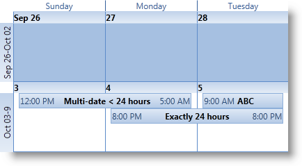

////

|metadata|
{
    "name": "wpf-whats-new-in-2010-volume-3",
    "controlName": [],
    "tags": ["Getting Started","How Do I"],
    "guid": "98707124-2d31-4a5a-a70b-5987aec6f712",  
    "buildFlags": [],
    "createdOn": "2012-01-30T19:39:51.7086949Z"
}
|metadata|
////

= What's New in 2010 Volume 3

The {ProductName} 2010 Vol. 3 release contains a powerful set of line of business controls.

Click the links below to see a list of the controls and features being offered in this release.

* <<dataTree,xamDataTree Control>>
* <<schedule,xamSchedule Control>>
* <<office2010,Office 2010 Blue Theme>>

[[dataTree]]

== xamDataTree Control

In the {ProductName} 2010 volume 3 release, we have added the xamDataTree control to our vast suite of controls. This new and exciting control allows you to display and navigate hierarchical data smoothly and efficiently using the xamDataTree control. The xamDataTree controls comes with rich features including node templates, node drag and drop and bi-state and tri-state checkboxes.

*Related Topics*

link:xamdatatree-about-xamdatatree.html[About xamDataTree]

link:xamdatatree-adding-xamdatatree-to-your-page.html[Adding xamDataTree to Your Page]

link:xamdatatree-using-xamdatatree.html[Using xamDataTree]

[[schedule]]

== xamSchedule Control

The {ProductName} 2010 volume 3 includes a new suite of scheduling components comprised of three new controls designed to address any scheduling requirements your applications may have. These new controls – xamDayView, xamScheduleView and xamMonthView – are coupled with an easy-to-use xamScheduleDataManager responsible for providing the resources, calendars, activities and other configuration settings.

As part of the Infragistics unified XAML strategy, these controls are provided as both Silverlight and WPF controls with identical APIs and object models, enabling you to create scheduling applications with a single set of code that can be built to target either platform.

In addition, the xamSchedule suite includes robust data connector architecture for accessing any type of backend data source containing scheduling information. For 10.3 we are shipping two connectors: a ListScheduleDataConnector for hooking up to any local list of scheduling data, and a WcfListScheduleDataConnector for use by applications that need to access data on a server. The WcfListScheduleDataConnector consists of a client-side connector and a server-side service that communicate via Windows Communication Foundation (WCF) to provide data to the xamSchedule controls.

*Related Topics*

link:xamschedule-understanding.html[Understanding xamSchedule]

link:xamschedule-getting-started.html[Getting Started with xamSchedule]

link:xamschedule-using.html[Using xamSchedule]

[[office2010]]

== Office 2010 Blue Theme

In the {ProductName} 2010 volume 3 release, we give you the opportunity to brighten your applications up with an Office 2010 theme. Now you can quickly change the control’s default look and feel with the Office 2010 Blue style inspired by the Microsoft Office 2010 suite of applications interface.

*Related Topics*

link:themes.html[Themes]