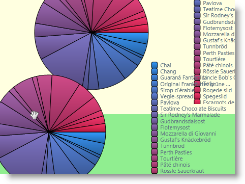

////

|metadata|
{
    "name": "wpf-whats-new-in-2011-volume-1",
    "controlName": [],
    "tags": ["Getting Started","Grids","How Do I","Scheduling","Theming"],
    "guid": "8cb217e5-a316-4fbf-be88-3e51f3e478b7",  
    "buildFlags": [],
    "createdOn": "2012-01-30T19:39:51.7126957Z"
}
|metadata|
////

= What's New in 2011 Volume 1

The {ProductName} product 2011 Volume 1 release contains a powerful set of line of business controls.

Click the links below to see a list of the new controls and features being offered in this release.

* <<DragDropFramework,Infragistics Drag And Drop Framework>>
* <<IGTheme,New IG Theme>>
* <<xamCalendar,xamCalendar Control>>
* <<xamDataGrid,xamDataGrid Improvements>>

** <<xamDataGrid_EE,xamDataGrid Asynchronous Excel Exporting>>
** <<xamDataGrid_WW,xamDataGrid Word Writer>>

* <<xamDockManager,xamDockManager Improvements>>

** <<xamDockManager,Minimizing and Maximizing of Floating Panes>>
** <<xamDockManager,Owned Panes>>

* <<xamSchedule,xamSchedule Improvements>>

** <<xamSchedule_Views,xamDateNavigator and xamOutlookCalendarView>>
** <<xamSchedule_AC,Activity Categories>>
** <<xamSchedule_EDC,ExchangeScheduleDataConnector>>
** <<xamSchedule_DLG,Dedicated Dialogs for Task and Journal Editing>>
** <<xamSchedule_RS,Resizing and Scrolling of the Calendar Group Area>>

[[DragDropFramework]]

== Infragistics Drag And Drop Framework

The {ProductName} 2011 Volume 1 release contains a new Drag and Drop Framework. This framework provides the necessary pieces to make it as simple as possible to add drag and drop functionality to your application. This allows for real-time moving of elements and more user-friendly interactions.

Utilizing the Drag and Drop Framework requires that you set a source and a target element. The source element can be dragged and dropped onto the target element. In some cases, it is as simple as that to implement drag and drop in your application.

== *Related Topics*

link:drag-and-drop-framework-about-ig-drag-and-drop-framework.html[About Infragistics Drag and Drop Framework]

link:drag-and-drop-framework-getting-started-with-ig-drag-and-drop-framework.html[Getting Started with Infragistics Drag and Drop Framework]

link:drag-and-drop-framework-using-ig-drag-and-drop-framework.html[Using Infragistics Drag and Drop Framework]

== IG Theme

[[IGTheme]]
*New IG Theme*

This release introduces a new theme – the IG Theme – that can be applied to all controls in {ProductName} Line of Business. This theme is dominantly monochromatic with the use of blacks, whites and some grays, with blue as a highlight/accent color.

For information on how apply themes to controls, refer to the link:themes.html[Themes] topic.

The pictures below demonstrates the xamDataGrid control without and with the IG theme applied:

The pictures below demonstrate the xamRibbon control without and with the IG theme applied:

Related Topic

link:themes.html[Themes]

[[xamCalendar]]

== xamCalendar Control

The {ProductName} 2011 Volume 1 release contains a new cross platform calendar control. The xamCalendar control supports different views (Day, Month, Year, Decade, and Century), multiple calendars plus single and multiple date selection.

image::images/Whats_New_11.1_01.png[]

== *Related Topics*

link:xamcalendar-about.html[About xamCalendar]

link:xamcalendar-restricting-date-selection.html[Implementing Date Selection Restrictions]

link:xamcalendar-using.html[Using xamCalendar]

[[xamDataGrid]]

== xamDataGrid Improvements

The {ProductName} 2011 Volume 1 introduces some improvements to the xamDataGrid control

[[xamDataGrid_EE]]

== xamDataGrid Asynchronous Excel Exporting

Now the Excel Exporter supports asynchronous data export.

== *Related Topics*
link:xamdatapresenter-export-a-datapresenter-control-to-excel.html[Export a DataPresenter Control to Excel]

[[xamDataGrid_WW]]

== xamDataGrid Word Writer

The {ProductName} 2011 Volume 1 release adds support for exporting of the xamDataGrid content to a Microsoft® Word™ format. You can customize the exported data by excluding records, columns or other visual parts of the grid. Also, different styling options are available for the exported data.

== *Related Topics*

link:xamdatapresenter-exporting-data-to-word.html[Exporting Data to Word Using the xamDataPresenter]

link:xamdatapresenter-applying-formats-when-exporting-data.html[Applying Formats When Exporting Data]

link:xamdatapresenter-exclude-settings.html[Exclude... Settings for the DataPresenter When Exporting]

link:xamdatapresenter-exporting-to-word-events.html[Managing the Export Through Handling Export Events]

[[xamDockManager]]

== xamDockManager Improvements

The {ProductName} 2011 Volume 1 introduces many improvements in the xamDockManager control. Floating panes may now be minimized and maximized, and you can select whether or not to show owned panes on the OS task bar.

image::images/xamDockManager_min_max_1.png[]

== *Related Topics*

link:xamdockmanager-min-max.html[Minimizing and Maximizing of Floating Panes]

link:xamdockmanager-owned-panes.html[Owned Panes vs. Non-Owned Panes]

link:xamdockmanger-dragging-panes.html[Modes of Pane Dragging]

[[xamSchedule]]

== xamSchedule Improvements

The {ProductName} 2011 Volume 1 introduces many improvements to the views available in the xamSchedule control.

[[xamSchedule_Views]]

== xamDateNavigator and xamOutlookCalendarView

Two new views are now available:

The xamDateNavigator, often used in conjunction with the xamOutlookCalendarView control, automatically coordinates with its DataManager and allows the user to select dates for displaying. It can also be used as a standalone view and can be configured to display information about the activities in a tooltip.

The xamOutlookCalendarView is a combined view of the xamDayView, xamScheduleView and xamMonthView and allows for switching between each view manually or automatically depending on the selected days amount.

== *Related Topics*

link:xamschedule-using-control-confdatenavigator.html[Configuring xamDateNavigator]

link:xamschedule-using-control-confoutlookcalendar.html[Configuring xamOutlookCalendarView]

[[xamSchedule_AC]]

== Activity Categories

Activity categories are now available to allow distinctive styles (through different colors) of various activities types displayed in a calendar.

image::images/xamSchedule_Activity_Cat1.png[]

== *Related Topics*

link:xamschedule-using-activities-categories.html[Activity Categories]

[[xamSchedule_EDC]]

== ExchangeScheduleDataConnector

The ExchangeScheduleDataConnector connects the xamSchedule to an Exchange Server enabling you to view and edit schedule data stored on the server.

== *Related Topics*

link:xamschedule-using-connector-exchange.html[Connecting xamSchedule to an Exchange Server Using the Exchange Data Connector]

[[xamSchedule_DLG]]

== Dedicated Dialogs for Task and Journal Editing

The xamSchedule now supports editing of Tasks and Journals using dedicated Task Dialog and Journal Dialog.

== *Related Topics*

link:xamschedule-using-activitydialogs.html[Activity Dialogs]

[[xamSchedule_RS]]

== Resizing and Scrolling of the Calendar Group Area

The xamSchedule views now support resizing and scrolling of the calendar group area. In addition the xamDayView which supports resizing of the multiday activity area.

image::images/xamSchedule_dayView-resizing-groups-1.png[]

image::images/xamSchedule_dayView-resizing-area-1.png[]

== *Related Topics*

link:xamschedule-using-control-confday.html[Configuring xamDayView]

link:xamschedule-using-control-confschedule.html[Configuring xamScheduleView]

link:xamschedule-using-control-confmonth.html[Configuring xamMonthView]