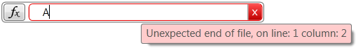
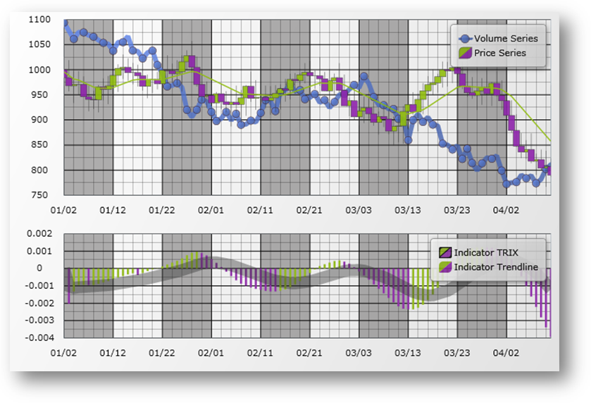
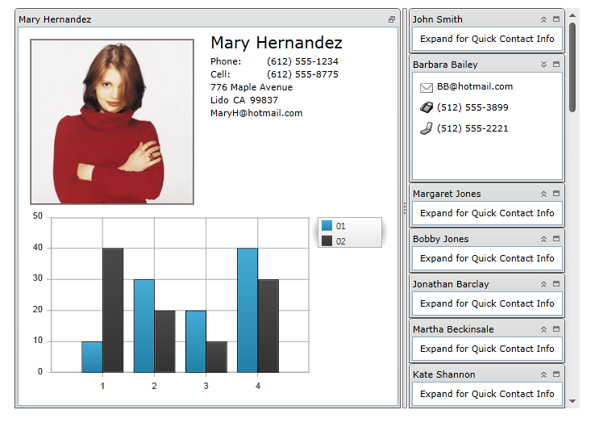
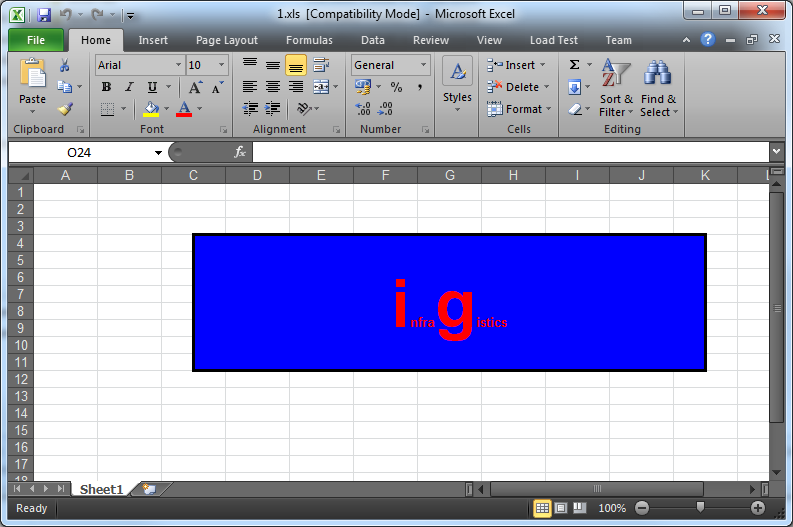

////

|metadata|
{
    "name": "wpf-whats-new-in-2011-volume-2",
    "controlName": [],
    "tags": [],
    "guid": "c33ad9d2-a279-4e80-8afc-ccc25955a670",  
    "buildFlags": [],
    "createdOn": "2012-01-30T19:39:51.7176967Z"
}
|metadata|
////

= What's New in 2011 Volume 2

== Topic Overview

== Purpose

This topic provides an overview of the new functionalities and components introduced with the {ProductName} 2011 Volume 2 Release.

== In this topic

This document contains the following sections:

*New Functionalities and Components*

** <<ExcelStyleFiltering,DataPresenter ExcelStyle Filtering>>
** <<xamCalculationManagerxamDataGrid,Using xamCalculationManager with xamDataGrid>>
** <<xamGrid,xamGrid™>>
** <<xamInputs,xamInputs™>>

*** <<xamMaskedInput,xamMaskedInput™>>
*** <<xamCurrencyInput,xamCurrenyInput™>>
*** <<xamNumericInput,xamNumericInput™>>
*** <<xamDateTimeInput,xamDateTimeInput™>>

** <<xamCalculationManager,xamCalculationManager™>>
** <<xamFormulaEditor,xamFormulaEditor™>>
** <<xamDataChart,xamDataChart™>>
** <<xamFunnelChart,xamFunnelChart™>>
** <<xamPieChart,xamPieChart™>>
** <<xamTileManager,xamTileManager™>>
** <<xamComboEditor,xamComboEditor™>>
** <<xamMultiCCE,xamMultiColumnComboEditor™>>
** <<ResourceWasher,Resource Washer>>
** <<PersistenceFW,Infragistics Persistence Framework™>>
** <<IGMath,Infragistics Math Library™>>
** <<InfragisticsMathCalculators,Infragistics Math Calculators™>>
** <<IGWord,Infragistics Word Library™>>
** <<dataGrid,Conditional Formatting in xamDataGrid™>>
** <<ValueEditors,xamNumericEditor™ and xamCurrencyEditor™ - TrimFractionalZeros support>>
** <<excelShapes,Shape support in Infragistics Excel Engine™>>

== Related Topics
=== New Functionalities and Components

The table below briefly explains the new functionalities and components.

[options="header", cols="a,a"]
|====
|Feature/ Component|Description

|DataPresenter ExcelStyle Filtering
|User friendly filtering in XamDataGrid control.

|Using xamCalculationManager with xamDataGrid (CTP)
|Integrate the xamCalculationManager control with the xamDataGrid control.

|xamGrid™
|The xamGrid is a cross-platform, high-performance control for visualizing thousands of records supporting paging, filtering, editing, hierarchical data and more.

|xamInputs™
|Cross-platform controls for masked data editing. 

* xamMaskedInput™ 

* xamCurrencyInput™ 

* xamNumericInput™ 

* xamDateTimeInput™ 

|xamCalculationManager™
|The xamCalculationManager is a cross-platform control that allows you to create complex formulas which will be dynamically calculated to produce results.

|xamFormulaEditor™
|A cross-platform control for editing formula expressions with auto complete and context help.

|xamDataChart™
|The xamDataChart is a next-generation, cross-platform, high-performance charting control.

|xamFunnelChart™
|The funnel chart displays data in sections as in top-down composition each section representing the data as slices from largest value to the smallest value.

|xamPieChart™
|This control allows you to render a circular chart broken down into slices that represent distinct data categories.

|xamTileManager™
|The xamTileManager is a cross-platform control, which displays content using rectangular tiles arranged in multiple rows.

|xamComboEditor™
|The xamComboEditor is a cross-platform control, which contains two main entries – a drop-down container for the items and a value display for the user input.

|xamMultiColumnComboEditor™
|The xamMultiColumnComboEditor is a cross-platform grid like control, which automatically generate columns for every property on the entity objects collection set on the control’s ItemsSource property.

|Resource Washer™
|You can use the Resource Washer to alter (wash) colors of the controls in your application.

|Persistence Framework™
|You can use the Persistence Framework to easily persist and load a control’s property values throughout end-user sessions.

|Infragistics Math Library™
|You can use the Infragistics Math library to perform a large range of accurate and memory efficient mathematical operations.

|Infragistics Word Library™
|You can use the Infragistics Word library to create Microsoft® Word documents.

|CellValuePesenterStyleSelector Reevaluated on Cell Value Change in xamDataGrid™
|You can apply different styles when a cell value changes in a xamDataGrid control.

|xamNumericEditor™ and xamCurrencyEditor™ - TrimFractionalZeros support
|You can suppress the auto-appended fractional zeros in both xamNumericEditor™ and xamCurrencyEditor™ controls.

|Shape support in Infragistics Excel Engine™
|You can use the Infragistics Excel Engine to manipulate different types of shapes (rectangle, line, etc.).

|====

[[ExcelStyleFiltering]]
==== DataPresenter ExcelStyle Filtering

The {ProductName} 2011 Volume 2 release contains a new ExcelStyle Filtering. This filter allows more user friendly filtering in XamDataGrid control.

*Related topics:*

* link:xamdatapresenter-enable-record-filtering.html[Enable Record Filtering]
* Enable ExcelStyle Record Filtering

[[xamCalculationManagerxamDataGrid]]
==== Using xamCalculationManager with xamDataGrid

You can use the xamCalculationManager™ control in combination with the xamDataGrid™ control to perform calculations using field values as sources and targets for the computations.

image::images/xamCalculationManager_Using_with_xamDataGrid.png[]

*Related topics:*

* link:using-xamcalculationmanager-with-xamdatagrid.html[Using xamCalculationManager with xamDataGrid]

[[xamGrid]]
==== xamGrid™

The xamGrid™ is a cross-platform control, that pushes the envelope of performance with data and UI virtualization. Your grid could have thousands of records and your end users will not encounter any performance issues.

The following is a list of some of the features of the xamGrid control:

*High Performance* – Data and UI virtualization makes xamGrid extremely lightweight and fast when handling large amounts of data.

*Hierarchical Data* - You can display complex hierarchical data with master/detail data relationships and different column layouts at each level.

*Editable* - The xamGrid control allows inline editing, add new row, and events for the create, read, update and delete operations.

*Flexible Columns* – Your end users can fix columns, move columns, resize columns and sort columns.

*Paging* - This feature breaks data into pages, reducing load time and increasing performance.

*Filtering* - This feature allows your end users to view a subset of data in a more manageable way which helps them to locate their required data.

*Templates* – You can style your xamGrid so that you can maintain a consistent look and feel throughout your entire application.

*Related topics:*

* link:xamgrid-about-xamgrid.html[About xamGrid]
* link:xamgrid-adding-xamgrid-to-your-page.html[Adding xamGrid to Your Page]
* link:xamgrid-using-xamgrid.html[Using xamGrid]

[[xamInputs]]
==== xamInputs

The controls in the xamInputs group are meant to guide the users during data entry and give you an opportunity to check if the entered data meets some predefined criteria. The controls are cross-platform by design therefore you can use them in Silverlight or WPF interchangeably. The input controls can be used as standalone text boxes or in combination with other controls, for example as cells in a xamGrid control.*

== Related topics

* link:xaminputs-about.html[About xamInputs]
* link:xaminputs-masks.html[Masks]

[[xamMaskedInput]]
==== xamMaskedInput

Starting with {ProductName} 2011 Volume 2 brings the new control, xamMaskedInput™. The xamMaskedInput control allows you to specify input masks to restrict or help guide user input. You can define literal characters, input flags, or prompt characters in the input mask. Literal characters separate or distinguish parts of the input (such as slashes in date fields), input flags restrict the type of characters your end user can input, and prompt characters indicate placeholders where data can be entered.

You can specify required or optional characters using input flags and check to see if all required data are entered. Further, xamMaskedInput allows you to retrieve just the raw input entered by your end user as well as the input including literal and prompt characters.

The xamMaskedInput control also lets you specify what should be the behavior of the control when invalid value is entered e.g. display error message, revert to the original value etc.

image::images/xamInputs_xamMaskedInput_About.png[]

*Related topics:*

* link:xammaskedinput-about.html[About xamMaskedInput]
* link:xammaskedinput-using.html[Using xamMaskedInput]

[[xamCurrencyInput]]
==== xamCurrencyInput

Starting with {ProductName} 2011 Volume 2, introduces the new xamCurrencyInput™ control. The xamCurrencyInput control is a simple text box control that uses a mask to display numeric values as a type of currency. Using this mask, you can prepend a value with a given culture's currency symbol. You can also ensure that the fraction portion of the value remains intact up to the hundredths place, even if there is no remainder.

image::images/xamInputs_xamCurrencyInput_About.png[]

*Related topics:*

* link:xamcurrencyinput-about.html[About xamCurrencyInput]
* link:xamcurrencyinput-using.html[Using xamCurrencyInput]

[[xamNumericInput]]
==== xamNumericInput

The xamNumericInput™ control is a simple text box control that uses a mask to assist users in entering numeric values. Using a mask you can restrict the user's input to predefined valid number formats.

image::images/xamInputs_xamNumericInput_About.png[]

*Related topics:*

* link:xamnumericinput-about.html[About xamNumericInput]
* link:xamnumericinput-using.html[Using xamNumericInput]

[[xamDateTimeInput]]
==== xamDateTimedInput

With the new release of the {ProductName} 2011 Volume 2 comes the xamDateTimeInput™ control. The xamDateTimeInput control is a simple text box control that uses a mask to assist users in entering dates and/or time values in the correct format. Using this mask, you can restrict the user's input to valid date and time formats that you decide beforehand. The control also provides a calendar drop down from which to choose a date.

image::images/xamInputs_xamDateTimeInput_About.png[]

*Related topics:*

* link:xamdatetimeinput-about.html[About xamDateTimeInput]
* link:xamdatetimeinput-using.html[Using xamDateTimeInput]

[[xamCalculationManager]]
==== xamCalculationManager

The xamCalculationManager control allows you to create complex formulas which will be dynamically calculated to produce results. The sources and targets for these formulas can be any public property of any object for item calculations. Formulas using lists of items can also be created to perform aggregate functions for example Sum and Average.

image::images/xamCalculationManager_About_01.png[]

*Related topics:*

* link:xamcalculationmanager.html[xamCalculationManager]
* link:xamcalculationmanager-getting-started-with-xamcalculationmanager.html[Getting Started with xamCalculationManager]
* link:xamcalculationmanager-overview-of-named-references.html[Overview of Named References]

[[xamFormulaEditor]]
==== xamFormulaEditor

The xamFormulaEditor control serves as editor for formulas managed by the xamCalculationManager. It offers autocompletion and context help features that facilitate formula editing for users. It also provides a FormulaEditorDialog where users can search operands and formulas.

*Related topics:*

* link:xamformulaeditor-about.html[About xamFormulaEditor]
* link:xamformulaeditor-contextualhelp.html[Contextual Help]
* link:xamformulaeditor-using.html[Using xamFormulaEditor and FormulaEditorDialog with xamCalculationManager]

[[xamDataChart]]
==== xamDataChart™

The xamDataChart™ control is a next-generation, high-performance component that can handle live feeds of tens of thousands of data points over milliseconds. It is also designed to facilitate the overlay of multiple series in a single chart plot area so that users can easily add statistical and technical indicators to their analyses. The xamDataChart control provides financial features similar to those found on Google® and Yahoo!® finance websites. It also provides a set of charts and a framework for creating charting applications, or adding charting capability to existing data or information-driven applications.

*Related topics:*

* link:datachart-series-types.html[Series Types]
* link:datachart-financial-indicators-overview.html[Financial Indicators]
* link:datachart-multiple-axes.html[Multiple Axes]
* link:datachart-multiple-legends.html[Multiple Legends]
* link:datachart-multiple-series.html[Multiple Series]
* link:datachart-chart-navigation.html[Chart Navigation]
* link:datachart-chart-synchronization.html[Chart Synchronization]

[[xamFunnelChart]]
==== xamFunnelChart™

The funnel chart displays data in a funnel shape. It displays sections in a top-down composition each representing the data as slices from largest value to the smallest value.

image::images/xamFunnelChart_01.png[]

*Related topics:*

* link:funnelchart.html[xamFunnelChart]
* link:funnelchart-getting-started-with-funnelchart.html[Getting Started with xamFunnelChart]
* link:funnelchart-data-binding.html[Data Binding]

[[xamPieChart]]
==== xamPieChart™

This release features a new, specialized control in the Data Chart assembly called xamPieChart™. This control allows you to render a circular chart broken down into slices that represent distinct data categories. (See Figure 1 below.) The Pie Chart control supports slice selection and explosion, as well as an “Others” slice for categories below a value threshold.

*Related topics:*

* link:piechart.html[xamPieChart]
* link:piechart-getting-started-with-piechart.html[Getting Started with xamPieChart]
* link:piechart-data-binding.html[Data Binding]

[[xamTileManager]]
==== xamTileManager™

The xamTileManager™ is a new cross-platform control, which displays content using rectangular tiles, which are arranged sequentially creating multiple rows of tiles. Your end users can maximize one or more tiles, which automatically minimizes the remaining tiles. However, the minimized tiles will remain in view along an edge of the control, so your end users can quickly maximize and shift their attention to new content.

*Related topics:*

* link:xamtilemanager-about-xamtilemanager.html[About xamTileManager]
* link:xamtilemanager-adding-xamtilemanager-to-your-application.html[Adding xamTileManager to Your Application]
* link:xamtilemanager-using-xamtilemanager.html[Using xamTileManager]

[[xamComboEditor]]
==== xamComboEditor

The xamComboEditor™ is a new cross-platform control, which allows you to bind a list of items to a control. It is a flat data bound control and contains two main entries – a drop-down container for the items and a value display for the user input.

The main features of the xamComboEditor are:

* Virtualized: the xamComboEditor can display a large number of items very quickly.
* You can write directly into the value input field and add the input as xamComboEditor control item.
* You can customize the behavior of the xamComboEditor according to your application logic - it can be used as a read-only combo box or as a Google style Type Ahead control.
* It has two primary modes: Selectable and Editable mode.
* You can easily customize the xamComboEditor visual Style items as well as its items.

*Related topics:*

* link:wpf-xamcomboeditor-about-xamcomboeditor.html[About xamComboEditor]
* link:xamcomboeditor-adding-xamcomboeditor-to-your-page.html[Adding xamComboEditor to Your Application]
* link:wpf-xamcomboeditor-using-xamcomboeditor.html[Using xamComboEditor]

[[xamMultiCCE]]
==== xamMultiColumnComboEditor™

The xamMultiColumnComboEditor acts just like a grid; it can automatically generate columns for every property on the data object that is contained in the IEnumerable that is set on the control’s ItemsSource property. The control’s AutoGenerateColumns property (which defaults to true) controls this behavior.

image::images/xamMultiCCE_About_1.png[]

*Related topics:*

* link:xammulticce-about.html[About xamMultiColumnComboEditor]

[[ResourceWasher]]
==== Resource Washer

With Resource Washing, you can set the color (the WashColor) on groups of resources (WashGroups) in an existing ResourceDictionary to update the color of the controls in your application.

*Related topics:*

* link:reswash-about.html[About Resource Washer]

[[PersistenceFW]]
==== Infragistics Control Persistence Framework

In the {ProductName} 2011 volume 2 release, we introduce to you the new Infragistics Control Persistence Framework. With the Control Persistence Framework, you can easily persist and load a control’s property values throughout end-user sessions. The framework supports the persisting and loading of control state of any control.

Here are some storage mediums that you can use to persist and load your settings:

* Isolated Storage
* Database

With the Control Persistence Framework, you can save all of a control’s property settings or you can selectively choose a subset of properties that will be persisted; you also have control over the fine tuning of the save and load process along with several events that you can handle for further control and customization.

*Related topics:*

* link:persistence-about-ig-control-persistence-framework.html[About Infragistics Control Persistence Framework]
* link:persistenceframework-getting-started-with-infragistics-control-persistence-framework.html[Getting Started with Infragistics Control Persistence Framework]
* link:persistence-using-ig-control-persistence-framework.html[Using Infragistics Control Persistence Framework]

[[IGMath]]
==== Infragistics Math Library™

The Math Library provides you with a unified set of core functions that will allow you to perform a large range of mathematical operations with ease. Perform mathematical calculations that are fast, accurate and memory efficient. Build your own math-driven applications without having to translate your data structures across multiple formats. Employ numerical methods; build compartmental models; perform Monte Carlo simulations; and solve regression problems.

*Related topics:*

* link:ig-math-infragistics.html[Infragistics Math Library]
* link:ig-math-mathematical-functions.html[Mathematical Functions]
* link:ig-math-matrices.html[Matrices]
* link:ig-math-vectors.html[Vectors]

==== Infragistics Math Calculators™

The link:{ApiPlatform}math.calculators.v{ProductVersion}~infragistics.math.calculators_namespace.html[Infragistics Math Calculators] is a library of mathematical and statistical calculators that you can use with all Infragistics controls to compute various calculations.

image::images/Whats_New_In_2011_Volume_2_IG_Math_Calculators_01.png[]

Figure 1 – Formula for Variance and Mean Calculations.

The Infragistics Math Calculators are required to calculate value overlay and error bars in the xamDataChart control. Refer to the link:ig-math-calculators.html[Infragistics Math Calculators] topic for more information on this library. They can be categorized in the following types of calculators:

[options="header", cols="a,a"]
|====
|Calculator Type|Description

|Value Calculators
|Represent a group of Infragistics Math Calculators that calculates a single value. Refer to the link:datachart-series-value-overlay.html[Value Overlay] and link:datachart-series-data-correlation.html[Series Data Correlation] topics for examples on how to integrate value calculators with the xamDataChart control. 

* link:ig-calculators-correlation-calculator.html[Infragistics Correlation Calculator] 

* link:ig-calculators-mean-calculator.html[Infragistics Mean Calculator] 

* link:ig-calculators-median-calculator.html[Infragistics Median Calculator] 

* link:ig-calculators-standard-deviation-calculator.html[Infragistics Standard Deviation Calculator] 

* link:ig-calculators-standard-error-calculator.html[Infragistics Standard Error Calculator] 

* link:ig-calculators-variance-calculator.html[Infragistics Variance Calculator] 

|Error Bar Calculators
|Represent a group of Infragistics Math Calculators that calculates length of error bars for Series objects in xamDataChart control. Refer to the link:datachart-series-error-bars.html[Series Error Bars] topic for examples on how to integrate error bars calculators with the xamDataChart control. 

* link:ig-calculators-data-calculator.html[Infragistics Data Calculator] 

* link:ig-calculators-fixed-value-calculator.html[Infragistics Fixed Value Calculator] 

* link:ig-calculators-percentage-calculator.html[Infragistics Percentage Calculator] 

* link:ig-calculators-standard-deviation-calculator.html[Infragistics Standard Deviation Calculator] 

* link:ig-calculators-standard-error-calculator.html[Infragistics Standard Error Calculator] 

|====

==== Infragistics Word Library™

This release of the {ProductName} 2011 Volume 2 introduces the new Infragistics® Word® library. The Word library enables you to create Microsoft® Word documents using forward-only streamer.

*Related topics:*

* link:word-about-ig-word-library.html[About Infragistics Word Library]

[[dataGrid]]
==== Conditional Formatting in xamDataGrid

You can apply different styles when a cell value changes in a xamDataGrid control. A CellValuePesenterStyleSelector can be specified on the FieldSettings at any level.

*Related topics:*

* link:xamdatagrid-cellvaluepesenterstyleselector-reevaluated.html[Conditional Formatting]

[[ValueEditors]]
==== xamNumericEditor and xamCurrencyEditor - TrimFractionalZeros support

You can have more control over the visual representation of the ValueEditor controls by using the new TrimFractionalZeros property. By setting it to true you can you can suppress the auto-appended fractional zeros.

* xamNumericEditor and xamCurrencyEditor - TrimFractionalZeros support

[[excelShapes]]
==== Shape support in Infragistics Excel Engine

You can use the link:igexcelengine-about-infragistics-excel-engine.html[Infragistics Excel Engine] to manipulate different types of shapes (rectangle, line, etc.).

Figure 1 - A rectangle created using Infragistics Excel Engine.

Following are all possible shapes that you can add or change in an Excel sheet.

[options="header", cols="a,a"]
|====
|Shape|Looks like...

|Line
|image::images/ExcelShaped_Line.png[]

|Straight Connector
|image::images/ExcelShaped_StraightConnector.png[]

|Diamond
|image::images/ExcelShaped_Diamod.png[]

|Ellipse (Oval)
|image::images/ExcelShaped_Ellipse.png[]

|Heart
|image::images/ExcelShaped_Hearth.png[]

|Explosion 1
|image::images/ExcelShaped_IrregularStar1.png[]

|Explosion 2
|image::images/ExcelShaped_IrregularStar2.png[]

|Lightning Bolt
|image::images/ExcelShaped_LightningBolt.png[]

|Pentagon
|image::images/ExcelShaped_Pentagon.png[]

|Rectangle
|image::images/ExcelShaped_Rectangle.png[]

|Right Triangle
|image::images/ExcelShaped_RightTriangle.png[]

|====

*Related topics:*

* link:igexcelengine-adding-a-shape-to-an-excel-worksheet.html[Adding a Shape to a Worksheet (Infragistics Excel Engine)]
* link:igexcelengine-customizing-excel-shapes.html[Customizing Shapes (Infragistics Excel Engine)]
* link:igexcelengine-grouping-excel-shapes.html[Grouping Shapes (Infragistics Excel Engine)]
* link:igexcelengine-importing-shapes-from-excel.html[Importing Shapes from Excel (Infragistics Excel Engine)]

== Related Topics

Following are some other topics that you may find useful.

* link:wpf-revision-history.html[Revision History]