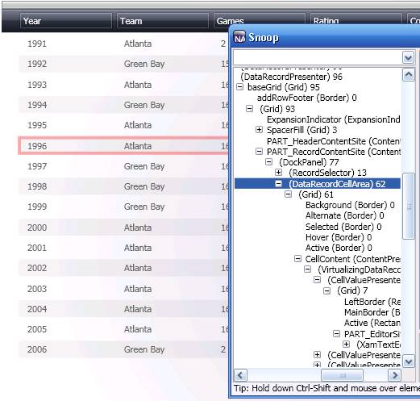
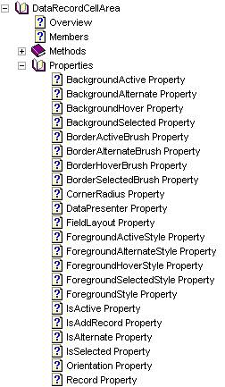

////

|metadata|
{
    "name": "wpf-working-with-xamdatagrid-xamdatacarousel-and-xamdatapresenter-styling-points",
    "controlName": [],
    "tags": ["Styling","Templating"],
    "guid": "177b5997-747c-41f5-9b33-ddc50c271f3b",  
    "buildFlags": ["wpf"],
    "createdOn": "2012-01-30T20:19:02.5380964Z"
}
|metadata|
////

= Styling Points for xamDataGrid, xamDataCarousel and xamDataPresenter

The xamDataGrid™, xamDataCarousel™, xamDataCards™, and xamDataPresenter™ expose a number of styling points that allow you to fully customize their look and feel. These styling points are simply smaller controls that are used together to make the larger control. Because they are actual controls, you can target and style them as you would any {ProductName} control. In less-demanding styling scenarios, simple brush or font settings can achieve the look you're going for. In more advanced scenarios, you can replace or customize the entire ControlTemplate of these controls.

Before any styling work can begin, you need to know which control to target with a Style. It's important that you understand how the smaller controls are used by the larger controls at run time. The composition diagrams (see 

== Related Topics
inks at the end of this topic) demonstrate how the individual controls are nested and work together.

Gain an even better understanding of how the controls work together by using the freely available SourceForge® Snoop ( link:http://blois.us/Snoop[http://blois.us/Snoop]). This tool allows you to attach to a running Windows® Presentation Foundation application and view the application's VisualTree. Using Snoop, you can quickly learn which control you need to target to achieve the look you're going for. You'll look at styling a single control (i.e., the link:{ApiPlatform}datapresenter{ApiVersion}~infragistics.windows.datapresenter.datarecordcellarea.html[DataRecordCellArea]) to get you started. Once you understand the process, you'll be prepared to identify and style other controls. For a complete list of Styling points, see link:{ApiPlatform}datapresenter{ApiVersion}~infragistics.windows.datapresenter.datapresenterbase.html[DataPresenterBase].

== Styling a Nested Control

In this walkthrough, you are going to change the background color of alternate rows in the grid. This walkthrough shows you how to identify the control responsible for rendering the alternate row background color. You will then learn how to identify which properties need to be set on the control.

[start=1]
. *Identify the target control.*

Using both the composition diagram and Snoop, you can identify the control that needs to be styled as the DataRecordCellArea.

[start=2]
. *Identify the styling properties.*

Now that you know which control to style, you need to determine which properties can be set that affect its appearance. Using the link:api-reference-guide.html[API Reference Guide], navigate to the DataRecordCellArea and expand the Properties section.

There are four properties that begin with the name "Background": BackgroundActive, BackgroundAlternate, BackgroundHover, and BackgroundSelected. Likewise, there are BorderBrush properties defined for the same states: BorderActiveBrush, BorderAlternateBrush, BorderHoverBrush, and BorderSelectedBrush.

.Note
[NOTE]
====
Properties displayed here are only the custom properties that have been added to this control. Inherited properties such as Background and BorderBrush do not appear in this list.
====

[start=3]
. *Create a default Style.*

Now that you have identified the brush properties that may be set, it's time to create a Style that targets the DataRecordCellArea. This Style can be added to any ResourceDictionary within the scope of the control you are targeting. Because this Style has not been given a key, all DataRecordCellArea controls within its scope will now use Red (#FF0000) for the alternate row background color.

*In XAML:*

----

----

[start=4]
. *Create a keyed Style.*

You can also create a keyed Style that is not used by default for all DataRecordCellAreas.

*In XAML:*

----

----

To apply this style, you must assign it to the DataRecordCellAreaStyle property of link:{ApiPlatform}datapresenter{ApiVersion}~infragistics.windows.datapresenter.fieldlayoutsettings.html[FieldLayoutSettings].

*In XAML:*

----
<igDP:XamDataGrid x:Key="myGrid">
        <igDP:XamDataGrid.FieldLayoutSettings>
                <igDP:FieldLayoutSettings DataRecordCellAreaStyle="{StaticResource customCellArea}" />
        </igDP:XamDataGrid.FieldLayoutSettings>
</igDP:XamDataGrid>
----

== Digging Deeper: Custom ControlTemplates

In many cases, specifying custom brushes or other property values (e.g., BorderThickness and FontFamily) will address your styling needs. In cases where you want to add additional artwork or change the fundamental layout of a control, you will need to customize the control's Template.

.Note
[NOTE]
====
An explanation of ControlTemplates, and their function and role in Windows® Presentation Foundation is beyond the scope of this topic.
====

Template editing is best achieved using a tool such as Microsoft® Expression® Blend. When editing {ProductName} templates in Expression Blend, it is recommended that you always start with a copy of the default control templates located in the following folder: {InstallPath}\DefaultStyles. Expression Blend can generate the default Template from a control, but you cannot rely on the tool to pull in the Template with 100% accuracy. Expression Blend ships a copy of the default XAML for the system controls for this very reason. It is important to start from a working Template to ensure that TemplateBinding, Triggers, and ContentPresenters are all working correctly.

== Recommended Steps

You should create a copy of the default styles ({InstallPath}\DefaultStyles) for use in your application so that you can always start from an original copy.

*To create a copy of the default styles:*

[start=1]
. Create a "resources" folder in your project directory and copy the default XAML files into that folder.
[start=2]
. Add the files to your project in either Microsoft Visual Studio® or Expression Blend.
[start=3]
. Add a MergedDictionary reference to the new ResourceDictionaries at the desired scope in your document.

*In XAML*

----
<Window.Resources>
        <ResourceDictionary>
                <ResourceDictionary.MergedDictionaries>
                        <ResourceDictionary Source="resources/DataPresenterGeneric.xaml"/>              
                </ResourceDictionary.MergedDictionaries>
        </ResourceDictionary>
</Window.Resources>
----

[start=4]
. Customize the templates using your editor of choice.

== Closer Look: Default ResourceDictionary Practices

The default ResourceDictionaries can be divided into three primary groups: Brush resources, Express edition resources, and Full version resources. There are three sets of these groups, each targeting a specific assembly: InfragisticsWPF4, {ApiPlatform}Controls.Editors and {ApiPlatform}DataPresenter:

* DataPresenterGeneric_Brushes.xaml
* DataPresenterGeneric_Express.xaml
* DataPresenterGeneric.xaml

Primary brushes used by each set of Styles are defined in the _Brushes.xaml files. You can quickly alter the look and feel of the controls by editing the resources found in these files.

.Note
[NOTE]
====
You cannot simply include the _Brushes file to make visual changes. The style files reference the brush files and apply them as StaticResources. The _Express files include Styles for controls that live in both the Express and Full assemblies. The non-Express files include Styles for the controls not include in the Express version.
====

== Summary

This walkthrough demonstrated how to identify a sub-control within a larger control, find available styling properties for that control, and create both a default and keyed Style that targets that control. This is the process you will use when targeting any region of the controls included with {ProductName}. Spend some time learning how the sub-controls are composited in the larger controls and you'll be well on your way to custom styling.

== RelatedTopics

link:xamdatapresenter-xamdatapresenters-carousel-view-composition-diagram.html[xamDataPresenter's Carousel View Composition Diagram]

link:xamdatapresenter-xamdatapresenters-grid-view-composition-diagram.html[xamDataPresenters Grid View Composition Diagram]