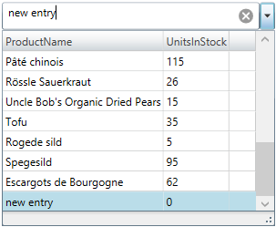

////
|metadata|
{
    "name": "xam-multicee-configuring-the-behavior-on-user-input",
    "tags": ["Editing","Getting Started","How Do I"],
    "controlName": ["xamMultiColumnComboEditor"],
    "guid": "55ab0031-57a9-4d37-ae7d-bb76d862fdea",
    "buildFlags": [],
    "createdOn": "2016-05-25T18:21:57.6142559Z"
}
|metadata|
////

= Configuring the Behavior on User Input (xamMultiColumnComboEditor)

== Topic Overview

=== Purpose

This topic describes how to configure the executed action when the user types and after that hits 'Enter' key in the input text field in the  _xamMultiColumnComboEditor_™ control.

=== Required background

The following topic is a prerequisite to understanding this topic:

[options="header", cols="a,a"]
|====
|Topic|Purpose

| link:xammulticce-adding.html[Adding xamMultiColumnComboEditor to Your Page]
|This topic describes how to add a _xamMultiColumnComboEditor_ control to your application and use some of its properties.

|====

=== In this topic

This topic contains the following sections:

* <<_Ref382667278,Configuring the Behavior on User Input>>
* <<_Ref382667283,Related Content>>

** <<_Ref382667287,Topics>>

[[_Ref382667278]]
== Configuring the Behavior on User Input

[[_Hlk368069110]]

=== Overview

Configure the behavior of the  _xamMultiColumnComboEditor_   when a user types in the input text field using the `CustomValueEnteredAction` property.

By default, this property is set to `Ignore` and typing text in the input text field results in filtering the  _xamMultiColumnComboEditor_   items.

=== Property settings

The following table maps the desired behavior to the property settings that manage it.

[options="header", cols="a,a,a"]
|====
|In order to:|Use this property:|And set it to:

|Add the user typed text to the underlying `ItemsSource` and the new entry to become valid data for selection.
| link:{ApiPlatform}controls.editors.xamcomboeditor.v{ProductVersion}~infragistics.controls.editors.comboeditorbase`2~customvalueenteredaction.html[CustomValueEnteredAction]
|`Add`

|Allow the user to type text but this text will not be included in the items collection.
| link:{ApiPlatform}controls.editors.xamcomboeditor.v{ProductVersion}~infragistics.controls.editors.comboeditorbase`2~customvalueenteredaction.html[CustomValueEnteredAction]
|`Allow`

|Prevent the user from typing invalid data. The user typed text is considered as a filter value.
| link:{ApiPlatform}controls.editors.xamcomboeditor.v{ProductVersion}~infragistics.controls.editors.comboeditorbase`2~customvalueenteredaction.html[CustomValueEnteredAction]
|`Ignore`

|====

[[_Hlk337817761]]

=== Example

The screenshot below demonstrates how the  _xamMultiColumnComboEditor_   behaves as a result of the following settings:

[options="header", cols="a,a"]
|====
|Property|Value

| link:{ApiPlatform}controls.editors.xamcomboeditor.v{ProductVersion}~infragistics.controls.editors.comboeditorbase`2~customvalueenteredaction.html[CustomValueEnteredAction]
| _Add_ 

| link:{ApiPlatform}controls.editors.xamcomboeditor.v{ProductVersion}~infragistics.controls.editors.comboeditorbase`2~displaymemberpath.html[DisplayMemberPath]
| _ProductName_ 

|====

Following is the code that implements this example.

*In XAML:*

[source,xaml]
----
<ig:XamMultiColumnComboEditor x:Name="MultiColumnComboEditor"
                              ItemsSource="{Binding Path=Products}" 
                              Height="30" Width="300"
                              AutoGenerateColumns="False"
                              DisplayMemberPath="ProductName"
                              CustomValueEnteredAction="Add">
    <ig:XamMultiColumnComboEditor.Columns>
        <ig:TextComboColumn Key="ProductName"/>
        <ig:TextComboColumn Key="UnitsInStock"/>
    </ig:XamMultiColumnComboEditor.Columns>
</ig:XamMultiColumnComboEditor>
----

[[_Ref382667283]]
== Related Content

[[_Ref382667287]]

=== Topics

The following topics provide additional information related to this topic.

[options="header", cols="a,a"]
|====
|Topic|Purpose

| link:xammulticce-configuring-data-binding-visualization.html[Configuring Data Binding and Visualization]
|This topic explains how to bind the _xamMultiColumnComboEditor_ control to data and configure the items layout in the control’s drop-down list.

| link:xammulticee-configuring-the-drop-down.html[Configuring the Drop-Down]
|This topic explains how to configure the layout and behavior of the _xamMultiColumnComboEditor_ Drop-Down.

| link:xammulticee-configuring-item-filtering.html[Configuring Item Filtering]
|This topic describes how to configure items filtering in the _xamMultiColumnComboEditor_ control.

| link:xammulticee-selection.html[Selection]
|The topics in this group explain selection feature in the _xamMultiColumnComboEditor_ control and its use.

|====