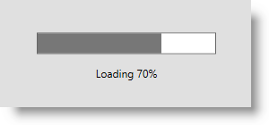
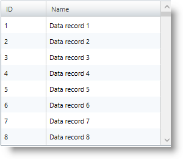

////
|metadata|
{
    "name": "xambusyindicator-adding-to-your-page",
    "tags": ["Getting Started","How Do I"],
    "controlName": ["xamBusyIndicator"],
    "guid": "4739e83e-bbf5-40c4-b164-8b5859b9def4",
    "buildFlags": [],
    "createdOn": "2015-07-30T16:03:47.5735268Z"
}
|metadata|
////

= Adding xamBusyIndicator To Your Page

== Topic Overview

=== Purpose

This topic provides detailed instructions to help you get up and running as soon as possible with the  _xamBusyIndicator™_   control.

=== Required background

The following topics are prerequisites to understanding this topic:

[options="header", cols="a,a"]
|====
|Topic|Purpose

| link:xambusyindicator-features-overview.html[Features Overview]
|This topic explains the features supported by the control from developer perspective.

| link:xambusyindicator-visual-elements.html[Visual Elements Overview]
|This topic provides an overview of the visual elements of the control.

| link:xamgrid-adding-xamgrid-to-your-page.html[Adding xamGrid to Your Page]
|This topic is designed to get you up and running as quickly as possible by describing the basic steps required for adding the _xamGrid_ control to your page using procedural code and XAML.

|====

=== External Resources
[options="header", cols="a,a"]
|====
|Article|Purpose

| link:https://msdn.microsoft.com/en-us/library/system.componentmodel.backgroundworker(v=vs.110).aspx[BackgroundWorker Class] 

|This MSDN page provides information about the BackgroundWorker class and its usage. 

|====

=== In this topic

This topic contains the following sections:

* <<_Ref426221454, Using xamBusyIndicator with BackgroundWorker to Display the Progress of a Time-Consuming Operation – Example >>

** <<_Ref426221467,Introduction>>
** <<_Preview,Preview>>
** <<_Prerequisites,Prerequisites>>

* <<_Ref426221529, Code Examples Summary >>
* <<_Ref426221588, Related Content >>

** <<_Ref427679356,Topics>>
** <<_Ref427679360,Samples>>

[[_Ref426221454]]
=== Using xamBusyIndicator with BackgroundWorker to Display the Progress of a Time-Consuming Operation – Example

[[_Ref426221467]]

=== Introduction

This example explains how to use the  _xamBusyIndicator_   control to notify the user that a time-consuming operation is executed and to provide visual output about the actual progress.

In this example, the  _xamGrid_   control is used as a data container and the `BackgroundWorker` class is used to run the data loading operation on a background thread.

[[_Preview]]

=== Preview

The following screenshot is a preview of the final result.

[[_Prerequisites]]

=== Prerequisites

To complete the procedure, you need the following:

* Create a Microsoft® WPF™ project and add the following assembly references:

** `XamBusyIndicator` is located in the {ApiPlatform}{ApiVersion} assembly 

** {ApiPlatform}Controls.Grids.XamGrid.{ApiVersion}

** {ApiPlatform}Controls.Menus.XamMenu.{ApiVersion}

** {ApiPlatform}DataManager.{ApiVersion}

* Add the following namespace declaration:

*In XAML:*

[source,xaml]
----
xmlns:ig="http://schemas.infragistics.com/xaml"
----

*In C#:*

[source,csharp]
----
using Infragistics.Controls.Interactions;
----

*In Visual Basic:*

[source,vb]
----
Imports Infragistics.Controls.Interactions
----

* Add the  _xamBusyIndicator_   control to the page:

*In XAML:*

[source,xaml]
----
<ig:XamBusyIndicator IsBusy="True">
    <!-- xamBusyIndicator content -->
</ig:XamBusyIndicator>
----

[[_Ref426221529]]
== Code Snippets Summary

=== Code snippets summary chart

The following table lists the code snippets included in this topic.

[options="header", cols="a,a"]
|====
|Example|Description

|<<_Ref426219199, Data Model classes >>
|This is the data model classes used in the example.

|<<_Ref426219966, ViewModel class >>
|This ViewModel class implements the data loading functionality using a `BackgroundWorker` instance and handling its main events – `DoWork`, `ProgressChanged` and `RunWorkerCompleted`.

|<<_Ref426222137, Using xamBusyIndicator in XAML to Display the Progress of a Long-Running Operation >>
|This XAML code configures the _xamBusyIndicator_ control.

|====

[[_Ref426219199]]
== Data Model classes

=== Description

This is the data model classes used in the example.

=== Code

*In C#:*

[source,csharp]
----
public class DataModel : ObservableModel
{
    public string ID { get; set; }
    public string Name { get; set; }
}
public class ObservableModel : INotifyPropertyChanged
{
    #region INotifyPropertyChanged
    public event PropertyChangedEventHandler PropertyChanged;
    protected void OnPropertyChanged(string propertyName)
    {
        OnPropertyChanged(this, new PropertyChangedEventArgs(propertyName));
    }
    protected void OnPropertyChanged(object sender, PropertyChangedEventArgs e)
    {
        PropertyChangedEventHandler handler = this.PropertyChanged;
        if (handler != null)
            handler(sender, e);
    }
    #endregion
}
----

*In Visual Basic:*

[source,vb]
----
Public Class DataModel
    Inherits ObservableModel
    Public Property ID() As String
        Get
            Return m_ID
        End Get
        Set(value As String)
            m_ID = value
        End Set
    End Property
    Private m_ID As String
    Public Property Name() As String
        Get
            Return m_Name
        End Get
        Set(value As String)
            m_Name = value
        End Set
    End Property
    Private m_Name As String
End Class
Public Class ObservableModel
    Implements INotifyPropertyChanged
#Region "INotifyPropertyChanged Members"
    Public Event PropertyChanged(ByVal sender As Object, ByVal e As PropertyChangedEventArgs) Implements INotifyPropertyChanged.PropertyChanged
    Public Sub OnPropertyChanged(ByVal propertyName As String)
        RaiseEvent PropertyChanged(Me, New PropertyChangedEventArgs(propertyName))
    End Sub
#End Region
End Class
----

[[_Ref426219966]]
== ViewModel class

=== Description

This ViewModel class implements the data loading functionality using a `BackgroundWorker` instance and handling its main events – `DoWork`, `ProgressChanged` and `RunWorkerCompleted`.

The following public properties are implemented for further usage in the  _xamBusyIndicator_   control:

* IsInProgress
* CurrentProgress
* CurrentProgressFormatted

=== Code

*In C#:*

[source,csharp]
----
public class DataProvider : ObservableModel
{
    private BackgroundWorker _worker;
    private bool _isInProgress;
    public bool IsInProgress
    {
        get
        {
            return this._isInProgress;
        }
        set
        {
            if (this._isInProgress != value)
            {
                this._isInProgress = value;
                this.OnPropertyChanged("IsInProgress");
            }
        }
    }
    private double _currentProgress;
    public double CurrentProgress
    {
        get
        {
            return this._currentProgress;
        }
        set
        {
            if (this._currentProgress != value)
            {
                this._currentProgress = value;
                this.OnPropertyChanged("CurrentProgress");
            }
        }
    }
    private object _currentProgressFormatted;
    public object CurrentProgressFormatted
    {
        get
        {
            return this._currentProgressFormatted;
        }
        set
        {
            if (this._currentProgressFormatted != value)
            {
                this._currentProgressFormatted = value;
                this.OnPropertyChanged("CurrentProgressFormatted");
            }
        }
    }
    private ObservableCollection<DataModel> _data;
    public ObservableCollection<DataModel> Data
    {
        get
        {
            return this._data;
        }
        set
        {
            if (this._data != value)
            {
                this._data = value;
                this.OnPropertyChanged("Data");
            }
        }
    }
    public DataProvider()
    {
        _worker = new BackgroundWorker() { WorkerReportsProgress = true };
        _worker.DoWork += new DoWorkEventHandler(WorkerDoWork);
        _worker.ProgressChanged += new ProgressChangedEventHandler(WorkerProgressChanged);
        _worker.RunWorkerCompleted += new RunWorkerCompletedEventHandler(WorkerCompleted);
        if (!_worker.IsBusy)
        {
            IsInProgress = true;
            _worker.RunWorkerAsync();
        }   
    }
    private void WorkerDoWork(object sender, DoWorkEventArgs e)
    {
        const int maxRecords = 1000;
        var orders = new List<DataModel>();
        for (int i = 1; i < maxRecords; i++)
        {
            System.Threading.Thread.Sleep(10);
            orders.Add(new DataModel(){ID = i.ToString(), Name = "Data record " + i});
            _worker.ReportProgress(Convert.ToInt32(((decimal)i / (decimal)maxRecords) * 100));
        }
        e.Result = orders;
    }
    private void WorkerProgressChanged(object sender, ProgressChangedEventArgs e)
    {
        CurrentProgress = (double)e.ProgressPercentage / 100;
        CurrentProgressFormatted = string.Format("Loading {0}%", e.ProgressPercentage);
    }
    private void WorkerCompleted(object sender, RunWorkerCompletedEventArgs e)
    {
        IsInProgress = false;
        this.Data = new ObservableCollection<DataModel>((List<DataModel>)e.Result);
    }
}
----

*In Visual Basic:*

[source,vb]
----
Public Class DataProvider
    Inherits ObservableModel
    Private _worker As BackgroundWorker
    Private _isInProgress As Boolean
    Public Property IsInProgress() As Boolean
        Get
            Return Me._isInProgress
        End Get
        Set(value As Boolean)
            If Me._isInProgress <> value Then
                Me._isInProgress = value
                Me.OnPropertyChanged("IsInProgress")
            End If
        End Set
    End Property
    Private _currentProgress As Double
    Public Property CurrentProgress() As Double
        Get
            Return Me._currentProgress
        End Get
        Set(value As Double)
            If Me._currentProgress <> value Then
                Me._currentProgress = value
                Me.OnPropertyChanged("CurrentProgress")
            End If
        End Set
    End Property
    Private _currentProgressFormatted As Object
    Public Property CurrentProgressFormatted() As Object
        Get
            Return Me._currentProgressFormatted
        End Get
        Set(value As Object)
            If Me._currentProgressFormatted IsNot value Then
                Me._currentProgressFormatted = value
                Me.OnPropertyChanged("CurrentProgressFormatted")
            End If
        End Set
    End Property
    Private _data As ObservableCollection(Of DataModel)
    Public Property Data() As ObservableCollection(Of DataModel)
        Get
            Return Me._data
        End Get
        Set(value As ObservableCollection(Of DataModel))
            If Me._data IsNot value Then
                Me._data = value
                Me.OnPropertyChanged("Data")
            End If
        End Set
    End Property
    Public Sub New()
        _worker = New BackgroundWorker() With {
            .WorkerReportsProgress = True
        }
        AddHandler _worker.DoWork, AddressOf WorkerDoWork
        AddHandler _worker.ProgressChanged, AddressOf WorkerProgressChanged
        AddHandler _worker.RunWorkerCompleted, AddressOf WorkerCompleted
        If Not _worker.IsBusy Then
            IsInProgress = True
            _worker.RunWorkerAsync()
        End If
    End Sub
    Private Sub WorkerDoWork(sender As Object, e As DoWorkEventArgs)
        Const maxRecords As Integer = 1000
        Dim orders = New List(Of DataModel)()
        For i As Integer = 1 To maxRecords - 1
            System.Threading.Thread.Sleep(10)
            orders.Add(New DataModel() With {
                .ID = i.ToString(),
                .Name = "Data record " & i
            })
            _worker.ReportProgress(Convert.ToInt32((CDec(i) / CDec(maxRecords)) * 100))
        Next
        e.Result = orders
    End Sub
    Private Sub WorkerProgressChanged(sender As Object, e As ProgressChangedEventArgs)
        CurrentProgress = CDbl(e.ProgressPercentage) / 100
        CurrentProgressFormatted = String.Format("Loading {0}%", e.ProgressPercentage)
    End Sub
    Private Sub WorkerCompleted(sender As Object, e As RunWorkerCompletedEventArgs)
        IsInProgress = False
        Me.Data = New ObservableCollection(Of DataModel)(DirectCast(e.Result, List(Of DataModel)))
    End Sub
End Class
----

[[_Ref426222137]]
== Using xamBusyIndicator in XAML to Display the Progress of a Long-Running Operation

=== Description

This XAML code configures the  _xamBusyIndicator_   control.

The following link:{RootAssembly}{ApiVersion}~infragistics.controls.interactions.xambusyindicator_members.html[XamBusyIndicator] properties are set:

[options="header", cols="a,a"]
|====
|Property|Description

| link:{RootAssembly}{ApiVersion}~infragistics.controls.interactions.xambusyindicator~isbusy.html[IsBusy]
|Specifies if the control is displayed.

| link:{RootAssembly}{ApiVersion}~infragistics.controls.interactions.xambusyindicator~animation.html[Animation]
|Specifies the animation type – in this example it is set to `ProgressBar`.

| link:{RootAssembly}{ApiVersion}~infragistics.controls.interactions.xambusyindicator~isindeterminate.html[IsIndeterminate]
|Specifies whether the animation is indeterminate or determinate. In this example, the _xamBusyIndicator_ `IsIndeterminate` property is set to `True` in order to display a determinate progress.

| link:{RootAssembly}{ApiVersion}~infragistics.controls.interactions.xambusyindicator~progressvalue.html[ProgressValue]
|Sets the progress value in the range from 0 to 1.

| link:{RootAssembly}{ApiVersion}~infragistics.controls.interactions.xambusyindicator~busycontent.html[BusyContent]
|Specifies the content beneath the busy animation. In this example, the `BusyContent` property is set to a text representing the progress percent.

|`Content`
|This property is set to the _xamGrid_ control in this example.

|====

=== Code

*In XAML:*

[source,xaml]
----
<Window.DataContext>
    <data:DataProvider />
</Window.DataContext>
<ig:XamBusyIndicator IsBusy="{Binding Path=IsInProgress}" 
                     Animation="ProgressBar" IsIndeterminate="False"
                     ProgressValue="{Binding Path=CurrentProgress}"
                     BusyContent="{Binding Path=CurrentProgressFormatted}">              
    <ig:XamGrid x:Name="DataGrid" ItemsSource="{Binding Path=Data}" ColumnWidth="*" />
</ig:XamBusyIndicator>
----

[[_Ref426221588]]
== Related Content

[[_Ref427679356]]

=== Topics

The following topics provide additional information related to this topic.

[options="header", cols="a,a"]
|====
|Topic|Purpose

| link:xambusyindicator-configuring.html[Configuring xamBusyIndicator]
|The topics in this section provide information about configuring the control.

| link:xambusyindicator-working.html[Working with xamBusyIndicator]
|The topics in this section provide deep knowledge on how to manage the control programmatically.

| link:xambusyindicator-api-reference.html[API Reference (xamBusyIndicator)]
|This topic provides reference information about the namespaces and classes related to the control.

|====

[[_Ref427679360]]

=== Samples

The following samples provide additional information related to this topic.

[options="header", cols="a,a"]
|====
|Sample|Purpose

| link:{SamplesURL}/busy-indicator/busy-indicator-xamgrid[Busy Content]
|This sample demonstrates how to customize the Busy Content of the _xamBusyIndicator_ control.

| link:{SamplesURL}/busy-indicator/reporting-progress[Reporting Progress]
|This sample demonstrates how to configure the _xamBusyIndicator_ control to report the progress of a lengthy operation.

|====