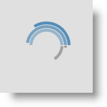
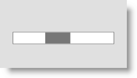
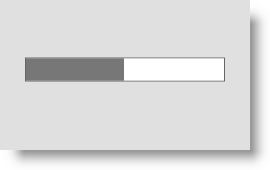
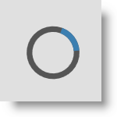
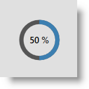
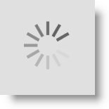
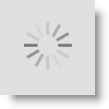
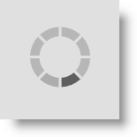

////

|metadata|
{
    "name": "xambusyindicator-animations",
    "tags": ["Getting Started","How Do I"],
    "controlName": ["xamBusyIndicator"],
    "guid": "d214f3c6-f372-4845-a277-fc14bbb40164",  
    "buildFlags": [],
    "createdOn": "2015-08-04T11:49:04.9766533Z"
}
|metadata|
////

= Animations (xamBusyIndicator)

== Topic Overview

=== Purpose

This topic summarizes the available pre-built animations in the  _xamBusyIndicator™_   control.

=== Required background

The following topics are prerequisites to understanding this topic:

[options="header", cols="a,a"]
|====
|Topic|Purpose

| link:xambusyindicator-features-overview.html[Features Overview]
|This topic explains the features supported by the control from developer perspective.

| link:xambusyindicator-visual-elements.html[Visual Elements]
|This topic provides an overview of the visual elements of the control.

|====

=== In this topic

This topic contains the following sections:

* <<_Ref426456818, Specifying Pre-built Animation >>
* <<_Ref426456819, Pre-built Animations >>
* <<_Ref426457443, Related Content >>

** <<_Ref426457447,Topics>>
** <<_Ref426457451,Samples>>

[[_Ref426456818]]
== Specifying Pre-built Animation

=== Overview

Use the link:{RootAssembly}{ApiVersion}~infragistics.controls.interactions.xambusyindicator_members.html[XamBusyIndicator] link:{RootAssembly}{ApiVersion}~infragistics.controls.interactions.xambusyindicator~animation.html[Animation] property to set a specific pre-built animation to the  _xamBusyIndicator_   control.

By default, the `Animation` property initial value is “SpinnerBars”.

=== Property settings

The following table maps the desired configuration to the property settings that manage it.

[options="header", cols="a,a,a"]
|====
|In order to:|Use this property:|And set it to:

|Specify the _xamBusyIndicator_ animation
| link:{RootAssembly}{ApiVersion}~infragistics.controls.interactions.xambusyindicator~animation.html[Animation]
| link:{RootAssembly}{ApiVersion}~infragistics.controls.interactions.busyanimation_members.html[BusyAnimation]

|====

=== Example

You can specify the  _xamBusyIndicator_   animation in one of the following ways:

*In XAML:*

[source,xaml]
----
<ig:XamBusyIndicator IsBusy="True" Animation="Gears" />
----

*In XAML:*

[source,xaml]
----
<ig:XamBusyIndicator IsBusy="True" >
    <ig:XamBusyIndicator.Animation>
        <ig:GearsBusyAnimation />
    </ig:XamBusyIndicator.Animation>
</ig:XamBusyIndicator>
----

*In C#:*

[source,csharp]
----
BusyIndicator.Animation = new GearsBusyAnimation();
----

[[_Ref426456819]]
== Pre-built Animations

=== Pre-built animations summary chart

The following table summarizes the pre-build animations in the  _xamBusyIndicator_   control and supported modes – determinate and indeterminate. Additional details are available after the summary table.

[options="header", cols="a,a"]
|====
|Animation|Has determinate state

|<<_Azure,Azure>>
|image::images/No.png[]

|<<_Ref426404474,Gears>>
|image::images/No.png[]

|<<_Ref426404481,ProgressBar>>
|image::images/Yes.png[]

|<<_Ref427698916,ProgressRing>>
|image::images/Yes.png[]

|<<_Ref426404496,SpinnerBalls>>
|image::images/No.png[]

|<<_Ref426404505,SpinnerBars>>
|image::images/No.png[]

|<<_Ref426404514,SpinnerBarsWave>>
|image::images/No.png[]

|<<_Ref427700108,SpinnerSegmented>>
|image::images/No.png[]

|====

[[_Azure]]

=== Azure

The screenshot below demonstrates how the “Azure” animation looks by default:

Following is the code that implements this example.

*In XAML:*

[source,xaml]
----
<ig:XamBusyIndicator IsBusy="True" Animation="Azure"  />
----

[[_Ref426404474]]

=== Gears

The screenshot below demonstrates how the “Gears” animation looks by default:

Following is the code that implements this example.

*In XAML:*

[source,xaml]
----
<ig:XamBusyIndicator IsBusy="True" Animation="Gears"  />
----

[[_Ref426404481]]

=== ProgressBar

The screenshot below demonstrates how the “ProgressBar” indeterminate animation looks by default:

Following is the code that implements this example.

*In XAML:*

[source,xaml]
----
<ig:XamBusyIndicator IsBusy="True" Animation="ProgressBar" IsIndeterminate="True"  />
----

The screenshot below demonstrates how the “ProgressBar” determinate animation looks by default:

Following is the code that implements this example.

*In XAML:*

[source,xaml]
----
<ig:XamBusyIndicator IsBusy="True" Animation="ProgressBar" IsIndeterminate=" ProgressValue="0.5" />
----

[[_Ref427698916]]

=== ProgressRing

The screenshot below demonstrates how the “ProgressRing” indeterminate animation looks by default:

Following is the code that implements this example.

*In XAML:*

[source,xaml]
----
<ig:XamBusyIndicator IsBusy="True" Animation="ProgressRing" IsIndeterminate="True"/>
----

The screenshot below demonstrates how the “ProgressRing” determinate animation looks by default:

Following is the code that implements this example.

*In XAML:*

[source,xaml]
----
<ig:XamBusyIndicator IsBusy="True" Animation="ProgressRing" IsIndeterminate=" ProgressValue=".5"/>
----

[[_Ref426404496]]

=== SpinnerBalls

The screenshot below demonstrates how the “SpinnerBalls” animation looks by default:

Following is the code that implements this example.

*In XAML:*

[source,xaml]
----
<ig:XamBusyIndicator IsBusy="True" Animation="SpinnerBalls" />
----

[[_Ref426404505]]

=== SpinnerBars

The screenshot below demonstrates how the “SpinnerBars” animation looks by default:

Following is the code that implements this example.

*In XAML:*

[source,xaml]
----
<ig:XamBusyIndicator IsBusy="True" Animation="SpinnerBars" />
----

[[_Ref426404514]]

=== SpinnerBarsWave

The screenshot below demonstrates how the “SpinnerBarsWave” animation looks by default:

Following is the code that implements this example.

*In XAML:*

[source,xaml]
----
<ig:XamBusyIndicator IsBusy="True" Animation="SpinnerBarsWave" />
----

[[_Ref427700108]]

=== SpinnerSegmented

The screenshot below demonstrates how the “SpinnerSegmented” animation looks by default:

Following is the code that implements this example.

*In XAML:*

[source,xaml]
----
<ig:XamBusyIndicator IsBusy="True" Animation="SpinnerSegmented" />
----

[[_Ref426457443]]
== Related Content

[[_Ref426457447]]

=== Topics

The following topic provides additional information related to this topic.

[options="header", cols="a,a"]
|====
|Topic|Purpose

| link:xambusyindicator-configuring-animations-brushes.html[Configuring Animations Brushes]
|This topic explains how to customize the _xamBusyIndicator_ control default animations brushes.

| link:xambusyindicator-applying-custom-animation.html[Applying Custom Animation]
|This topic explains how to apply a custom animation to the _xamBusyIndicator_ control.

| link:xambusyindicator-api-reference.html[API Reference]
|This topic provides reference information about the key classes related to the control.

|====

[[_Ref426457451]]

=== Samples

The following sample provides additional information related to this topic.

[options="header", cols="a,a"]
|====
|Sample|Purpose

| link:{SamplesURL}/busy-indicator/busy-indicator-custom-animation[Using Custom Animations]
|This sample demonstrates how to apply a custom _xamBusyIndicator_ animation.

| link:{SamplesURL}/busy-indicator/busy-indicator-custom-brushes[Customizing Animations Brushes]
|This sample demonstrates how to customize quickly the _xamBusyIndicator_ animations brushes.

|====