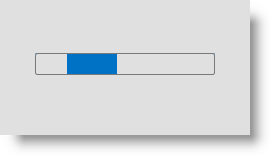

////
|metadata|
{
    "name": "xambusyindicator-applying-custom-animation",
    "tags": ["Getting Started","How Do I","Templating"],
    "controlName": ["xamBusyIndicator"],
    "guid": "93832856-d007-48d8-a791-e50ef41806e1",
    "buildFlags": [],
    "createdOn": "2015-08-19T11:17:29.5161045Z"
}
|metadata|
////

= Applying Custom Animation (xamBusyIndicator)

== Topic Overview

=== Purpose

This topic explains how to apply a custom animation to the  _xamBusyIndicator_™ control.

=== Required background

The following topics are prerequisites to understanding this topic:

[options="header", cols="a,a"]
|====
|Topic|Purpose

| link:xambusyindicator-features-overview.html[Features Overview]
|This topic explains the features supported by the control from developer perspective.

| link:xambusyindicator-visual-elements.html[Visual Elements]
|This topic provides an overview of the visual elements of the control.

|====

=== In this topic

This topic contains the following sections:

* <<_Ref426457437, Applying Custom Animation >>
* <<_Ref427701229, Related Content >>

** <<_Ref427701233,Topics>>
** <<_Ref427701238,Samples>>

[[_Ref426457437]]
== Applying Custom Animation

=== Introduction

In addition to providing a set of pre-built  _xamBusyIndicator_   animations, you can also create a custom animation and apply it to the control.

=== Preview

The following screenshot is a preview of the final result.

=== Steps

The following steps demonstrate how to apply a custom animation to the  _xamBusyIndicator_ control:

. Add XamBusyIndicator to your page
+
Add the _xamBusyIndicator_ to your page:
+
*In XAML:*
+
[source,xaml]
----
<ig:XamBusyIndicator Name="BusyIndicator" IsBusy="True" />
----

. Create a custom DataTemplate
+
Create a custom data template as a `Window` resource:
+
*In XAML:*
+
[source,xaml]
----
<Window.Resources>
    
    <DataTemplate x:Key="CustomBusyIndicatorTemplate">
        <ProgressBar Height="22" Width="180" IsIndeterminate="True" Style="{StaticResource ProgressBarStyle}"  />
    </DataTemplate>
</Window.Resources>
----

. Create a CustomBusyAnimation object and set it to the Animation property
+
Use the link:{ApiPlatform}v{ProductVersion}~infragistics.controls.interactions.busyanimations_members.html[BusyAnimations] class link:{ApiPlatform}v{ProductVersion}~infragistics.controls.interactions.busyanimations~createcustomanimation.html[CreateCustomAnimation] method to create a link:{ApiPlatform}v{ProductVersion}~infragistics.controls.interactions.custombusyanimation_members.html[CustomBusyAnimation] object and set it to the link:{ApiPlatform}v{ProductVersion}~infragistics.controls.interactions.xambusyindicator_members.html[XamBusyIndicator] link:{ApiPlatform}v{ProductVersion}~infragistics.controls.interactions.xambusyindicator~animation.html[Animation] property in code-behind:
+
*In C#:*
+
[source,csharp]
----
CustomBusyAnimation customAnimation = BusyAnimations.CreateCustomAnimation(this.Resources["CustomBusyIndicatorTemplate"] as DataTemplate);
BusyIndicator.Animation = customAnimation;
----
+
*In Visual Basic:*
+
[source,vb]
----
Dim customAnimation As CustomBusyAnimation = BusyAnimations.CreateCustomAnimation(TryCast(Me.Resources("CustomBusyIndicatorTemplate"), DataTemplate))
BusyIndicator.Animation = customAnimation
----
+
Or use the following code in XAML:
+
*In XAML:*
+
[source,xaml]
----
<ig:XamBusyIndicator.Animation>
    <ig:CustomBusyAnimation DataTemplate="{StaticResource CustomBusyIndicatorTemplate}" />
</ig:XamBusyIndicator.Animation>
----

[[_Ref382317785]]
=== Full code

Following is the full code for this procedure:

[start=1]
. Creating a custom template as a `Window` resource:
+
*In XAML:*
+
[source,xaml]
----
<Window.Resources>
    
    <DataTemplate x:Key="CustomBusyIndicatorTemplate">
        <ProgressBar Height="22" Width="180" IsIndeterminate="True" Style="{StaticResource ProgressBarStyle}"  />
    </DataTemplate>
</Window.Resources>
----

[start=2]
. Adding the  _xamBusyIndicator_   to the page and setting a link:{ApiPlatform}v{ProductVersion}~infragistics.controls.interactions.custombusyanimation_members.html[CustomBusyAnimation] to the `Animation` property:
+
*In XAML:*
+
[source,xaml]
----
<ig:XamBusyIndicator Name="BusyIndicator" IsBusy="True">
    <ig:XamBusyIndicator.Animation>
        <ig:CustomBusyAnimation DataTemplate="{StaticResource CustomBusyIndicatorTemplate}" />
    </ig:XamBusyIndicator.Animation>
</ig:XamBusyIndicator>
----

[[_Ref427701229]]
== Related Content

[[_Ref427701233]]
=== Topics

The following topics provide additional information related to this topic.

[options="header", cols="a,a"]
|====
|Topic|Purpose

| link:xambusyindicator-animations.html[Animations]
|This topic summarizes the available pre-built animations in the _xamBusyIndicator_ control and their configurable aspects.

| link:xambusyindicator-api-reference.html[API Reference]
|This topic provides reference information about the key classes related to the control.

|====

[[_Ref427701238]]
=== Samples

The following sample provides additional information related to this topic.

[options="header", cols="a,a"]
|====
|Sample|Purpose

| link:{SamplesURL}/busy-indicator/busy-indicator-custom-animation[Using Custom Animations]
|This sample demonstrates how to apply a custom _xamBusyIndicator_ animation.

|====