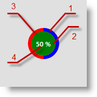
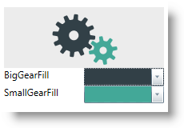

////
|metadata|
{
    "name": "xambusyindicator-configuring-animations-brushes",
    "tags": ["Getting Started","How Do I","Styling"],
    "controlName": ["xamBusyIndicator"],
    "guid": "1b6d7184-7bf8-4190-81dc-128cebd327a5",
    "buildFlags": [],
    "createdOn": "2015-08-22T09:08:38.4703434Z"
}
|metadata|
////

= Configuring Animations Brushes (xamBusyIndicator)

== Topic Overview

=== Purpose

This topic explains how to customize the  _xamBusyIndicator™_   control default animations brushes.

=== Required background

The following topics are prerequisites to understanding this topic:

[options="header", cols="a,a"]
|====
|Topic|Purpose

| link:xambusyindicator-features-overview.html[Features Overview]
|This topic explains the features supported by the control from developer perspective.

| link:xambusyindicator-visual-elements.html[Visual Elements]
|This topic provides an overview of the visual elements of the control.

| link:xambusyindicator-animations.html[Animations]
|This topic summarizes the available pre-built animations in the _xamBusyIndicator_ control.

| link:xamcolorpicker-adding-xamcolorpicker-to-your-page.html[Adding xamColorPicker to Your Page]
|This topic demonstrates how to add a _xamColorPicker_ control to your page using XAML and procedural code.

|====

=== In this topic

This topic contains the following sections:

* <<_Ref428008502, Animations Brushes Configuration Summary >>
* <<_Ref428195809, Changing Animations Brushes in Runtime >>
* <<_Ref428008512, Related Content >>

** <<_Ref428008517,Topics>>
** <<_Ref428008521,Samples>>

[[_Ref428008502]]
== Animations Brushes Configuration Summary

=== Animations brushes configuration summary chart

The following table summarizes the pre-build animations in the  _xamBusyIndicator_   control, their customizable brushes and available modes – determinate and indeterminate. Additional details are available after the summary table.

[options="header", cols="a,a,a"]
|====
|Animation|Configurable brushes|Has determinate state

|<<_Azure,Configuring Azure Animation Brushes>>
| link:{RootAssembly}{ApiVersion}~infragistics.controls.interactions.azurebusyanimation~lowerelementsfill.html[LowerElementsFill] 

link:{RootAssembly}{ApiVersion}~infragistics.controls.interactions.azurebusyanimation~upperelementsfill.html[UpperElementsFill]
|image::images/No.png[]

|<<_Ref428004594,Configuring Gears Animation Brushes>>
| link:{RootAssembly}{ApiVersion}~infragistics.controls.interactions.gearsbusyanimation~biggearfill.html[BigGearFill] 

link:{RootAssembly}{ApiVersion}~infragistics.controls.interactions.gearsbusyanimation~smallgearfill.html[SmallGearFill]
|image::images/No.png[]

|<<_Ref428005877,Configuring ProgressRing Animation Brushes>>
| link:{RootAssembly}{ApiVersion}~infragistics.controls.interactions.progressringbusyanimation~ringbackground.html[RingBackground] 

link:{RootAssembly}{ApiVersion}~infragistics.controls.interactions.progressringbusyanimation~background.html[Background] 

link:{RootAssembly}{ApiVersion}~infragistics.controls.interactions.progressringbusyanimation~foreground.html[Foreground] 

link:{RootAssembly}{ApiVersion}~infragistics.controls.interactions.progressringbusyanimation~ringfill.html[RingFill]
|image::images/Yes.png[]

|<<_Ref428006558,Configuring SpinnerBalls Animation Brush>>
| link:{RootAssembly}{ApiVersion}~infragistics.controls.interactions.singlebrushbusyanimation`1~animationfill.html[AnimationFill]
|image::images/No.png[]

|<<_Ref428007454,Configuring SpinnerBars Animation Brush>>
| link:{RootAssembly}{ApiVersion}~infragistics.controls.interactions.singlebrushbusyanimation`1~animationfill.html[AnimationFill]
|image::images/No.png[]

|<<_Ref428008116,Configuring SpinnerBarsWave Animation Brush>>
| link:{RootAssembly}{ApiVersion}~infragistics.controls.interactions.singlebrushbusyanimation`1~animationfill.html[AnimationFill]
|image::images/No.png[]

|<<_Ref428199374,Configuring SpinnerSegmented Animation Brush>>
| link:{RootAssembly}{ApiVersion}~infragistics.controls.interactions.singlebrushbusyanimation`1~animationfill.html[AnimationFill]
|image::images/No.png[]

|====

[[_Azure]]
== Configuring Azure Animation Brushes

=== Overview

Use the link:{RootAssembly}{ApiVersion}~infragistics.controls.interactions.azurebusyanimation_members.html[AzureBusyAnimation] link:{RootAssembly}{ApiVersion}~infragistics.controls.interactions.azurebusyanimation~lowerelementsfill.html[LowerElementsFill] and link:{RootAssembly}{ApiVersion}~infragistics.controls.interactions.azurebusyanimation~upperelementsfill.html[UpperElementsFill] properties to change the default Azure animation brushes.

.Note
[NOTE]
====
These properties are used for initialization and are not bindable dependency properties.
====

In order to change the animation brushes in runtime, see the <<_Ref428195809,Changing Animations Brushes in Runtime>> section.

=== Example

The screenshot below demonstrates how the  _xamBusyIndicator_   Azure animation looks as a result of the following settings:

[options="header", cols="a,a"]
|====
|Property|Value

| link:{RootAssembly}{ApiVersion}~infragistics.controls.interactions.azurebusyanimation~lowerelementsfill.html[LowerElementsFill]
|_#FFB8D432_

| link:{RootAssembly}{ApiVersion}~infragistics.controls.interactions.azurebusyanimation~upperelementsfill.html[UpperElementsFill]
|_#FF59B4D9_

|====

Following is the code that implements this example.

*In XAML:*

[source,xaml]
----
<ig:XamBusyIndicator IsBusy="True" Name="Azure" >
    <ig:XamBusyIndicator.Animation>
        <ig:AzureBusyAnimation LowerElementsFill="#FFB8D432" UpperElementsFill="#FF59B4D9"/>
    </ig:XamBusyIndicator.Animation>
</ig:XamBusyIndicator>
----

[[_Ref428004594]]
== Configuring Gears Animation Brushes

=== Overview

Use the link:{RootAssembly}{ApiVersion}~infragistics.controls.interactions.gearsbusyanimation_members.html[GearsBusyAnimation] link:{RootAssembly}{ApiVersion}~infragistics.controls.interactions.gearsbusyanimation~biggearfill.html[BigGearFill] and link:{RootAssembly}{ApiVersion}~infragistics.controls.interactions.gearsbusyanimation~smallgearfill.html[SmallGearFill] properties to change the default Gears animation brushes.

.Note
[NOTE]
====
These properties are used for initialization and are not bindable dependency properties.
====

In order to change the animation brushes in runtime, see the <<_Ref428195809,Changing Animations Brushes in Runtime>> section.

=== Example

The screenshot below demonstrates how the  _xamBusyIndicator_   Gears animation looks as a result of the following settings:

[options="header", cols="a,a"]
|====
|Property|Value

| link:{RootAssembly}{ApiVersion}~infragistics.controls.interactions.gearsbusyanimation~biggearfill.html[BigGearFill]
|_#FF324047_

| link:{RootAssembly}{ApiVersion}~infragistics.controls.interactions.gearsbusyanimation~smallgearfill.html[SmallGearFill]
|_#FF43A898_

|====

Following is the code that implements this example.

*In XAML:*

[source,xaml]
----
<ig:XamBusyIndicator IsBusy="True" Name="Gears" >
    <ig:XamBusyIndicator.Animation>
        <ig:GearsBusyAnimation BigGearFill="#FF324047" SmallGearFill="#FF43A898"/>
    </ig:XamBusyIndicator.Animation>
</ig:XamBusyIndicator>
----

[[_Ref428005877]]
== Configuring ProgressRing Animation Brushes

=== Overview

Use the link:{RootAssembly}{ApiVersion}~infragistics.controls.interactions.progressringbusyanimation_members.html[ProgressRingBusyAnimation] link:{RootAssembly}{ApiVersion}~infragistics.controls.interactions.progressringbusyanimation~ringbackground.html[RingBackground], link:{RootAssembly}{ApiVersion}~infragistics.controls.interactions.progressringbusyanimation~background.html[Background], link:{RootAssembly}{ApiVersion}~infragistics.controls.interactions.progressringbusyanimation~foreground.html[Foreground] and link:{RootAssembly}{ApiVersion}~infragistics.controls.interactions.progressringbusyanimation~ringfill.html[RingFill] properties to change the default ProgressRing animation brushes.

.Note
[NOTE]
====
These properties are used for initialization and are not bindable dependency properties.
====

In order to change the animation brushes in runtime, see the <<_Ref428195809,Changing Animations Brushes in Runtime>> section.

=== Example

The screenshot below demonstrates how the  _xamBusyIndicator_   ProgressRing animation looks as a result of the following settings:

[options="header", cols="a,a"]
|====
|Property|Value

| link:{RootAssembly}{ApiVersion}~infragistics.controls.interactions.progressringbusyanimation~ringbackground.html[RingBackground]
|_Red_

| link:{RootAssembly}{ApiVersion}~infragistics.controls.interactions.progressringbusyanimation~background.html[Background]
|_Green_

| link:{RootAssembly}{ApiVersion}~infragistics.controls.interactions.progressringbusyanimation~foreground.html[Foreground]
|_White_

| link:{RootAssembly}{ApiVersion}~infragistics.controls.interactions.progressringbusyanimation~ringfill.html[RingFill]
|_Blue_

|====

[start=1]
. RingFill
[start=2]
. Background
[start=3]
. RingBackground
[start=4]
. Foreground

Following is the code that implements this example.

*In XAML:*

[source,xaml]
----
<ig:XamBusyIndicator IsBusy="True" IsIndeterminate="False" Name="ProgressRingDeterminate" ProgressValue=".5" >
    <ig:XamBusyIndicator.Animation>
        <ig:ProgressRingBusyAnimation RingBackground="Red" Background="Green" Foreground="White" RingFill="Blue"  />
    </ig:XamBusyIndicator.Animation>
</ig:XamBusyIndicator>
----

[[_Ref428006558]]
== Configuring SpinnerBalls Animation Brush

=== Overview

Use the link:{RootAssembly}{ApiVersion}~infragistics.controls.interactions.singlebrushbusyanimation`1_members.html[SingleBrushBusyAnimation] link:{RootAssembly}{ApiVersion}~infragistics.controls.interactions.singlebrushbusyanimation`1~animationfill.html[AnimationFill] property to change the default SpinnerBalls animation brush.

.Note
[NOTE]
====
This property is used for initialization and is not a bindable dependency property.
====

In order to change the animation brushes in runtime, see the <<_Ref428195809,Changing Animations Brushes in Runtime>> section.

=== Example

The screenshot below demonstrates how the  _xamBusyIndicator_   SpinnerBalls animation looks as a result of the following settings:

[options="header", cols="a,a"]
|====
|Property|Value

| link:{RootAssembly}{ApiVersion}~infragistics.controls.interactions.singlebrushbusyanimation`1~animationfill.html[AnimationFill]
|_#FF609BAE_

|====

Following is the code that implements this example.

*In XAML:*

[source,xaml]
----
<ig:XamBusyIndicator IsBusy="True" Name="SpinnerBalls">
    <ig:XamBusyIndicator.Animation>
        <ig:SpinnerBallsBusyAnimation AnimationFill="#FF609BAE" />
    </ig:XamBusyIndicator.Animation>
</ig:XamBusyIndicator>
----

[[_Ref428007454]]
== Configuring SpinnerBars Animation Brush

=== Overview

Use the link:{RootAssembly}{ApiVersion}~infragistics.controls.interactions.singlebrushbusyanimation`1_members.html[SingleBrushBusyAnimation] link:{RootAssembly}{ApiVersion}~infragistics.controls.interactions.singlebrushbusyanimation`1~animationfill.html[AnimationFill] property to change the default SpinnerBars animation brush.

.Note
[NOTE]
====
This property is used for initialization and is not a bindable dependency property.
====

In order to change the animation brushes in runtime, see the <<_Ref428195809,Changing Animations Brushes in Runtime>> section.

=== Example

The screenshot below demonstrates how the  _xamBusyIndicator_   SpinnerBars animation looks as a result of the following settings:

[options="header", cols="a,a"]
|====
|Property|Value

| link:{RootAssembly}{ApiVersion}~infragistics.controls.interactions.singlebrushbusyanimation`1~animationfill.html[AnimationFill]
|_#FF3C7B82_

|====

Following is the code that implements this example.

*In XAML:*

[source,xaml]
----
<ig:XamBusyIndicator IsBusy="True" Name="SpinnerBars" >
    <ig:XamBusyIndicator.Animation>
        <ig:SpinnerBarsBusyAnimation AnimationFill="#FF3C7B82" />
    </ig:XamBusyIndicator.Animation>
</ig:XamBusyIndicator>
----

[[_Ref428008116]]
== Configuring SpinnerBarsWave Animation Brush

=== Overview

Use the link:{RootAssembly}{ApiVersion}~infragistics.controls.interactions.singlebrushbusyanimation`1_members.html[SingleBrushBusyAnimation] link:{RootAssembly}{ApiVersion}~infragistics.controls.interactions.singlebrushbusyanimation`1~animationfill.html[AnimationFill] property to change the default SpinnerBarsWave animation brush.

.Note
[NOTE]
====
This property is used for initialization and is not a bindable dependency property.
====

In order to change the animation brushes in runtime, see the <<_Ref428195809,Changing Animations Brushes in Runtime>> section.

=== Example

The screenshot below demonstrates how the  _xamBusyIndicator_   SpinnerBarsWave animation looks as a result of the following settings:

[options="header", cols="a,a"]
|====
|Property|Value

| link:{RootAssembly}{ApiVersion}~infragistics.controls.interactions.singlebrushbusyanimation`1~animationfill.html[AnimationFill]
|_#FF3C7B82_

|====

Following is the code that implements this example.

*In XAML:*

[source,xaml]
----
<ig:XamBusyIndicator IsBusy="True" Name="SpinnerBarsWave" >
    <ig:XamBusyIndicator.Animation>
        <ig:SpinnerBarsWaveBusyAnimation AnimationFill="#FF3C7B82" />
    </ig:XamBusyIndicator.Animation>
</ig:XamBusyIndicator>
----

[[_Ref428199374]]
== Configuring SpinnerSegmented Animation Brush

=== Overview

Use the link:{RootAssembly}{ApiVersion}~infragistics.controls.interactions.singlebrushbusyanimation`1_members.html[SingleBrushBusyAnimation] link:{RootAssembly}{ApiVersion}~infragistics.controls.interactions.singlebrushbusyanimation`1~animationfill.html[AnimationFill] property to change the default SpinnerSegmented animation brush.

.Note
[NOTE]
====
This property is used for initialization and is not a bindable dependency property.
====

In order to change the animation brushes in runtime, see the <<_Ref428195809,Changing Animations Brushes in Runtime>> section.

=== Example

The screenshot below demonstrates how the  _xamBusyIndicator_   SpinnerSegmented animation looks as a result of the following settings:

[options="header", cols="a,a"]
|====
|Property|Value

| link:{RootAssembly}{ApiVersion}~infragistics.controls.interactions.singlebrushbusyanimation`1~animationfill.html[AnimationFill]
|_#FF43A898_

|====

Following is the code that implements this example.

*In XAML:*

[source,xaml]
----
<ig:XamBusyIndicator IsBusy="True" Name="SpinnerSegmented" >
    <ig:XamBusyIndicator.Animation>
        <ig:SpinnerSegmentedBusyAnimation AnimationFill="#FF43A898" />
    </ig:XamBusyIndicator.Animation>
</ig:XamBusyIndicator>
----

[[_Ref428195809]]
== Changing Animations Brushes in Runtime

=== Introduction

The following example explains how to bind the  _xamBusyIndicator_   Gears animation brushes and change them in runtime using the  _xamColorPicker_   control.

Use the link:{RootAssembly}{ApiVersion}~infragistics.controls.interactions.primitives.gearsbusyanimationpresenter_members.html[GearsBusyAnimationPresenter] link:{RootAssembly}{ApiVersion}~infragistics.controls.interactions.primitives.gearsbusyanimationpresenter~biggearfill.html[BigGearFill] and link:{RootAssembly}{ApiVersion}~infragistics.controls.interactions.primitives.gearsbusyanimationpresenter~smallgearfill.html[SmallGearFill] properties to bind to the  _xamColorPicker_   link:{ApiPlatform}controls.editors.xamcolorpicker{ApiVersion}~infragistics.controls.editors.xamcolorpicker~selectedcolorpreview.html[SelectedColorPreview] property in order to change the animations colors dynamically.

Unlike the link:{RootAssembly}{ApiVersion}~infragistics.controls.interactions.gearsbusyanimation_members.html[GearsBusyAnimation] link:{RootAssembly}{ApiVersion}~infragistics.controls.interactions.gearsbusyanimation~biggearfill.html[BigGearFill] and link:{RootAssembly}{ApiVersion}~infragistics.controls.interactions.gearsbusyanimation~smallgearfill.html[SmallGearFill] properties which are not bindable and used only for initialization, the link:{RootAssembly}{ApiVersion}~infragistics.controls.interactions.primitives.gearsbusyanimationpresenter_members.html[GearsBusyAnimationPresenter] link:{RootAssembly}{ApiVersion}~infragistics.controls.interactions.primitives.gearsbusyanimationpresenter~biggearfill.html[BigGearFill] and link:{RootAssembly}{ApiVersion}~infragistics.controls.interactions.primitives.gearsbusyanimationpresenter~smallgearfill.html[SmallGearFill] properties are bindable dependency properties.

=== Preview

The following screenshot is a preview of the final result.

=== Prerequisites

To complete the procedure, you need the following:

* Add the following references to your project:

** {ApiPlatform}Controls.Editors.XamColorPicker.{ApiVersion}
** {ApiPlatform}Controls.Editors.XamSlider.{ApiVersion}
** {ApiPlatform}{ApiVersion}

=== Steps

The following steps demonstrate how to change the Gears animations brushes in runtime.

. Add the xamBusyIndicator control to your page
+
*In XAML:*
+
[source,xaml]
----
<ig:XamBusyIndicator Name="Gears" IsBusy="True" Animation="Gears" Width="200" />
----

. Add a xamColorPicker control to your page and bind its SelectedColorPreview property to a xamBusyIndicator animation brush
+
*In XAML:*
+
[source,xaml]
----
<ig:XamColorPicker SelectedColor="#FF324047" Width="100" SelectedColorPreview="{Binding ElementName=Gears, Path=AnimationPresenter.BigGearFill, Mode=TwoWay, Converter={StaticResource ColorToSolidColorBrushValueConverter}}" />
----

[[_Ref382317785]]

=== Full code

Following is the full code for this procedure.

*In XAML:*

[source,xaml]
----
<Grid>
    <Grid.Resources>
        <local:ColorToSolidColorBrushValueConverter x:Key="ColorToSolidColorBrushValueConverter" />
    </Grid.Resources>
    <StackPanel>
        <ig:XamBusyIndicator Name="Gears" IsBusy="True" Animation="Gears" Width="200" />
        <StackPanel Orientation="Horizontal" HorizontalAlignment="Center">
            <TextBlock Text="BigGearFill" Width="100" />
            <ig:XamColorPicker SelectedColor="#FF324047" Width="100"
            SelectedColorPreview="{Binding ElementName=Gears, Path=AnimationPresenter.BigGearFill, Mode=TwoWay, Converter={StaticResource ColorToSolidColorBrushValueConverter}}" />
        </StackPanel>
        <StackPanel Orientation="Horizontal" HorizontalAlignment="Center">
            <TextBlock Text="SmallGearFill" Width="100"/>
            <ig:XamColorPicker SelectedColor="#FF43A898" Width="100"
            SelectedColorPreview="{Binding ElementName=Gears, Path=AnimationPresenter.SmallGearFill, Mode=TwoWay, Converter={StaticResource ColorToSolidColorBrushValueConverter}}" />
        </StackPanel>                  
    </StackPanel>
</Grid>
----

*In C#:*

[source,csharp]
----
public class ColorToSolidColorBrushValueConverter : IValueConverter
{
    public object Convert(object value, Type targetType, object parameter, CultureInfo culture)
    {
        var result = new Color();
        if (value is SolidColorBrush)
            result = ((SolidColorBrush)value).Color;
            return result;
    }
     public object ConvertBack(object value, Type targetType, object parameter, CultureInfo culture)
     {
         SolidColorBrush result = null;
         if (value is Color)
             result = new SolidColorBrush((Color)value);
         return result;
    }
}
----

*In Visual Basic:*

[source,vb]
----
Public Class ColorToSolidColorBrushValueConverter
      Implements IValueConverter
      Public Function Convert(value As Object, targetType As Type, parameter As Object, culture As CultureInfo) As Object
            Dim result = New Color()
            If TypeOf value Is SolidColorBrush Then
                  result = DirectCast(value, SolidColorBrush).Color
            End If
            Return result
      End Function
      Public Function ConvertBack(value As Object, targetType As Type, parameter As Object, culture As CultureInfo) As Object
            Dim result As SolidColorBrush = Nothing
            If TypeOf value Is Color Then
                  result = New SolidColorBrush(DirectCast(value, Color))
            End If
            Return result
      End Function
End Class
----

[[_Ref428008512]]
== Related Content

[[_Ref428008517]]

=== Topics

The following topics provide additional information related to this topic.

[options="header", cols="a,a"]
|====
|Topic|Purpose

| link:xambusyindicator-configuring-busy-indicator-display.html[Configuring Busy Indicator Display]
|This topic explains how to display the _xamBusyIndicator_ control.

| link:xambusyindicator-configuring-busy-content.html[Configuring Busy Content]
|This topic explains how to configure the _xamBusyIndicator_ busy content.

| link:xambusyindicator-configuring-delayed-display.html[Configuring Delayed Display]
|This topic explains how to configure the delay before displaying the _xamBusyIndicator_ control.

| link:xambusyindicator-configuring-focus-target.html[Configuring Focus Target]
|This topic explains how to configure explicitly which `UIElement` receives the focus when the _xamBusyIndicator_ is no longer active.

| link:xambusyindicator-configuring-determinate-xambusyindicator.html[Configuring Determinate xamBusyIndicator]
|This topic explains how to configure the _xamBusyIndicator_ control to display determine progress.

| link:xambusyindicator-configuring-overlay-style.html[Configuring Overlay Style]
|This topic explains how to customize the _xamBusyIndicator_ overlay style.

|====

[[_Ref428008521]]

=== Samples

The following sample provides additional information related to this topic.

[options="header", cols="a,a"]
|====
|Sample|Purpose

| link:{SamplesURL}/busy-indicator/busy-indicator-configuration[Busy Indicator Configuration]
|This sample demonstrates the configuration of the _xamBusyIndicator_ control key features.

| link:{SamplesURL}/busy-indicator/busy-indicator-custom-brushes[Customizing Animations Brushes]
|This sample demonstrates how to customize quickly the _xamBusyIndicator_ control animations brushes.

|====