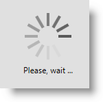
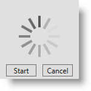
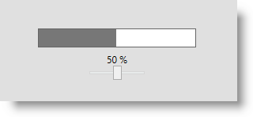

////

|metadata|
{
    "name": "xambusyindicator-configuring-busy-content",
    "tags": ["Getting Started","How Do I"],
    "controlName": ["xamBusyIndicator"],
    "guid": "a30b36d9-abd9-4113-b69f-a0cd00c222e0",  
    "buildFlags": [],
    "createdOn": "2015-08-04T11:24:13.7529187Z"
}
|metadata|
////

= Configuring Busy Content (xamBusyIndicator)

== Topic Overview

=== Purpose

This topic explains how to configure the  _xamBusyIndicator_   busy content.

=== Required background

The following topics are prerequisites to understanding this topic:

[options="header", cols="a,a"]
|====
|Topic|Purpose

| link:xambusyindicator-features-overview.html[Features Overview]
|This topic explains the features supported by the control from developer perspective.

| link:xambusyindicator-visual-elements.html[Visual Elements]
|This topic provides an overview of the visual elements of the control.

|====

[[_Ref426237144]]

=== In this topic

This topic contains the following sections:

* <<_Ref426381889, Configuring Busy Content >>
* <<_Ref427774342, Applying Busy Content Template >>
* <<_Ref426366458, Related Content >>

** <<_Ref426366463,Topics>>
** <<_Ref426366498,Samples>>

[[_Ref426381889]]
== Configuring Busy Content

[[_Ref426381902]]

=== Overview

The  _xamBusyIndicator_   busy content is the content under the animation area.

Use the link:{RootAssembly}{ApiVersion}~infragistics.controls.interactions.xambusyindicator_members.html[XamBusyIndicator] link:{RootAssembly}{ApiVersion}~infragistics.controls.interactions.xambusyindicator~busycontent.html[BusyContent] property to place a text or a `FrameworkElement`.

Two examples follow to demonstrate both setting text and a `FrameworkElement` for  _xamBusyIndicator_   busy content.

By default, the initial value of the `BusyContent` property is `null`.

=== Property settings

The following table maps the desired configuration to the property settings that manage it.

[options="header", cols="a,a,a"]
|====
|In order to:|Use this property:|And set it to:

|Configure the displayed busy content
| link:{RootAssembly}{ApiVersion}~infragistics.controls.interactions.xambusyindicator~busycontent.html[BusyContent]
|`object`

|====

[[_Ref426381917]]

=== Setting text as busy content - Example

The screenshot below demonstrates how the  _xamBusyIndicator_   looks as a result of the following settings:

[options="header", cols="a,a"]
|====
|Property|Value

| link:{RootAssembly}{ApiVersion}~infragistics.controls.interactions.xambusyindicator~busycontent.html[BusyContent]
| _"Please, wait ..."_ 

|====

Following is the code that implements this example.

*In XAML:*

[source,xaml]
----
<ig:XamBusyIndicator IsBusy="True" BusyContent="Please, wait ..." />
----

[[_Ref426381921]]

=== Setting a FrameworkElement as busy content - Example

The screenshot below demonstrates how the  _xamBusyIndicator_   looks as a result of the following settings:

[options="header", cols="a,a"]
|====
|Property|Value

| link:{RootAssembly}{ApiVersion}~infragistics.controls.interactions.xambusyindicator~busycontent.html[BusyContent]
|_<StackPanel Orientation="Horizontal" HorizontalAlignment="Center">_ 

_<Button Content="Start" Width="50" Margin="5"/>_ 

_<Button Content="Cancel" Width="50" Margin="5" />_ 

_</StackPanel>_

|====

Following is the code that implements this example.

*In XAML:*

[source,xaml]
----
<ig:XamBusyIndicator IsBusy="True">
    <ig:XamBusyIndicator.BusyContent>
        <StackPanel Orientation="Horizontal" HorizontalAlignment="Center">
            <Button Content="Start" Width="50" Margin="5"/>
            <Button Content="Cancel" Width="50" Margin="5" />
        </StackPanel>
    </ig:XamBusyIndicator.BusyContent>
</ig:XamBusyIndicator>
----

[[_Ref427774342]]
== Applying Busy Content Template

=== Overview

Use the link:{RootAssembly}{ApiVersion}~infragistics.controls.interactions.xambusyindicator_members.html[XamBusyIndicator] link:{RootAssembly}{ApiVersion}~infragistics.controls.interactions.xambusyindicator~busycontenttemplate.html[BusyContentTemplate] property to apply a custom template to the  _xamBusyIndicator_   busy content.

=== Property settings

The following table maps the desired configuration to the property settings that manage it.

[options="header", cols="a,a,a"]
|====
|In order to:|Use this property:|And set it to:

|Apply a custom template to the busy content
| link:{RootAssembly}{ApiVersion}~infragistics.controls.interactions.xambusyindicator~busycontenttemplate.html[BusyContentTemplate]
|`DataTemplate`

|====

=== Example

The screenshot below demonstrates how the  _xamBusyIndicator_   would look as a result of the following settings:

[options="header", cols="a,a"]
|====
|Property|Value

| link:{RootAssembly}{ApiVersion}~infragistics.controls.interactions.xambusyindicator~busycontenttemplate.html[BusyContentTemplate]
|_<DataTemplate>_ 

_<StackPanel Orientation="Vertical">_ 

_<TextBlock Text="{Binding ProgressValue, StringFormat={}{0:P0}}" />_ 

_<Slider Maximum="1" Minimum="0" Width="80" Value="{Binding ProgressValue}" />_ 

_</StackPanel>_ 

_</DataTemplate>_

|====

Following is the code that implements this example.

*In XAML:*

[source,xaml]
----
<ig:XamBusyIndicator IsBusy="True" Animation="ProgressBar"
                     BusyContent="{Binding RelativeSource={RelativeSource Self}}"
                     ProgressValue=".5">
    <ig:XamBusyIndicator.BusyContentTemplate>
        <DataTemplate>
            <StackPanel Orientation="Vertical">
                <TextBlock Text="{Binding ProgressValue, StringFormat={}{0:P0}}" />
                <Slider Maximum="1" Minimum="0" Width="80" Value="{Binding ProgressValue}" />
            </StackPanel>
        </DataTemplate>
    </ig:XamBusyIndicator.BusyContentTemplate>
</ig:XamBusyIndicator>
----

[[_Ref426366458]]
== Related Content

[[_Ref426366463]]

=== Topics

The following topics provide additional information related to this topic.

[options="header", cols="a,a"]
|====
|Topic|Purpose

| link:xambusyindicator-configuring-busy-indicator-display.html[Configuring Busy Indicator Display]
|This topic explains how to display the _xamBusyIndicator_ control.

| link:xambusyindicator-configuring-delayed-display.html[Configuring Delayed Display]
|This topic explains how to configure the delay before displaying the _xamBusyIndicator_ control.

| link:xambusyindicator-configuring-focus-target.html[Configuring Focus Target]
|This topic explains how to configure explicitly which UIElement receives the focus when the _xamBusyIndicator_ is no longer active.

| link:xambusyindicator-configuring-determinate-xambusyindicator.html[Configuring Determinate xamBusyIndicator]
|This topic explains how to configure the _xamBusyIndicator_ control to display determine progress.

| link:xambusyindicator-configuring-overlay-style.html[Configuring Overlay Style]
|This topic explains how to customize the _xamBusyIndicator_ overlay style.

| link:xambusyindicator-configuring-animations-brushes.html[Configuring Animations Brushes]
|This topic explains how to customize the _xamBusyIndicator_ control default animations brushes.

|====

[[_Ref426366498]]

=== Samples

The following sample provides additional information related to this topic.

[options="header", cols="a,a"]
|====
|Sample|Purpose

| link:{SamplesURL}/busy-indicator/busy-indicator-configuration[Busy Indicator Configuration]
|This sample demonstrates the configuration of the _xamBusyIndicator_ control key features.

| link:{SamplesURL}/busy-indicator/busy-indicator-xamgrid[Busy Content]
|This sample demonstrates how to customize the Busy Content of the _xamBusyIndicator_ control.

|====