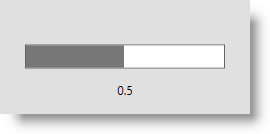

////

|metadata|
{
    "name": "xambusyindicator-configuring-determinate-xambusyindicator",
    "tags": ["Getting Started","How Do I"],
    "controlName": ["xamBusyIndicator"],
    "guid": "c4a8e024-a5e0-479b-af63-fd2cb9303366",  
    "buildFlags": [],
    "createdOn": "2015-08-04T11:30:29.9464131Z"
}
|metadata|
////

= Configuring Determinate Progress Bar (xamBusyIndicator)

== Topic Overview

=== Purpose

This topic explains how to configure the  _xamBusyIndicator™_   control to display determinate progress.

=== Required background

The following topics are prerequisites to understanding this topic:

[options="header", cols="a,a"]
|====
|Topic|Purpose

| link:xambusyindicator-features-overview.html[Features Overview]
|This topic explains the features supported by the control from developer perspective.

| link:xambusyindicator-visual-elements.html[Visual Elements]
|This topic provides an overview of the visual elements of the control.

| link:xambusyindicator-adding-to-your-page.html[Adding xamBusyIndicator to Your Page]
|This topic provides detailed instructions to help you get up and running as soon as possible with the _xamBusyIndicator_ control.

|====

=== In this topic

This topic contains the following sections:

* <<_Ref426475884, Configuring Determinate Progress Bar >>
* <<_Ref426475890, Related Content >>

** <<_Ref426475894,Topics>>
** <<_Ref426475899,Samples>>

[[_Ref426362477]]
[[_Ref426475884]]
== Configuring Determinate Progress Bar

[[_Ref426391669]]

=== Overview

The  _xamBusyIndicator_   control provides Progress Bar animation that has two modes – determinate and indeterminate.

Use the link:{RootAssembly}{ApiVersion}~infragistics.controls.interactions.xambusyindicator~animation.html[Animation] property to set the animation to pre-built type `ProgressBar`.

Use the link:{RootAssembly}{ApiVersion}~infragistics.controls.interactions.xambusyindicator~isindeterminate.html[IsIndeterminate] property and set it to `False` in order to switch the animation to determinate mode.

Use the link:{RootAssembly}{ApiVersion}~infragistics.controls.interactions.xambusyindicator~progressvalue.html[ProgressValue] property to set progress value.

.Note
[NOTE]
====
The `ProgressValue` property takes values in the range from 0 to 1.
====

[[_Ref426391673]]

=== Property settings

The following table maps the desired behavior to the property settings that manage it.

[options="header", cols="a,a,a"]
|====
|In order to:|Use this property:|And set it to:

|Set a progress bar animation
| link:{RootAssembly}{ApiVersion}~infragistics.controls.interactions.xambusyindicator~animation.html[Animation]
|`ProgressBar`

|Set determinate animation mode
| link:{RootAssembly}{ApiVersion}~infragistics.controls.interactions.xambusyindicator~isindeterminate.html[IsIndeterminate]
|`False`

|Set progress value
| link:{RootAssembly}{ApiVersion}~infragistics.controls.interactions.xambusyindicator~progressvalue.html[ProgressValue]
|`double?`

|====

[[_Ref426391677]]

=== Example

The following screenshot is a preview of the example below.

Following is the code that implements this example.

*In XAML:*

[source,xaml]
----
<ig:XamBusyIndicator Name="ProgressBar" 
                     IsBusy="True"
                     IsIndeterminate=" Animation="ProgressBar"
                     ProgressValue="0.5"
                     BusyContent="{Binding RelativeSource={RelativeSource Self}, Path=ProgressValue}">                                    
</ig:XamBusyIndicator>
----

[[_Ref426475890]]
== Related Content

[[_Ref426475894]]

=== Topics

The following topics provide additional information related to this topic.

[options="header", cols="a,a"]
|====
|Topic|Purpose

| link:xambusyindicator-animations.html[Animations]
|This topic summarizes the available pre-built animations in the _xamBusyIndicator_ control and their configurable aspects.

| link:xambusyindicator-configuring-busy-indicator-display.html[Configuring Busy Indicator Display]
|This topic explains how to display the _xamBusyIndicator_ control.

| link:xambusyindicator-configuring-busy-content.html[Configuring Busy Content]
|This topic explains how to configure the _xamBusyIndicator_ busy content.

| link:xambusyindicator-configuring-delayed-display.html[Configuring Delayed Display]
|This topic explains how to configure the delay before displaying the _xamBusyIndicator_ control.

| link:xambusyindicator-configuring-focus-target.html[Configuring Focus Target]
|This topic explains how to configure explicitly which `UIElement` receives the focus when the _xamBusyIndicator_ is no longer active.

| link:xambusyindicator-configuring-overlay-style.html[Configuring Overlay Style]
|This topic explains how to customize the _xamBusyIndicator_ overlay style.

| link:xambusyindicator-configuring-animations-brushes.html[Configuring Animations Brushes]
|This topic explains how to customize the _xamBusyIndicator_ control default animations brushes.

|====

[[_Ref426475899]]

=== Samples

The following samples provide additional information related to this topic.

[options="header", cols="a,a"]
|====
|Sample|Purpose

| link:{SamplesURL}/busy-indicator/reporting-progress[Reporting Progress]
|This sample demonstrates how to configure the _xamBusyIndicator_ control to report the progress of a lengthy operation.

|====