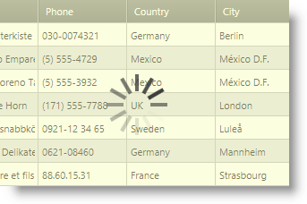

////

|metadata|
{
    "name": "xambusyindicator-configuring-overlay-style",
    "tags": ["Getting Started","How Do I"],
    "controlName": ["xamBusyIndicator"],
    "guid": "1207872d-2c58-405f-90c5-e907e24ee5a6",  
    "buildFlags": [],
    "createdOn": "2015-08-04T11:32:06.3356326Z"
}
|metadata|
////

= Configuring Overlay Style (xamBusyIndicator)

== Topic Overview

=== Purpose

This topic explains how to change the default overlay style of the  _xamBusyIndicator™_   control.

=== Required background

The following topics are prerequisites to understanding this topic:

[options="header", cols="a,a"]
|====
|Topic|Purpose

| link:xambusyindicator-features-overview.html[Features Overview]
|This topic explains the features supported by the control from developer perspective.

| link:xambusyindicator-visual-elements.html[Visual Elements]
|This topic provides an overview of the visual elements of the control.

|====

=== In this topic

This topic contains the following sections:

* <<_Ref427942477, Configuring Overlay Style >>
* <<_Ref427942481, Related Content >>

** <<_Ref427942485,Topics>>
** <<_Ref427942489,Samples>>

[[_Ref427942477]]
== Configuring Overlay Style

=== Overview

Use the link:{RootAssembly}{ApiVersion}~infragistics.controls.interactions.xambusyindicator_members.html[XamBusyIndicator] link:{RootAssembly}{ApiVersion}~infragistics.controls.interactions.xambusyindicator~overlaystyle.html[OverlayStyle] property to apply a custom style to the `Rectangle` element that is placed over the  _xamBusyIndicator_   content when the indicator is busy.

=== Property settings

The following table maps the desired configuration to the property settings that manage it.

[options="header", cols="a,a,a"]
|====
|In order to:|Use this property:|And set it to:

|Apply a style to the content overlaying rectangle
| link:{RootAssembly}{ApiVersion}~infragistics.controls.interactions.xambusyindicator~overlaystyle.html[OverlayStyle]
|`Style`

|====

=== Example

The screenshot below demonstrates how the  _xamBusyIndicator_   control looks as a result of the following settings:

[options="header", cols="a,a"]
|====
|Property|Value

| link:{RootAssembly}{ApiVersion}~infragistics.controls.interactions.xambusyindicator~overlaystyle.html[OverlayStyle]
|__

|====

Following is the code that implements this example.

*In XAML:*

[source,xaml]
----
<ig:XamBusyIndicator IsBusy="True" >
    <ig:XamBusyIndicator.OverlayStyle>
        
    </ig:XamBusyIndicator.OverlayStyle>
</ig:XamBusyIndicator>
----

[[_Ref427942481]]
== Related Content

[[_Ref427942485]]

=== Topics

The following topics provide additional information related to this topic.

[options="header", cols="a,a"]
|====
|Topic|Purpose

| link:xambusyindicator-configuring-busy-indicator-display.html[Configuring Busy Indicator Display]
|This topic explains how to display the _xamBusyIndicator_ control.

| link:xambusyindicator-configuring-busy-content.html[] link:xambusyindicator-configuring-busy-content.html[Configuring Busy Content]
|This topic explains how to configure the _xamBusyIndicator_ busy content.

| link:xambusyindicator-configuring-delayed-display.html[Configuring Delayed Display]
|This topic explains how to configure the delay before displaying the _xamBusyIndicator_ control.

| link:xambusyindicator-configuring-focus-target.html[Configuring Focus Target]
|This topic explains how to configure explicitly which `UIElement` receives the focus when the _xamBusyIndicator_ is no longer active.

| link:xambusyindicator-configuring-determinate-xambusyindicator.html[Configuring Determinate xamBusyIndicator]
|This topic explains how to customize the _xamBusyIndicator_ overlay style.

| link:xambusyindicator-configuring-animations-brushes.html[Configuring Animations Brushes]
|This topic explains how to customize the _xamBusyIndicator_ control default animations brushes.

|====

[[_Ref427942489]]

=== Samples

The following sample provides additional information related to this topic.

[options="header", cols="a,a"]
|====
|Sample|Purpose

| link:{SamplesURL}/busy-indicator/busy-indicator-configuration[Busy Indicator Configuration]
|This sample demonstrates the configuration of the _xamBusyIndicator_ control key features.

|====