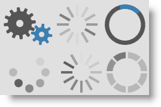

////
|metadata|
{
    "name": "xambusyindicator-features-overview",
    "tags": [],
    "controlName": ["xamBusyIndicator"],
    "guid": "ab5a6378-7230-477c-8924-0e9bfd1d9cf5",
    "buildFlags": [],
    "createdOn": "2015-07-30T15:58:43.8630753Z"
}
|metadata|
////

= Features Overview (xamBusyIndicator)

== Topic Overview

=== Purpose

This topic explains the features supported by the control from developer perspective.

=== In this topic

This topic contains the following sections:

* <<_Ref428373160, Introduction >>
* <<_Ref428373168, Main Features >>
* <<_Ref428373174, Related Content >>

** <<_Ref428373179,Topics>>
** <<_Ref428373183,Samples>>

[[_Ref428373160]]
== Introduction

=== xamBusyIndicator summary

The  _xamBusyIndicator_   is a control that overlays its content and displays an indication that an underlying long-running process is executed.

The  _xamBusyIndicator_   control provides various animations, some of them have determinate and indeterminate mode.

image::images/xamBusyIndicator_Features_Overview_1.png[]

[[_Ref428373168]]
== Main Features

=== Main features summary chart

The following table summarizes the main features of the  _xamBusyIndicator_   control. Additional details are available after the summary table.

[options="header", cols="a,a"]
|====
|Feature|Description

|<<_Ref428376087,Pre-built Animations>>
|The _xamBusyIndicator_ control provides a set of pre-built animations.

|<<_Ref428378819,Display Progress>>
|The _xamBusyIndicator_ control has two modes - determinate and indeterminate. When the control is in determinate mode, the underlying activity progress is displayed.

|<<_Ref428379228,Delayed Start>>
|The _xamBusyIndicator_ control may appear after a specified delay.

|<<_Ref428454948,Configurable Busy Content>>
|The content beneath the _xamBusyIndicator_ animation is fully customizable.

|<<_Ref428379500,Configurable Focus Element>>
|A `UIElement` can be specified to receive the focus when the _xamBusyIndicator_ control is no longer active.

|<<_Ref428453028,Stylable Overlay>>
|The overlay style of the _xamBusyIndicator_ control is easily changed just by setting the `OverlayStyle` property to the `Rectangle` element.

|<<_Ref428448810,Themes>>
|Themes are provided for the _xamBusyIndicator_ control.

|====

[[_Ref428376087]]

=== Pre-built Animations

The  _xamBusyIndicator_   control provides a set of pre-built animations.

The animations default brushes are fully customizable as well as the animations speed.

You can also create your own animation and replace the default control animation.

==== Related Topics:

* link:xambusyindicator-animations.html[Animations]
* link:xambusyindicator-configuring-animations-brushes.html[Configuring Animations Brushes]
* link:xambusyindicator-configuring-animation-duration.html[Configuring Animation Duration]
* link:xambusyindicator-applying-custom-animation.html[Applying Custom Animation]

[[_Ref428378819]]

=== Display Progress

The  _xamBusyIndicator_   control provides two animations that have both indeterminate and determinate mode – ProgressRing and ProgressBar.

When in determinate mode, they display the underlying activity progress.

*Related Topic:*

* link:xambusyindicator-configuring-determinate-xambusyindicator.html[Configuring Determinate Progress Bar]

[[_Ref428379228]]

=== Delayed Start

The  _xamBusyIndicator_   control may appear after a specified interval.

*Related Topic:*

* link:xambusyindicator-configuring-delayed-display.html[Configuring Delayed Display]

[[_Ref428454948]]

=== Configurable Busy Content

The Busy content area in the  _xamBusyIndicator_   control is fully customizable.

*Related Topic:*

* link:xambusyindicator-configuring-busy-content.html[Configuring Busy Content]

[[_Ref428379500]]

=== Configurable Focus Element

A `UIElement` can be specified to receive the focus when the  _xamBusyIndicator_   control is no longer active.

*Related Topic:*

* link:xambusyindicator-configuring-focus-target.html[Configuring Focus Target]

[[_Ref428453028]]

=== Stylable Overlay

The default overlay style of the  _xamBusyIndicator_   control can be changed easily just by setting the `OverlayStyle` property to the `Rectangle` element.

*Related Topic:*

* link:xambusyindicator-configuring-overlay-style.html[Configuring Overlay Style]

[[_Ref428448810]]

=== Themes

The full set of themes is provided for the  _xamBusyIndicator_   control.

In order to apply a theme, use the following theme files:

[options="header", cols="a,a"]
|====
|Theme|Theme File

|IG Theme
|IG.WPF.xaml

|Metro Theme
|Metro.WPF.xaml

|Metro Dark Theme
|MetroDark.WPF.xaml

|Office 2010 Blue Theme
|Office2010Blue.WPF.xaml

|Office 2013 Theme
|Office2013.WPF.xaml

|Royal Dark
|RoyalDark.WPF.xaml

|====

IG Theme +

Metro Theme +

Metro Dark Theme +

Office 2010 Blue Theme +

Office 2013 Theme +

Royal Dark Theme +

==== Related Topics:

* link:designers-guide-using-themes.html[Using Themes]

[[_Ref428373174]]
== Related Content

[[_Ref428373179]]

=== Topics

The following topics provide additional information related to this topic.

[options="header", cols="a,a"]
|====
|Topic|Purpose

| link:xambusyindicator-visual-elements.html[Visual Elements]
|This topic provides an overview of the visual elements of the control.

| link:xambusyindicator-adding-to-your-page.html[Adding xamBusyIndicator To Your Page]
|This topic provides detailed instructions to help you get up and running as soon as possible with the _xamBusyIndicator_ control.

| link:xambusyindicator-configuring.html[Configuring xamBusyIndicator]
|The topics in this section provide information about configuring the _xamBusyIndicator_ control.

|====

[[_Ref428373183]]

=== Samples

The following sample provides additional information related to this topic.

[options="header", cols="a,a"]
|====
|Sample|Purpose

| link:{SamplesURL}/busy-indicator/busy-indicator-configuration[Busy Indicator Configuration]
|This sample demonstrates the configuration of the _xamBusyIndicator_ control key features.

|====