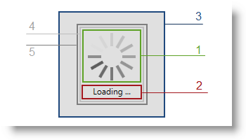

////
|metadata|
{
    "name": "xambusyindicator-visual-elements",
    "tags": [],
    "controlName": ["xamBusyIndicator"],
    "guid": "0d4ece43-37b7-4416-b245-330b981c3e19",
    "buildFlags": [],
    "createdOn": "2015-07-30T16:02:01.5453397Z"
}
|metadata|
////

= Visual Elements (xamBusyIndicator)

== Topic Overview

=== Purpose

This topic provides an overview of the visual elements of the control.

=== In this topic

This topic contains the following sections:

* <<_Ref428364135, Visual Elements of the xamBusyIndicator Control and Related Properties >>
* <<_Ref428364140, Related Content >>

** <<_Ref428364144,Topics>>
** <<_Ref428364148,Samples>>

[[_Ref428364135]]
== Visual Elements of the xamBusyIndicator Control and Related Properties

=== Visual elements summary

The following screenshot depicts the visual elements of the  _xamBusyIndicator_   control. The configurable elements are listed after the image.

[start=1]
. Animation
[start=2]
. Busy Content
[start=3]
. Overlay
[start=4]
. Grid element
[start=5]
. Border element

=== Visual elements and related properties

The following table maps the visual elements of the  _xamBusyIndicator_   control and the properties that configure them.

[options="header", cols="a,a,a"]
|====
|Visual Element
|Properties
|Topic

.2+| Busy Indicator
| link:{RootAssembly}{ApiVersion}~infragistics.controls.interactions.xambusyindicator~isbusy.html[IsBusy]
| link:xambusyindicator-configuring-busy-indicator-display.html[Configuring Busy Indicator Display]

| link:{RootAssembly}{ApiVersion}~infragistics.controls.interactions.xambusyindicator~displayafter.html[DisplayAfter]
| link:xambusyindicator-configuring-delayed-display.html[Configuring Delayed Display]

.3+|Animation
| link:{RootAssembly}{ApiVersion}~infragistics.controls.interactions.xambusyindicator~animation.html[Animation]
| link:xambusyindicator-animations.html[Animations] 

link:xambusyindicator-applying-custom-animation.html[Applying Custom Animation]

|link:{RootAssembly}{ApiVersion}~infragistics.controls.interactions.busyanimation~animationtotalduration.html[AnimationTotalDuration]

|link:xambusyindicator-configuring-animation-duration.html[Configuring Animation Duration]

|Various configurable animations brushes properties
| link:xambusyindicator-configuring-animations-brushes.html[Configuring Animations Brushes]

|Busy Content
| link:{RootAssembly}{ApiVersion}~infragistics.controls.interactions.xambusyindicator~busycontent.html[BusyContent] 

link:{RootAssembly}{ApiVersion}~infragistics.controls.interactions.xambusyindicator~busycontenttemplate.html[BusyContentTemplate] 

link:{RootAssembly}{ApiVersion}~infragistics.controls.interactions.xambusyindicator~busycontenttemplateselector.html[BusyContentTemplateSelector]
| link:xambusyindicator-configuring-busy-content.html[Configuring Busy Content]

|Overlay
| link:{RootAssembly}{ApiVersion}~infragistics.controls.interactions.xambusyindicator~overlaystyle.html[OverlayStyle]
| link:xambusyindicator-configuring-overlay-style.html[Configuring Overlay Style]

|====

[[_Ref428364140]]
== Related Content

[[_Ref428364144]]
=== Topics

The following topics provide additional information related to this topic.

[options="header", cols="a,a"]
|====
|Topic|Purpose

| link:xambusyindicator-features-overview.html[Features Overview]
|This topic explains the features supported by the control from developer perspective.

| link:xambusyindicator-adding-to-your-page.html[Adding xamBusyIndicator To Your Page]
|This topic provides detailed instructions to help you get up and running as soon as possible with the _xamBusyIndicator_ control.

| link:xambusyindicator-configuring.html[Configuring xamBusyIndicator]
|The topics in this section provide information about configuring the _xamBusyIndicator_ control.

|====

[[_Ref428364148]]
=== Samples

The following sample provides additional information related to this topic.

[options="header", cols="a,a"]
|====
|Sample|Purpose

| link:{SamplesURL}/busy-indicator/busy-indicator-configuration[Busy Indicator Configuration]
|This sample demonstrates the configuration of the _xamBusyIndicator_ control key features.

|====