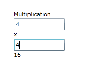

////
|metadata|
{
    "name": "xamcalculationmanager-getting-started-with-xamcalculationmanager",
    "controlName": ["xamCalculationManager"],
    "tags": ["Calculations","How Do I"],
    "guid": "88ec75fe-d17b-41f6-889d-38ad7cec2b5a",
    "buildFlags": [],
    "createdOn": "2016-05-25T18:21:54.5351226Z"
}
|metadata|
////

= Getting Started with xamCalculationManager

== Topic Overview

== Purpose

This topic demonstrates how to create formulas using the xamCalculationManager™ control.

While this sample demonstrates how to multiply two numbers together, it covers the steps that are required to complete every calculation. As long as the sources are set correctly, the xamCalculationManager allows you to create complex mathematical formulas by simply setting the control’s link:{ApiPlatform}calculations.xamcalculationmanager{ApiVersion}~infragistics.calculations.controlcalculationsettings~formula.html[Formula] property to your formula.

The xamCalculationManager control allows you to create complex formulas which can be reused among different controls. Formulas are composed of sources and targets which can be any public property of any object. Formulas also support lists as sources to perform aggregate functions. For more information, see the link:xamcalculationmanager-overview-of-list-calculator.html[Overview of List Calculator] topic.

Aggregate functions including calculations like Sum and Average are available through the control and the control also contains many other pre-defined functions. While may built-in functions are available, you can also create custom functions as demonstrated in the link:xamcalculationmanager-create-xamcalculationmanager-custom-functions.html[Create xamCalculationManager Custom Functions] topic.

== In this topic

This topic contains the following sections:

* <<introduction,Introduction>>
* <<preview,Preview>>
* <<steps,Steps>>
* <<relatedtopics,Related Topics>>

[[introduction]]
== Introduction

This following example demonstrates how to create a multiplication formula using the xamCalculationManager control.

The formula in this example is calculated in two different ways:

[start=1]
. Calculate formulas using the textbox’s x:Name property
+
By default the control’s x:Name property is used by the xamCalculationManager control as its link:{ApiPlatform}calculations.xamcalculationmanager{ApiVersion}~infragistics.calculations.controlcalculationsettings~referenceid.html[ReferenceId]. If the x:Name property is not specified then the ReferenceId property must be set on the link:{ApiPlatform}calculations.xamcalculationmanager{ApiVersion}~infragistics.calculations.controlcalculationsettings.html[ControlCalculationSettings] object (as in option 2 below).

[start=2]
. Explicitly setting the ReferenceId on the ControlCalculationSettings object.
+
The ReferenceId must be set if the x:Name property of the control is not set.

[[preview]]
== Preview

Following is a preview of the final result where the values from each text box are multiplied together.

== Overview

Following is a conceptual overview of the process:

. Create a formula using the textbox’s x:name property
. Create a formula using the ControlCalculationSettings ReferenceId property

[[steps]]
== Steps

. Create a formula using the textbox’s x:Name property.

.. Create a formula using the textbox’s x:Name property.

... Add a StackPanel to your page
... Add the xamCalculationManager control to your page
... Add two textboxes to your page, register them to the xamCalculationManager and set the x:Name properties to txtQuantity and txtPrice respectively.
+
*In XAML:*
+
[source,xaml]
----
<StackPanel>
    <StackPanel.Resources>
        <ig:XamCalculationManager x:Key="CalcManager"/>
    </StackPanel.Resources>
    <TextBox x:Name="txtQuantity" 
        ig:XamCalculationManager.CalculationManager="{StaticResource CalcManager}"/>
    <TextBox x:Name="txtPrice" 
        ig:XamCalculationManager.CalculationManager="{StaticResource CalcManager}"/>
    <!--TODO: Create Result text block -->
</StackPanel>
----
+
*In Visual Basic:*
+
[source,vb]
----
Dim CalcManager As XamCalculationManager = New XamCalculationManager
Dim stackPanel As StackPanel = New StackPanel
Dim textbox1 As TextBox = New TextBox
textbox1.Name = "txtQuantity"
stackPanel.Children.Add(textbox1)
Dim textbox2 As TextBox = New TextBox
textbox2.Name = "txtPrice"
stackPanel.Children.Add(textbox2)
XamCalculationManager.SetCalculationManager(textbox1, CalcManager)
XamCalculationManager.SetCalculationManager(textbox2, CalcManager)
----
+
*In C#:*
+
[source,csharp]
----
XamCalculationManager CalcManager = new XamCalculationManager();
StackPanel stackPanel = new StackPanel();

TextBox textbox1 = new TextBox();
textbox1.Name = "txtQuantity";
stackPanel.Children.Add(textbox1);

TextBox textbox2 = new TextBox();
textbox2.Name = "txtPrice";
stackPanel.Children.Add(textbox2);

XamCalculationManager.SetCalculationManager(textbox1, CalcManager);
XamCalculationManager.SetCalculationManager(textbox2, CalcManager);
----

.. Add a TextBlock to the StackPanel.

... The TextBlock is where the result is displayed. Add the xamCalculationManager control’s ControlCalculationSettings object to set the target of the formula.
... Define a formula set to the Formula property that multiplies the value of the two TextBoxes together using the x:Name properties.
+
*In XAML:*
+
[source,xaml]
----
<TextBlock x:Name="mulResult" 
    ig:XamCalculationManager.CalculationManager="{StaticResource CalcManager}">
    <ig:XamCalculationManager.ControlSettings>
        <ig:ControlCalculationSettings
            ReferenceId="mulTotal"
            Formula="[txtQuantity] * [txtPrice]" />
    </ig:XamCalculationManager.ControlSettings>
</TextBlock>
----
+
*In Visual Basic:*
+
[source,vb]
----
Dim textblock1 As TextBlock = New TextBlock
Dim calcSettings As ControlCalculationSettings = New ControlCalculationSettings
calcSettings.Formula = "[txtQuantity]*[txtPrice]"
XamCalculationManager.SetControlSettings(textblock1, calcSettings)
XamCalculationManager.SetCalculationManager(textblock1, CalcManager)
stackPanel.Children.Add(textblock1)
----
+
*In C#:*
+
[source,csharp]
----
TextBlock textblock1 = new TextBlock();

ControlCalculationSettings calcSettings = new ControlCalculationSettings();
calcSettings.Formula = "[txtQuantity]*[txtPrice]";

XamCalculationManager.SetControlSettings(textblock1, calcSettings);
XamCalculationManager.SetCalculationManager(textblock1, CalcManager);
stackPanel.Children.Add(textblock1);
----

. Create a formula using the ControlCalculationSettings ReferenceId property

.. Create a formula using the ControlCalculationSettings ReferenceId property

... Add a StackPanel to your page
... Add the xamCalculationManager control to your page
... Add two textboxes to your page, register them to the xamCalculationManager control. Add the xamCalculationManager control’s ControlCalculationSettings object to each TextBox.
... Set the ReferenceIds to RefQuantity and RefPrice respectively.
+
*In XAML:*
+
[source,xaml]
----
<StackPanel Width="150" Orientation="Vertical">
    <StackPanel.Resources>
        <ig:XamCalculationManager x:Key="CalcManager"/>
    </StackPanel.Resources>
    
    <TextBox x:Name="txtQuantity" 
        ig:XamCalculationManager.CalculationManager="{StaticResource CalcManager}">
        <ig:XamCalculationManager.ControlSettings>
            <ig:ControlCalculationSettings ReferenceId="RefQuantity"/>
        </ig:XamCalculationManager.ControlSettings>
   </TextBox>
   
   <TextBox x:Name="txtPrice"  
        ig:XamCalculationManager.CalculationManager="{StaticResource CalcManager}">
        <ig:XamCalculationManager.ControlSettings>
            <ig:ControlCalculationSettings ReferenceId="RefPrice"/>
        </ig:XamCalculationManager.ControlSettings>
    </TextBox>
    <!--TODO: Create Result text block -->
</StackPanel>
----
+
*In Visual Basic:*
+
[source,vb]
----
Dim CalcManager As XamCalculationManager = New XamCalculationManagerDim stackPanel As StackPanel = New StackPanel
Dim textbox1 As TextBox = New TextBox
stackPanel.Children.Add(textbox1)
Dim calcSettings1 As ControlCalculationSettings = New ControlCalculationSettings
calcSettings1.ReferenceId = "RefQuantity"
XamCalculationManager.SetControlSettings(textbox1, calcSettings1)
Dim textbox2 As TextBox = New TextBox
stackPanel.Children.Add(textbox2)
Dim calcSettings2 As ControlCalculationSettings = New ControlCalculationSettings
calcSettings2.ReferenceId = "RefPrice"
XamCalculationManager.SetControlSettings(textbox2, calcSettings2)
XamCalculationManager.SetCalculationManager(textbox2, CalcManager)
XamCalculationManager.SetCalculationManager(textbox1, CalcManager)
----
+
*In C#:*
+
[source,csharp]
----
XamCalculationManager CalcManager = new XamCalculationManager();
StackPanel stackPanel = new StackPanel();
TextBox textbox1 = new TextBox();
stackPanel.Children.Add(textbox1);
ControlCalculationSettings calcSettings1 = new ControlCalculationSettings();
calcSettings1.ReferenceId = "RefQuantity";
XamCalculationManager.SetControlSettings(textbox1, calcSettings1);

TextBox textbox2 = new TextBox();
stackPanel.Children.Add(textbox2);
ControlCalculationSettings calcSettings2 = new ControlCalculationSettings();
calcSettings2.ReferenceId = "RefPrice";
XamCalculationManager.SetControlSettings(textbox2, calcSettings2);

XamCalculationManager.SetCalculationManager(textbox2, CalcManager);
XamCalculationManager.SetCalculationManager(textbox1, CalcManager);
----

.. Add a TextBlock to the StackPanel.

... The TextBlock is where the result is displayed. Add the xamCalculationManager control’s ControlCalculationSettings to set the target of the formula.
... Define a formula set to the Formula property that multiplies the value of the two TextBoxes together using the ReferenceIds.
+
*In XAML:*
+
[source,xaml]
----
<TextBlock x:Name="mulResult" Width="100" 
    ig:XamCalculationManager.CalculationManager="{StaticResource CalcManager}">
    <ig:XamCalculationManager.ControlSettings>
        <ig:ControlCalculationSettings
            ReferenceId="mulTotal"
            Formula="[RefQuantity] * [RefPrice]" />
   </ig:XamCalculationManager.ControlSettings>
</TextBlock>
----
+
*In Visual Basic:*
+
[source,vb]
----
Dim textblock1 As TextBlock = New TextBlock
Dim calcSettings As ControlCalculationSettings = New ControlCalculationSettings
calcSettings.Formula = "[RefQuantity]*[RefPrice]"
XamCalculationManager.SetControlSettings(textblock1, calcSettings)
XamCalculationManager.SetCalculationManager(textblock1, CalcManager)
stackPanel.Children.Add(textblock1)
----
+
*In C#:*
+
[source,csharp]
----
TextBlock textblock1 = new TextBlock();

ControlCalculationSettings calcSettings = new ControlCalculationSettings();
calcSettings.Formula = "[RefQuantity]*[RefPrice]";
XamCalculationManager.SetControlSettings(textblock1, calcSettings);
XamCalculationManager.SetCalculationManager(textblock1, CalcManager);
stackPanel.Children.Add(textblock1);
----

[[relatedtopics]]
*Related Topics:*

* link:xamcalculationmanager-overview-of-named-references.html[Overview of Named References]
* link:xamcalculationmanager-overview-of-list-calculator.html[Overview of List Calculator]
* link:xamcalculationmanager-overview-of-item-calculator.html[Overview of Item Calculator]
* link:xamcalculationmanager-create-xamcalculationmanager-custom-functions.html[Create xamCalculationManager Custom Functions]