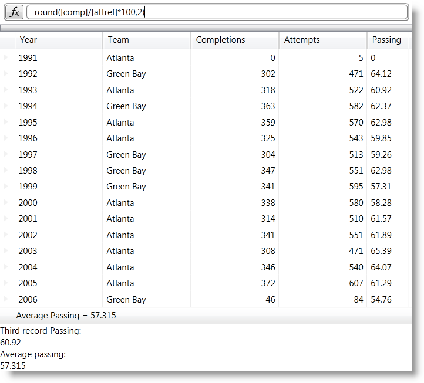

////
|metadata|
{
    "name": "xamcalculationmanager-using-xamcalculationmanager-with-xamdatagrid",
    "controlName": ["xamCalculationManager"],
    "tags": ["Calculations","Getting Started"],
    "guid": "e5e69ffc-6db9-47cc-82c1-795cb760baed",
    "buildFlags": [],
    "createdOn": "2016-05-25T18:21:54.5941242Z"
}
|metadata|
////

= Using xamCalculationManager with xamDataGrid

== Topic Overview

== Purpose

This topic explains how you can use the xamCalculationManager™ control in combination with the xamDataGrid™ control to perform calculations using field values as sources and targets for the computations.

== In this topic

This document contains the following sections:

* Required Background
* Introduction
* Overview
* Steps

== Required background

You need to be familiar with the information in the following topics:

* link:xamdatagrid-understanding-xamdatagrid.html[About xamDataGrid]
* link:xamdatapresenter-bind-a-datapresenter-control-to-an-xmldataprovider.html[Bind a DataPresenter Control to an XmlDataProvider]
* link:xamdatapresenter-manually-assigning-a-field-layout-to-xamdatapresenter.html[Manually Assigning a Field Layout to xamDataPresenter]
* link:xamdatapresenter-define-a-field-layout.html[Define a Field Layout]
* link:xamdatapresenter-add-unbound-fields-to-a-datapresenter-control.html[Add Unbound Fields to a DataPresenter Control]
* link:xamcalculationmanager.html[xamCalculationManager]
* link:xamcalculationmanager-getting-started-with-xamcalculationmanager.html[Getting Started with xamCalculationManager]
* link:xamformulaeditor-about.html[About xamFormulaEditor]
* link:xamformulaeditor-using.html[Using xamFormulaEditor and FormulaEditorDialog with xamCalculationManager]

== Introduction

This topic covers the integration of the xamCalculationManager with the xamDataGrid controls; however you can apply the same steps for the other DataPresenter controls. Other controls eligible to participate in calculations conducted by the xamCalculationManager component derive from the DataPresenterBase class. These controls include:

* xamDataPresenter™
* xamDataGrid
* xamDataCards™
* xamDataCarousel™

Various parts of these controls can be used as sources and targets of calculations, including cells and summaries.

== Preview

The following screenshot is a preview of the final result. Values in the Passing column are calculated based on the values of the Completions and Attempts columns. The formula for the Passing column is: Completion/Attempt$$*$$100, rounded to two decimal places. Above the grid is the xamFormulaEditor control where users can edit the formula for the Passing field of the grid. Below the grid is the Average Passing summary which is calculated by the xamCalculationManager control. Under the summary are two text blocks that demonstrate that you can use the xamCalculationManger control to access the value of a property of object registered with the control. In this case the Passing field in the third data record and the average passing score are calculated and shown in the summary.

== Overview

Following is a conceptual overview of the process:

. Create a new WPF project and add the required references.
. Add the required XML namespaces.
. Add the xamCalculationManager.
. Configure the datasource for the xamDataGrid.
. Add the xamDataGrid.
. Configure the CalculationAdapter.
. Configure the xamDataGrid FieldLayout.
. Add external references to calculated values.
. Add a xamFormulaEditor.
. Build and run your solution.

== Steps

. *Create a new WPF project and add the required references*
+
Start Microsoft Visual Studio and create a new Microsoft® Windows® Presentation Foundation project. Next add to your project references to the following assemblies:
+
--
* {ApiPlatform}.v{ProductVersion}.dll
* {ApiPlatform}.DataPresenter.v{ProductVersion}.dll
* {ApiPlatform}.DataPresenter.CalculationAdapter.v{ProductVersion}.dll
* {ApiPlatform}.Calculations.XamCalculationManager.v{ProductVersion}.dll
* {ApiPlatform}.Editors.v{ProductVersion}.dll
* {ApiPlatform}.Controls.Interactions.XamFormulaEditor.v{ProductVersion}.dll
--

. *Add the required XML namespaces*
+
In order to use the xamCalculationManger component in combination with the xamDataGrid control you must add the Infragistics XAML xml namespace and the Infragistics DataPresenter xml namespace declarations to the opening Window tag of the MainWindow.xaml file of your application:
+
*In XAML:*
+
[source,xaml]
----
<Window …
    xmlns:ig="http://schemas.infragistics.com/xaml"
    xmlns:igDP="http://infragistics.com/DataPresenter">
----

. *Add the xamCalculationManager*
+
After adding the namespaces the next step is to add a xamCalculationManager control to your application. Place its declaration in the resources section of the window or in the main grid container. The only difference between these two approaches is how you reference the calculation manager in code. If you add it in the grid container then you will access the calculation manager through the x:Name. If you declare it as a StaticResource, then you will access it through the x:Key, using the StaticResource markup extension.
+
If you choose to place it in the main grid container, the xamCalculationManager declaration should look like this:
+
*In XAML:*
+
[source,xaml]
----
<ig:XamCalculationManager x:Name="CalculationManager" />
----

. *Configure the datasource for the xamDataGrid*
+
As a datasource for the xamDataGrid control you can use the link:resources-quarterbacks.html[Quarterbacks.xml] file through an XmlDataProvider.
+
--
.. First add the xml file to the root of your project in the solution explorer of Visual Studio
.. Next, in the Window.Resources section add an XmlDataProvider and set its Source property to "Quarterbacks.xml"
.. Set the XPath property to "/QuarterBack" and specify a key through which you can reference this resource later
--
+
*In XAML:*
+
[source,xaml]
----
<XmlDataProvider Source="Quarterbacks.xml" 
    x:Key="QuarterbackData" XPath="/QuarterBack" />
----

. *Add the xamDataGrid*
+
As soon as you have configured the XmlDataProvider you can move on to configuring the xamDataGrid.
+
--
.. Begin by adding the XamDataGrid tags. Then set the control’s DataSource property to the XmlDataProvider instance:
+
*In XAML:*
+
[source,xaml]
----
<igDP:XamDataGrid
    DataSource="{Binding Source={StaticResource QuarterbackData}, XPath=season}"      
…
----
.. Next set the CalculationManager attached property.
+
*In XAML:*
+
[source,xaml]
----
ig:XamCalculationManager.CalculationManager=
    "{Binding ElementName=CalculationManager}"
----
--

. *Configure the CalculationAdapter*
+
Next, set the xamDataGrid’s CalculationAdapter property to an instance of the DataPresenterCalculationAdapter class. As a result of this and the previous step, the xamDataGrid will be able to participate in xamCalculationManager calculations. In order to reference formulas of the calculation manager for xamDataGrid fields, you need to set the ReferenceId property of the DataPresenterCalculationAdapter.
+
*In XAML:*
+
[source,xaml]
----
<igDP:XamDataGrid … >
    <igDP:XamDataGrid.CalculationAdapter>
        <igDP:DataPresenterCalculationAdapter 
            ReferenceId="dataPresenterAdapter"/>
        </igDP:XamDataGrid.CalculationAdapter>
    …
</igDP:XamDataGrid>
----

. *Configure the xamDataGrid FieldLayout*
.. Turn off automatic field generation.
+
.Note:
[NOTE]
====
This step is not required for the xamCalculationManager to work with the xamDataGrid. However it is mentioned here because it minimizes the number of fields and thus makes the application simpler.
====
+
By default the xamDataGrid will automatically create a field for every public property of the datasource objects. To prevent this behavior you need to do the following:
+
--
... Declare tags for the FieldLayoutSettings property of the xamDataGrid
... Add a FieldLayoutSettings object within the tags of the FieldLayoutSettings property
... Set the AutoGenerateFields property to False
--
+
*In XAML:*
+
[source,xaml]
----
<igDP:XamDataGrid.FieldLayoutSettings>
    <igDP:FieldLayoutSettings 
        AutoGenerateFields="False" />
</igDP:XamDataGrid.FieldLayoutSettings>
----

.. Define the FieldLayout.
+
--
... Declare the tags for the xamDataGrid’s FieldLayouts property
... Add a FieldLayout to the FieldLayoutCollection of the grid and set its CalculationReferenceId property to a string that you can later use to reference the fields in the layout from formulas of the xamCalculationManager
... Declare the tags for the Fields collection of the FieldLayout
... Declare the tags for the SumamaryDefinitions
--
+
*In XAML:*
+
[source,xaml]
----
<igDP:XamDataGrid.FieldLayouts>
    <igDP:FieldLayout CalculationReferenceId="Quarterback">
        <igDP:FieldLayout.Fields>
        </igDP:FieldLayout.Fields>
        <igDP:FieldLayout.SummaryDefinitions>
        </igDP:FieldLayout.SummaryDefinitions>
    </igDP:FieldLayout>
</igDP:XamDataGrid.FieldLayouts>
----

.. Add fields to the FieldLayout FieldCollection.
+
For information on how to define a FieldLayout refer to the Define a Field Layout topic. For the current sample you need a couple of numeric fields on whose values will be based the values of the calculated fields and a couple of text fields to identify different records.
+
--
... Add fields matching the datasource
... Declare tags for the Settings property of the Fields and add FieldSettings objects inside the tags
... Set the EditAsType property of the FieldSettings objects for the numeric fields to Int32
... Declare tags for the CalculationSettings of the numeric fields and add a FieldCalculationSettings object inside them
... Set the ReferenceId property of the FieldCalculationSettings objects to a string that you can use later to reference field values in xamCalculationManager formulas
--
+
.Note:
[NOTE]
====
This step is optional and if you do not specify a ReferenceId you can use the Field’s Name instead.
====
+
*In XAML:*
+
[source,xaml]
----
<igDP:Field Name="year" Label="Year"/>
<igDP:Field Name="team" Label="Team"/>
<igDP:Field Name="comp" Label="Completions">
    <igDP:Field.Settings>
        <igDP:FieldSettings EditAsType="{x:Type sys:Int32}" />
    </igDP:Field.Settings>
    <igDP:Field.CalculationSettings>
        <igDP:FieldCalculationSettings ReferenceId="compref" />
    </igDP:Field.CalculationSettings>
</igDP:Field>
<igDP:Field Name="att" Label="Attempts">
    <igDP:Field.Settings>
        <igDP:FieldSettings EditAsType="{x:Type sys:Int32}" />
    </igDP:Field.Settings>
    <igDP:Field.CalculationSettings>
        <igDP:FieldCalculationSettings ReferenceId="attref" />
    </igDP:Field.CalculationSettings>
</igDP:Field>
----

.. Add UnboundFields whose values will be calculated.
+
Using the xamCalculationManager component you can calculate the values for UnboundFields in the xamDataGrid. Each value is calculated using a predefined formula, which can be changed in code at runtime or edited through the xamFormulaEditor. When a formula is changed all values affected by the formula are recalculated. The process of adding a calculated UnboundField is as follows:
+
--
... Add an UnboundField and set its Name and Label (optional) properties
... Declare tags for the CalculationSettings property of the UnboundField
... Add a FieldCalculationSettings object inside the CalculationSettings tags
... Set the Formula and ReferenceId properties to the FieldCalculationSettings object
--
+
*In XAML:*
+
[source,xaml]
----
<igDP:UnboundField Name="pct" Label="Passing">
    <igDP:UnboundField.CalculationSettings>
        <igDP:FieldCalculationSettings 
            Formula="round([comp]/[attref]*100,2)" 
            ReferenceId="pctref" />
    </igDP:UnboundField.CalculationSettings>
</igDP:UnboundField>
----
+
The most important part of the code snippet above is how values of other fields in the xamDataGrid control are used as sources for the formula. To reference a field you can use the value of its Name property (in the example above – "comp") or the value of the ReferenceId of its FieldCalculationSettings object ("attref").

.. Add a calculated summary to the FieldLayout SummaryDefinitionCollection.
+
Another feature of the xamCalculationManager integration with the xamDataGrid is that you can create custom summaries based on field values.
+
--
... Add a summary definition and set its Key
... Declare tags for the CalculationSettings property of the SummaryDefinition
... Add a SummaryCalculationSettings objects inside the tags. Set its Formula and ReferenceId properties
--
+
*In XAML:*
+
[source,xaml]
----
<igDP:SummaryDefinition Position="Left" Key="Average Passing">
    <igDP:SummaryDefinition.CalculationSettings>
        <igDP:SummaryCalculationSettings 
            Formula="average([pctref])" 
            ReferenceId="pctavgref" />
    </igDP:SummaryDefinition.CalculationSettings>
</igDP:SummaryDefinition>
----
+
This summary calculates the average of all values in pct fields. In the same way you can create your own summaries that use the build in and/or user defined functions of the xamCalculationManager component. As sources for summary calculations you can use field values from all records in the xamDataGrid control.

. *Add external references to calculated values*
+
You can reference calculated values through the xamCalculationManager
+
--
.. Add two text blocks and set the XamCalculationManager’s CalculationManager attached property to the calculation manager that you earlier declared
.. Declare tags for the ControlSettings attached property of the XamCalculationManager attached property
.. Add a ControlCalculationSettings object and set its Formula property
--
+
*In XAML:*
+
[source,xaml]
----
<TextBlock
    ig:XamCalculationManager.CalculationManager=
        "{Binding ElementName=CalculationManager}">
    <ig:XamCalculationManager.ControlSettings> 
        <ig:ControlCalculationSettings 
            Formula="[//dataPresenterAdapter/Quarterback(2)/pctref]" /> 
    </ig:XamCalculationManager.ControlSettings> 
</TextBlock>
----
+
This code will display the value of the pct field in for third record of the datasource. You can also use references to summaries calculated by the xamCalculationManager component. The following displays the value of the calculated Average Passing summary.
+
*In XAML:*
+
[source,xaml]
----
<TextBlock
    ig:XamCalculationManager.CalculationManager=
        "{Binding ElementName=CalculationManager}">
    <ig:XamCalculationManager.ControlSettings>
        <ig:ControlCalculationSettings 
            Formula="[//dataPresenterAdapter/Quarterback/pctavgref]" />
    </ig:XamCalculationManager.ControlSettings>
</TextBlock>
----

. *Add a xamFormulaEditor*
+
Another feature that you may want to use in combination with the xamDataGrid and the xamCalculationManager is integration with the xamFormulaEditor controler. Using the editor allows users to define custom formulas for fields and summaries. To take advantage of this feature, add a xamFormulaEditor to your application and set its Target property to a Field or Summary of the xamDataGrid control.
+
*In XAML:*
+
[source,xaml]
----
<ig:XamFormulaEditor 
    Target="{Binding ElementName=dataGrid, 
        Path=FieldLayouts[0].Fields[pct]}" Margin="5" />
----
+
This code creates a xamFormulaEditor control where the users can edit the formula applied to the pct fields.

. *Build and run your solution*

== Code Example: Using xamCalculationManager with xamDataGrid

The code below demonstrates the end result of the procedure above.

*In XAML:*
[source,xaml]
----
<Window …
    xmlns:ig="http://schemas.infragistics.com/xaml"
    xmlns:igDP="http://infragistics.com/DataPresenter"
    xmlns:sys="clr-namespace:System;assembly=mscorlib">
    
    <Window.Resources>
        <XmlDataProvider Source="Quarterbacks.xml"
            x:Key="QuarterbackData" XPath="/QuarterBack" />
    </Window.Resources>
    
    <Grid>
        <StackPanel>
            <ig:XamCalculationManager x:Name="CalculationManager" />
            <ig:XamFormulaEditor Margin="5"
                Target="{Binding ElementName=dataGrid, Path=FieldLayouts[0].Fields[pct]}" />
            <igDP:XamDataGrid x:Name="dataGrid"
                ig:XamCalculationManager.CalculationManager=
                    "{Binding ElementName=CalculationManager}"
                DataSource="{Binding Source={StaticResource QuarterbackData}, XPath=season}">
            
                <igDP:XamDataGrid.CalculationAdapter>
                    <igDP:DataPresenterCalculationAdapter 
                        ReferenceId="dataPresenterAdapter" />
                </igDP:XamDataGrid.CalculationAdapter>
 
                <igDP:XamDataGrid.FieldLayoutSettings>
                    <igDP:FieldLayoutSettings AutoGenerateFields="False" />
                </igDP:XamDataGrid.FieldLayoutSettings>
 
                <igDP:XamDataGrid.FieldLayouts>
                    <igDP:FieldLayout CalculationReferenceId="Quarterback">
                        <igDP:FieldLayout.Fields>
                            <igDP:Field Name="year" Label="Year"/>
                            <igDP:Field Name="team" Label="Team"/>
                            <igDP:Field Name="comp" Label="Completions">
                                <igDP:Field.Settings>
                                    <igDP:FieldSettings 
                                        EditAsType="{x:Type sys:Int32}" />
                                </igDP:Field.Settings>
                            </igDP:Field>
                            <igDP:Field Name="att" Label="Attempts">
                                <igDP:Field.CalculationSettings>
                                    <igDP:FieldCalculationSettings 
                                        ReferenceId="attref" />
                                </igDP:Field.CalculationSettings>
                                <igDP:Field.Settings>
                                    <igDP:FieldSettings 
                                        EditAsType="{x:Type sys:Int32}" />
                                </igDP:Field.Settings>
                            </igDP:Field>
 
                            <igDP:UnboundField Name="pct" Label="Passing">
                                <igDP:UnboundField.CalculationSettings>
                                    <igDP:FieldCalculationSettings 
                                        Formula="round([comp]/[attref]*100,2)" ReferenceId="pctref" />
                                </igDP:UnboundField.CalculationSettings>
                            </igDP:UnboundField>
                        </igDP:FieldLayout.Fields>
                    
                        <igDP:FieldLayout.SummaryDefinitions>
                            <igDP:SummaryDefinition 
                                Position="Left" Key="Average Passing">
                                <igDP:SummaryDefinition.CalculationSettings>
                                    <igDP:SummaryCalculationSettings 
                                        Formula="average([pctref])" ReferenceId="pctavgref" />
                                </igDP:SummaryDefinition.CalculationSettings>
                            </igDP:SummaryDefinition>
                        </igDP:FieldLayout.SummaryDefinitions>
                    
                    </igDP:FieldLayout>
                </igDP:XamDataGrid.FieldLayouts>
            </igDP:XamDataGrid>
        <TextBlock Text="Third record Passing:" />
        <TextBlock ig:XamCalculationManager.CalculationManager=
            "{Binding ElementName=CalculationManager}">
                <ig:XamCalculationManager.ControlSettings>
                    <ig:ControlCalculationSettings 
                        Formula="[//dataPresenterAdapter/Quarterback(2)/pctref]" />
                </ig:XamCalculationManager.ControlSettings>
            </TextBlock>
        <TextBlock Text="Average passing:"/>
            <TextBlock ig:XamCalculationManager.CalculationManager=
                "{Binding ElementName=CalculationManager}">
                <ig:XamCalculationManager.ControlSettings>
                    <ig:ControlCalculationSettings 
                        Formula="[//dataPresenterAdapter/Quarterback/pctavgref]" />
                </ig:XamCalculationManager.ControlSettings>
            </TextBlock>
        </StackPanel>        
    </Grid>
</Window>
----

== Related Topics

Following are some other topics you may find useful.

* link:xamdatagrid-understanding-xamdatagrid.html[About xamDataGrid]
* link:xamdatagrid-using-xamdatagrid.html[Using xamDataGrid]
* link:xamcalculationmanager.html[xamCalculationManager]
* link:xamcalculationmanager-getting-started-with-xamcalculationmanager.html[Getting Started with xamCalculationManager]
* link:xamformulaeditor-about.html[About xamFormulaEditor]
* link:xamformulaeditor-using.html[Using xamFormulaEditor and FormulaEditorDialog with xamCalculationManager]