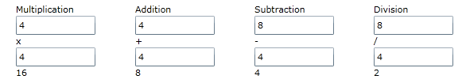

////

|metadata|
{
    "name": "xamcalculationmanager",
    "controlName": ["xamCalculationManager"],
    "tags": ["Calculations"],
    "guid": "749d7fd3-c573-4ce8-8e81-f8ce98409e59",  
    "buildFlags": [],
    "createdOn": "2016-05-25T18:21:54.5291226Z"
}
|metadata|
////

= xamCalculationManager

== Topic Overview

== Purpose

This topic introduces the xamCalculationManager™ control and explains the features of the control.

== Overview

The xamCalculationManager control allows you to create complex formulas may be reused among different controls. The sources and targets for these formulas can be any public property of any object for item calculations. You can also create formulas using lists of items to perform aggregate functions (e.g. Sum and Average).

The xamCalculationManager has many pre-defined functions which emulate Excel functions as well as allowing you to register custom functions. The xamCalculationManager automatically determines the order in which to solve formulas based on the dependencies of the sources and targets.

The following screenshot displays the result of formulas calculated by the xamCalculationManager.

*Related Topics:*

* link:xamcalculationmanager-getting-started-with-xamcalculationmanager.html[Getting Started with xamCalculationManager]
* link:xamcalculationmanager-overview-of-item-calculator.html[Overview of Item Calculator]
* link:xamcalculationmanager-overview-of-list-calculator.html[Overview of List Calculator]
* link:xamcalculationmanager-create-xamcalculationmanager-custom-functions.html[Create xamCalculationManager Custom Functions]
* link:xamcalculationmanager-api-overview.html[API Overview]