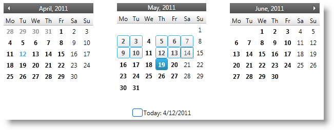
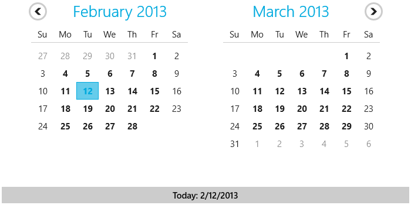
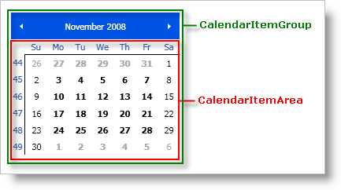
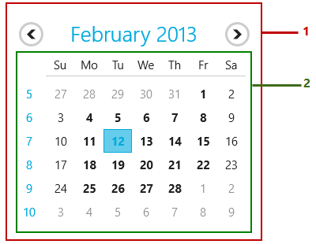
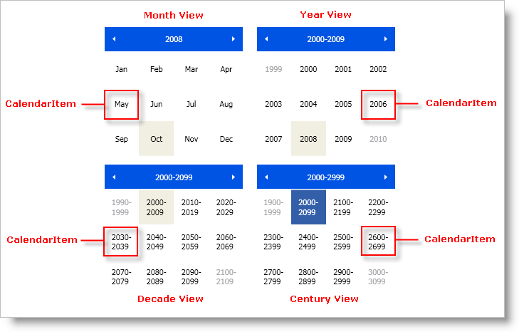
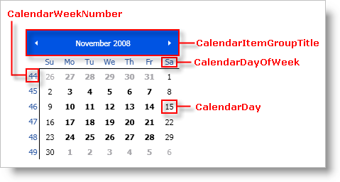
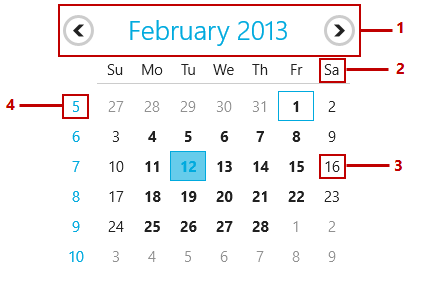

////

|metadata|
{
    "name": "xamcalendar-about",
    "controlName": ["xamCalendar"],
    "tags": ["Editing","Getting Started","Recurrences","Selection"],
    "guid": "310bc25c-0ae4-4dc6-9703-da421bb9db5e",  
    "buildFlags": [],
    "createdOn": "2016-05-25T18:21:54.6011244Z"
}
|metadata|
////

= About xamCalendar

pick:[sl,wpf="The"]   pick:[sl,wpf=" link:{ApiPlatform}controls.editors.xamcalendar{ApiVersion}~infragistics.controls.editors.xamcalendar.html[xamCalendar™]"]   pick:[sl,wpf="control provides functionality similar to that of the Microsoft Vista Common Controls Calendar class."]  The link:{ApiPlatform}controls.editors.xamcalendar{ApiVersion}~infragistics.controls.editors.xamcalendar.html[xamCalendar]™ control is designed to show one or more CalendarItemGroup items (Figure 3 below). These groups can display Days, Months, Years, Decades or Centuries based on the CurrentMode property of the control. The control allows the user to:

* Navigate - by clicking the arrows in the header area
* Zoom in and out - by clicking on the CalendarItemGroupTitle (zoom out) or on the CalendarItems (zoom in) thus changing the link:{ApiPlatform}controls.editors.xamcalendar{ApiVersion}~infragistics.controls.editors.calendarbase~currentmode.html[CurrentMode]
* Select – by selecting one or more CalendarItems. This functionality is available when the CurrentMode= link:{ApiPlatform}controls.editors.xamcalendar{ApiVersion}~infragistics.controls.editors.xamcalendar~mincalendarmode.html[MinCalendarMode]. Otherwise the control will zoom in.

ifdef::sl,wpf,win-phone[]

endif::sl,wpf,win-phone[]

ifdef::win-rt[]

endif::win-rt[]

Figure 1: Sample implementation of xamCalendar

== Main Features

The xamCalendar control has the following main features:

* multiple calendars
* different views
* single/multiple date selection

Each of them is explained in details below.

== Multiple Calendars

The xamCalendar can display one or more CalendarItemGroups:

ifdef::sl,wpf[]

endif::sl,wpf[]

ifdef::win-rt[]

endif::win-rt[]

Figure 2: A CalendarItemGroup

ifdef::win-rt[]
[start=1]
. CalendarItemGroup
[start=2]
. CalendarItemArea

endif::win-rt[]

*Note:* All CalendarItemGroups in one control use the same zoom mode that is set on the xamCalendar control. If you need to show CalendarItemGroups in different zoom modes you should have multiple xamCalendar controls.

== Different Views

The CalendarItemGroups can display the following views (Figure 3):

* Day View (default)
* Month View
* Year View
* Decade View
* Century View

ifdef::sl,wpf[]

endif::sl,wpf[]

ifdef::win-rt[]

[cols="a,a"]
|====
|image::images/xamCalendar_RT_About_MonthView.png[]
|image::images/xamCalendar_About_YearView.png[]

|Month View 

1. CalendarItem
|Year View 

1. CalendarItem

|image::images/xamCalendar_About_DecadeView.png[]
|image::images/xamCalendar_About_CenturyView.png[]

|Decade View 

1. CalendarItem
|Century View 

1. CalendarItem

|====

endif::win-rt[]

Figure 3: The xamCalendar Views

The views are managed by the CurrentMode property of the xamCalendar control.

ifdef::sl,wpf[]

endif::sl,wpf[]

ifdef::win-rt[]

endif::win-rt[]

Figure 4: CalendarItemGroup Elements in Day View

ifdef::win-rt[]
[start=1]
. CalendarItemGroupTitle
[start=2]
. CalendarDayOfWeek
[start=3]
. CalendarDay
[start=4]
. CalendarWeekNumber

endif::win-rt[]

By clicking pick:[win-rt="/tapping"]  the header in the CalendarItemGroupTitle, the user can zoom out to view months within years, years within decades, decades within centuries or centuries within millennia. By clicking pick:[win-rt="/tapping"]  on a CalendarItem (Figure 3), the user can zoom in until days within months are displayed.

== Single/Multiple Date Selection

The xamCalendar control supports single date selection, as well as multiple date selection. You control this behavior by setting the SelectionMode property. You get the current selection from link:{ApiPlatform}controls.editors.xamcalendar{ApiVersion}~infragistics.controls.editors.calendarbase~selecteddates.html[SelectedDates] and link:{ApiPlatform}controls.editors.xamcalendar{ApiVersion}~infragistics.controls.editors.calendarbase~selecteddate.html[SelectedDate] properties.

== Related Topics

link:xamcalendar-restricting-date-selection.html[Implementing Date Selection Restrictions]

link:xamcalendar-using.html[Using xamCalendar]