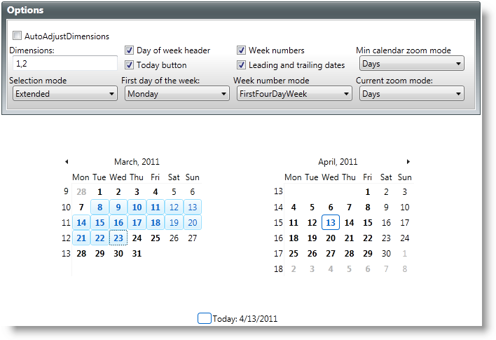
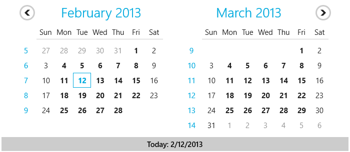

////

|metadata|
{
    "name": "xamcalendar-using",
    "controlName": ["xamCalendar"],
    "tags": ["Editing","Getting Started","How Do I","Selection"],
    "guid": "a45cb446-f02a-41cf-b7f1-4856b7bb84da",  
    "buildFlags": [],
    "createdOn": "2016-05-25T18:21:54.6121244Z"
}
|metadata|
////

= Using xamCalendar

This topic explains the link:{ApiPlatform}controls.editors.xamcalendar{ApiVersion}~infragistics.controls.editors.xamcalendar.html[xamCalendar] control and its modes and properties. At the end, example code is provided demonstrating how to use the main properties of the control to customize its appearance and functionalities.

The topic is organized as follows:

* <<Intro,Introduction>>
* <<DisplayModes,Display Modes>>
* <<SelectionModes,Selection Modes>>
* <<DisplayProperties,Display Properties of the xamCalendar Control>>

** <<VisibilityProperties,Visibility Properties>>
** <<Layout-Properties, Layout Properties>>
** <<Look-and-Feel,Look-and-Feel Properties>>

* <<CodeExample,Code Example>>
* <<RelatedTopics,Related Topics>>

[[Intro]]

== Introduction

ifdef::sl,wpf[]
The xamCalendar™ control provides functionality similar to that of the Microsoft Vista Common Controls Calendar class.
endif::sl,wpf[]

ifdef::sl,wpf[]

endif::sl,wpf[]

ifdef::win-rt[]

endif::win-rt[]

Figure 1: Example implementation of the xamCalendar control

[[DisplayModes]]

== Display Modes

The control provides navigation functionality enabling you to zoom in/out for a faster navigation and ease of changing the selection. There are two properties for controlling the zoom modes:

* link:{ApiPlatform}controls.editors.xamcalendar{ApiVersion}~infragistics.controls.editors.calendarbase~currentmode.html[CurrentMode] – controls the current display mode (Day, Month, Year, Decade or Century)
* link:{ApiPlatform}controls.editors.xamcalendar{ApiVersion}~infragistics.controls.editors.xamcalendar~mincalendarmode.html[MinCalendarMode] – controls the lowest zoom level to which the user can navigate

[[SelectionModes]]

== Selection Modes

The control supports Single and Multiple selection modes. They are managed from its link:{ApiPlatform}controls.editors.xamcalendar{ApiVersion}~infragistics.controls.editors.xamcalendar~selectionmode.html[SelectionMode] property. When using a Multiple selection mode such as Extended or Range, use the link:{ApiPlatform}controls.editors.xamcalendar{ApiVersion}~infragistics.controls.editors.calendarbase~selecteddates.html[SelectedDates] property to access/change the selection. The control also has a link:{ApiPlatform}controls.editors.xamcalendar{ApiVersion}~infragistics.controls.editors.calendarbase~selecteddate.html[SelectedDate] property which is primarily used when in a Single selection mode. When in a Multiple selection mode, this property returns the first selected date.

[[DisplayProperties]]

== Display Properties of the xamCalendar Control

[[VisibilityProperties]]

=== Visibility Properties

The following properties control the visibility of different UI elements:

* link:{ApiPlatform}controls.editors.xamcalendar{ApiVersion}~infragistics.controls.editors.calendarbase~leadingandtrailingdatesvisibility.html[LeadingAndTrailingDatesVisibility] – configures the visibility of the dates that don’t belong to the current month (applicable when CurrentMode is set to Days)
* link:{ApiPlatform}controls.editors.xamcalendar{ApiVersion}~infragistics.controls.editors.calendarbase~weeknumbervisibility.html[WeekNumberVisibility] – controls the visibility of the week numbers (calculated by setting the link:{ApiPlatform}controls.editors.xamcalendar{ApiVersion}~infragistics.controls.editors.xamcalendar~weekrule.html[WeekRule] property)
* link:{ApiPlatform}controls.editors.xamcalendar{ApiVersion}~infragistics.controls.editors.xamcalendar~todaybuttonvisibility.html[TodayButtonVisibility] – configures the visibility of the TodayButton
* link:{ApiPlatform}controls.editors.xamcalendar{ApiVersion}~infragistics.controls.editors.calendarbase~dayofweekheadervisibility.html[DayOfWeekHeaderVisibility] – configures the visibility of the calendar day of week headers (the display format is controlled by the link:{ApiPlatform}controls.editors.xamcalendar{ApiVersion}~infragistics.controls.editors.calendarbase~dayofweekheaderformat.html[DayOfWeekHeaderFormat] property)

[[Layout-Properties]]

=== Layout Properties

* link:{ApiPlatform}controls.editors.xamcalendar{ApiVersion}~infragistics.controls.editors.calendarbase~dimensions.html[Dimensions] - controls how many CalendarItemGroup instances are shown, based on the row/column count (in Figure 1 above, the Dimensions property is set to 1 row x 2 columns).

* link:{ApiPlatform}controls.editors.xamcalendar{ApiVersion}~infragistics.controls.editors.calendarbase~autoadjustdimensions.html[AutoAdjustDimensions] - configures the control to automatically fill the available space in the panel with additional CalendarItemGroups.

* link:{ApiPlatform}controls.editors.xamcalendar{ApiVersion}~infragistics.controls.editors.calendarbase~scrolldirection.html[ScrollDirection] - configures the scrolling direction of the CalendarItemGroup instance(s).

[[Look-and-Feel]]

=== Look-and-Feel Properties

The properties below control the look of the calendar. Except for the first one, ResourceProvider, they are all style-type properties:

* link:{ApiPlatform}controls.editors.xamcalendar{ApiVersion}~infragistics.controls.editors.calendarbase~resourceprovider.html[ResourceProvider]
* link:{ApiPlatform}controls.editors.xamcalendar{ApiVersion}~infragistics.controls.editors.calendarbase~calendardaystyle.html[CalendarDayStyle] – CalendarDay is the element that represents an individual day (used only when the CurrentMode of the control is set to Days)
* link:{ApiPlatform}controls.editors.xamcalendar{ApiVersion}~infragistics.controls.editors.calendarbase~calendaritemstyle.html[CalendarItemStyle] – CalendarItem is the element that represents range of dates (used only when the CurrentMode of the control is set to anything other than Days)
* link:{ApiPlatform}controls.editors.xamcalendar{ApiVersion}~infragistics.controls.editors.calendarbase~scrollnextrepeatbuttonstyle.html[ScrollNextRepeatButtonStyle] and link:{ApiPlatform}controls.editors.xamcalendar{ApiVersion}~infragistics.controls.editors.calendarbase~scrollpreviousrepeatbuttonstyle.html[ScrollPreviousRepeatButtonStyle] – control the style of the two RepeatButtons used to scroll forward and backward thru the CalendarDays or CalendarItems
* link:{ApiPlatform}controls.editors.xamcalendar{ApiVersion}~infragistics.controls.editors.calendarbase~todaybuttonstyle.html[TodayButtonStyle] – controls the style of the button that selects and navigates to the current date

[[CodeExample]]

== Code Example

The following example code demonstrates the settings for the xamCalendar control shown in Figure 1 above.

ifdef::wpf[]

*In XAML:*

----
<ig:XamCalendar x:Name="myCalendar" 
        DayOfWeekHeaderFormat="Abbreviated"                         
        CurrentMode="Days"
        Dimensions="1,2"                        
        FirstDayOfWeek="Monday"
        AutoAdjustDimensions="
        DayOfWeekHeaderVisibility="Visible" 
        MinCalendarMode="Days"                        
        SelectionMode="Extended"
        TodayButtonVisibility="Visible"
        WeekNumberVisibility="Visible"
        LeadingAndTrailingDatesVisibility="Visible"
        WeekRule="FirstFullWeek"/>
----

endif::wpf[]

*In Visual Basic:*

----
Imports Infragistics.Controls.Editors
...
Dim myCalendar = New XamCalendar()
myCalendar.Name = "myCalendar"
myCalendar.DayOfWeekHeaderFormat = DayOfWeekHeaderFormat.Abbreviated
myCalendar.CurrentMode = CalendarZoomMode.Days
myCalendar.Dimensions =
    New Infragistics.Controls.Editors.Primitives.CalendarDimensions(1, 2)
myCalendar.FirstDayOfWeek = System.DayOfWeek.Monday
myCalendar.AutoAdjustDimensions = False
myCalendar.DayOfWeekHeaderVisibility = Visibility.Visible
myCalendar.MinCalendarMode = CalendarZoomMode.Days
myCalendar.SelectionMode = CalendarDateSelectionMode.Extended
myCalendar.TodayButtonVisibility = Visibility.Visible
myCalendar.WeekNumberVisibility = Visibility.Visible
myCalendar.LeadingAndTrailingDatesVisibility = Visibility.Visible
myCalendar.WeekRule = System.Globalization.CalendarWeekRule.FirstFullWeek
...
----

*In C#:*

----
using Infragistics.Controls.Editors;
...
var myCalendar = new XamCalendar();
myCalendar.Name = "myCalendar";
myCalendar.DayOfWeekHeaderFormat = DayOfWeekHeaderFormat.Abbreviated;
myCalendar.CurrentMode = CalendarZoomMode.Days;
myCalendar.Dimensions =
    new Infragistics.Controls.Editors.Primitives.CalendarDimensions(1, 2);
myCalendar.FirstDayOfWeek = System.DayOfWeek.Monday;
myCalendar.AutoAdjustDimensions = false;
myCalendar.DayOfWeekHeaderVisibility = Visibility.Visible;
myCalendar.MinCalendarMode = CalendarZoomMode.Days;
myCalendar.SelectionMode = CalendarDateSelectionMode.Extended;
myCalendar.TodayButtonVisibility = Visibility.Visible;
myCalendar.WeekNumberVisibility = Visibility.Visible;
myCalendar.LeadingAndTrailingDatesVisibility = Visibility.Visible;
myCalendar.WeekRule = System.Globalization.CalendarWeekRule.FirstFullWeek; 
...
----

[[RelatedTopics]]

== Related Topics

link:xamcalendar-about.html[About xamCalendar]

link:xamcalendar-restricting-date-selection.html[Implementing Date Selection Restrictions]