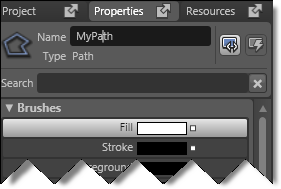

////

|metadata|
{
    "name": "xamcarousel-creating-a-named-path-on-the-artboard",
    "controlName": ["xamCarousel"],
    "tags": [],
    "guid": "{BEF00F5A-53BF-4DD6-A208-D34516E8A180}",  
    "buildFlags": [],
    "createdOn": "2012-01-30T19:39:52.0017535Z"
}
|metadata|
////

= Creating a Named Path on the Artboard

The xamCarouselPanel™, xamCarouselListBox™, xamDataCarousel™, and xamDataPresenter™ Carousel View controls use a path to display items. These controls use a built in path if you don't specify one. However, you can create your own custom path for these controls. You can use Microsoft® Expression® Blend to draw a path and then import it into your Visual Studio project.

Follow these steps to create a named path in Expression Blend's Artboard.

[start=1]
. Create a New Project.
[start=2]
. From the toolbox area on the left, select the Pen tool.

[start=3]
. Draw a path on the Artboard. Simply click multiple areas on the Artboard and Blend will connect the points, creating the path.

[start=4]
. In the Properties tab on the right, specify a name for the path in the Name text box.

[start=5]
. You've just created a named path in Expression Blend! For more information on assigning this path to one of the carousel controls, see link:xamcarousellistbox-setting-a-path-for-xamcarousellistbox-to-use.html[Setting a Path for xamCarouselListBox to Use] or link:xamcarouselpanel-setting-a-path-for-xamcarouselpanel-to-use.html[Setting a Path for xamCarouselPanel to Use].