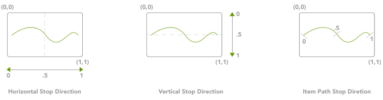

////

|metadata|
{
    "name": "xamcarousel-overview-of-path-effects",
    "controlName": ["xamCarousel"],
    "tags": ["How Do I","Layouts"],
    "guid": "{D6ACBC91-0126-4C38-B12B-D4A339FDBB6A}",  
    "buildFlags": [],
    "createdOn": "2012-01-30T19:39:52.0107553Z"
}
|metadata|
////

= Overview of Path Effects

You can apply Path effects to enhance the paths of xamCarouselPanel™, xamCarouselListBox™, xamDataCarousel™, and xamDataPresenter™ Carousel View. The available Path effects are:

* Opacity
* Scaling
* Z-Order
* Skew-X
* Skew-Y

Path effects are defined similarly to gradient stops in that each effect consists of a collection of link:{RootAssembly}{ApiVersion}~infragistics.windows.controls.effectstop.html[EffectStops]. These effects are then positioned on the control in one of the three ways:

* Horizontally
* Vertically
* Item Path Stop Direction

These options are shown below:

Each EffectStop has an offset value to determine its position on the Path. The offset is expressed as a decimal percentage (0-1) of the overall length of the stop direction. For example, if the stop direction is horizontal, the offset is a percentage of the width of the control.

Each EffectStop also has a value corresponding to the value of the particular effect being set. Since each effect is different, the value ranges specified will be interpreted differently for each effect.

The following code shows how you might define a OpacityEffectStopCollection with three OpacityEffectStops. The opacity value goes from 0 (completely transparent) to 1 (completely opaque), expressed as a decimal percentage.

*In XAML:*

----
...
        <igWindows:OpacityEffectStopCollection>
                <igWindows:OpacityEffectStop Offset="0" Value="1" />
                <igWindows:OpacityEffectStop Offset=".5" Value="0" />
                <igWindows:OpacityEffectStop Offset="1" Value="1" />
        </igWindows:OpacityEffectStopCollection>
...
----

Once you have the EffectStops determined the control uses the stop values and interpolation to create a linear range of values to apply to the item's position between each stop offset.

.Note
[NOTE]
====
The path always assumes that a stop path effect's collection has a zero based offset. You have the choice of explicitly defining a stop with an offset of 0, or allowing the control to interpret the existence of the zero offset stop.
====

== Related Topics

link:xamcarouselpanel-modifying-the-opacity-effect-of-items-on-xamcarouselpanels-path.html[Modifying the Opacity Effect of Items on xamCarouselPanel's Path]

link:xamcarouselpanel-modifying-the-scale-of-elements-on-xamcarouselpanels-path.html[Modifying the Scale of Elements on xamCarouselPanel's Path]

link:xamcarouselpanel-modifying-the-skew-effect-of-items-on-xamcarouselpanels-path.html[Modifying the Skew Effect of Items on xamCarouselPanel's Path]

link:xamcarousellistbox-modifying-the-opacity-effect-of-items-on-xamcarousellistboxs-path.html[Modifying the Opacity Effect of Items on xamCarouselListBox's Path]

link:xamcarousellistbox-modifying-the-scale-of-elements-on-xamcarouselistboxs-path.html[Modifying the Scale of Elements on xamCarouselListBox's Path]

link:xamcarousellistbox-modifying-the-skew-effect-of-items-on-xamcarousellistboxs-path.html[Modifying the Skew Effect of Items on xamCarouselListBox's Path]