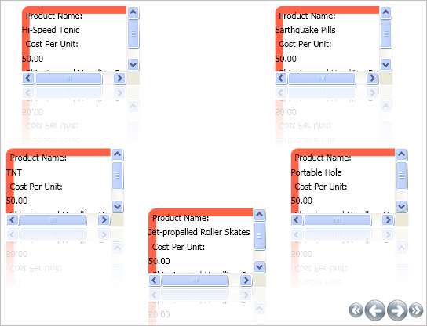

////

|metadata|
{
    "name": "xamcarousellistbox-editing-the-carousellistboxitem-template",
    "controlName": ["xamCarouselListBox"],
    "tags": ["Data Presentation","Templating"],
    "guid": "{A94D8983-45BC-429F-9353-3F12D76211AF}",  
    "buildFlags": [],
    "createdOn": "2012-01-30T19:39:52.0357603Z"
}
|metadata|
////

= Editing the CarouselListBoxItem Template

link:{ApiPlatform}v{ProductVersion}~infragistics.windows.controls.carousellistboxitem.html[CarouselListBoxItem] is a selectable container for items contained within the xamCarouselListBox™ control. The CarouselListBoxItem derives from link:{ApiPlatform}v{ProductVersion}~infragistics.windows.controls.carouselpanelitem.html[CarouselPanelItem] which derives from ListBoxItem. The xamCarouselListBox contains a collection of CarouseListBoxItems. You can create these items manually, or xamCarouselListBox will create them if it is data bound.

Templates can be very complex. A control's template contains all the settings necessary to render that particular control.

Follow these steps to modify the CarouselListBoxItem template. You will place a border around each item in the xamCarouselListBox. This topic assumes you have completed the tasks in the link:xamcarousellistbox-getting-started-with-xamcarousellistbox.html[Adding xamCarouselListBox to Your Application] and link:xamcarousellistbox-working-with-the-itemtemplate.html[Working with the ItemTemplate] topics.

[start=1]
. Make a few modifications to the code in the Working with the ItemTemplate topic. Remove the Label's Background and Foreground settings in the DataTemplate. The modified DataTemplate should look similar to the code below.

*In XAML:*

----
<DataTemplate x:Key="SimpleDataTemplate">
        <StackPanel>
                <Label Content="Product Name:"/>
                <ContentPresenter Content="{Binding XPath=ProductName}" />
                <Label Content="Cost Per Unit:"/>
                <ContentPresenter Content="{Binding XPath=CostPerUnit}" />
                <Label Content="Shipping and Handling Costs:"/>
                <ContentPresenter Content="{Binding XPath=ShipAndHandle}" />
        </StackPanel>
</DataTemplate>
----

[start=2]
. Create a Border and set the BorderBrush to Tomato and the BorderThickness to 10. For your convenience, you can copy the entire link:resources-editing-the-carousellistboxitem-template.html[Style Template] into your project.

*In XAML:*

----

----

[start=3]
. Build and run the project. You will see a reddish border around each item of the xamCarouselListBox similar to the image below.

