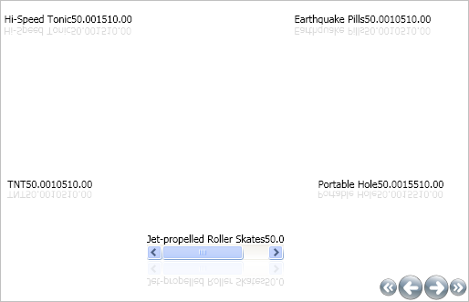

////

|metadata|
{
    "name": "xamcarousellistbox-getting-started-with-xamcarousellistbox",
    "controlName": ["xamCarouselListBox"],
    "tags": ["Data Presentation","Getting Started"],
    "guid": "{CD0FEF23-0169-4FDA-8629-FB6D652AD1FD}",  
    "buildFlags": [],
    "createdOn": "2012-01-30T19:39:52.0387609Z"
}
|metadata|
////

= Adding xamCarouselListBox to Your Application

When you first start working with a new control, you may not know where to begin. This topic will walk you through, from the beginning, how to create the xamCarouselListBox™ control and data bind it using XAML.

The xamCarouselListBox control arranges items along a path. To modify this path, see link:xamcarousellistbox-setting-a-path-for-xamcarousellistbox-to-use.html[Setting a Path for xamCarouselListBox to Use]. For more data binding options, see the link:generalconcepts-data-binding.html[Data Binding] section of the General Programming Concepts.

[start=1]
. Create a Microsoft® Windows® Presentation Foundation Window or Page project.
[start=2]
. For easier access to xamCarouselListBox, place the following namespace declaration inside the opening Page or Window tag.

*In XAML:*

----
xmlns:igWindows="http://infragistics.com/Windows"
----

[start=3]
. Create a resources section defining an XmlDataProvider. The XmlDataProvider references the link:resources-orders.html[Orders] XML file. Place the following XAML inside the Grid Panel.

*In XAML:*

----
<Grid.Resources>
        <XmlDataProvider Source="../Data/Orders.xml" 
          x:Key="OrderData" XPath="/Orders" />
</Grid.Resources>
----

[start=4]
. Create an instance of XamCarouselListBox and set the ItemSource property to the XmlDataProvider created in the previous step.

*In XAML:*

----
<igWindows:XamCarouselListBox 
  ItemsSource="{Binding Source={StaticResource OrderData}, XPath=Order}"/>
----

[start=5]
. Build and run the project. You should see xamCarouselListBox populated with data similar to the image below.

The xamCarouselListBox control displays the data, but not very well at first. You can remedy this by creating an ItemTemplate for xamCarouselListBox. Using an ItemTemplate, you can display the data however you need. For more information on ItemTemplates, see link:xamcarousellistbox-working-with-the-itemtemplate.html[Working with the ItemTemplate].

== Related Topics

link:using-the-data-context-for-data-binding.html[Using the Data Context for Data Binding]