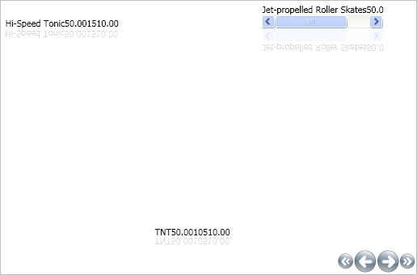

////

|metadata|
{
    "name": "xamcarousellistbox-limiting-the-number-of-items-on-xamcarousellistboxs-path",
    "controlName": ["xamCarouselListBox"],
    "tags": ["Data Presentation","Editing"],
    "guid": "{FCEBD7F7-D062-4B3A-83F1-2002F4A3B32A}",  
    "buildFlags": [],
    "createdOn": "2012-01-30T19:39:52.0407613Z"
}
|metadata|
////

= Limiting the Number of Items on xamCarouselListBox's Path

The xamCarouselListBox™ control displays items along a path. Change the amount of items displayed at one time by modifying the link:{ApiPlatform}v{ProductVersion}~infragistics.windows.controls.carouselviewsettings~itemsperpage.html[ItemsPerPage] property off the CarouselViewSettings object.

The following code sets the xamCarouselListBox control to display three items at a time.

*In XAML:*

----
<igWindows:XamCarouselListBox.ViewSettings>
        <igWindows:CarouselViewSettings ItemsPerPage="3" />
</igWindows:XamCarouselListBox.ViewSettings>
----

Placing this code inside the opening XamCarouselListBox tag in the link:xamcarousellistbox-getting-started-with-xamcarousellistbox.html[Adding xamCarouselListBox to Your Application] topic will produce a result similar to the image below.

