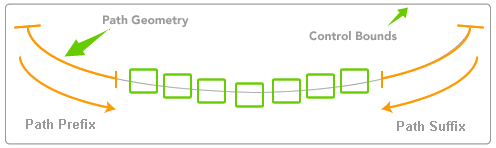
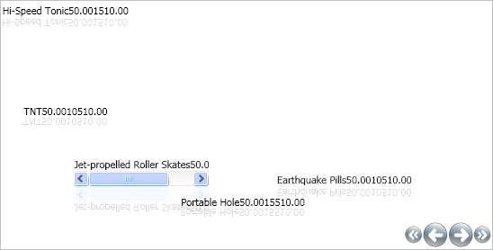

////

|metadata|
{
    "name": "xamcarousellistbox-setting-padding-on-xamcarousellistboxs-path",
    "controlName": ["xamCarouselListBox"],
    "tags": ["Data Presentation","Editing"],
    "guid": "{F7D25D04-100C-4E88-9FDE-BF6C7BBFF023}",  
    "buildFlags": [],
    "createdOn": "2012-01-30T19:39:52.0537639Z"
}
|metadata|
////

= Setting Padding on xamCarouselListBox's Path

You can place buffer zones before and after xamCarouselListBox's™ path. The xamCarouselListBox uses this buffer zone, or padding, when it calculates the control's layout along the path.

The following image demonstrates the Path prefix and suffix functionality.

Use the following code to specify the link:{ApiPlatform}v{ProductVersion}~infragistics.windows.controls.carouselviewsettings~itempathprefixpercent.html[ItemPathPrefixPercent] and link:{ApiPlatform}v{ProductVersion}~infragistics.windows.controls.carouselviewsettings~itempathsuffixpercent.html[ItemPathSuffixPercent] properties off the link:{ApiPlatform}v{ProductVersion}~infragistics.windows.controls.carouselviewsettings.html[CarouselViewSettings].

*In XAML:*

----
<igWindows:XamCarouselListBox.ViewSettings>
        <igWindows:CarouselViewSettings ItemPathPrefixPercent=".2" 
          ItemPathSuffixPercent=".4" />
</igWindows:XamCarouselListBox.ViewSettings>
----

Applying this code to the link:xamcarousellistbox-getting-started-with-xamcarousellistbox.html[Adding xamCarouselListBox to Your Application] topic results in a larger amount of padding after the EarthQuake Pills record similar to the image below.

