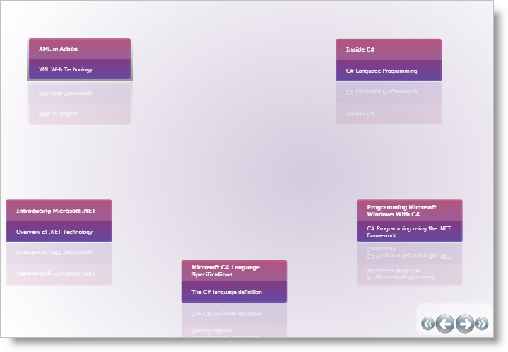
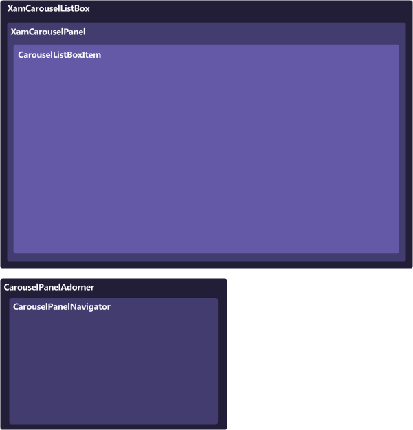

////

|metadata|
{
    "name": "xamcarousellistbox-understanding-xamcarousellistbox",
    "controlName": ["xamCarouselListBox"],
    "tags": ["Data Presentation","Getting Started"],
    "guid": "{DDA4B679-1789-4370-B5B2-8C8837655FE6}",  
    "buildFlags": [],
    "createdOn": "2012-01-30T19:39:52.0557643Z"
}
|metadata|
////

= About xamCarouselListBox

The xamCarouselListBox™ control is similar to the xamCarouselPanel™ control. The xamCarouselListBox is a derived Selector control that uses a xamCarouselPanel as its ItemsPanel in order to position its items along a specified link:xamcarousel-path.html[Path]. The xamCarouselListBox combines the layout capabilities of the xamCarouselPanel with the item management and selection capability of the Selector control.

* link:xamcarousel-path-effects.html[Path Effects] – You can use several effects along xamCarouselListBox's path that will grant items a certain visual flare that normally wouldn't be possible. These path effects can give the path itself a three dimensional look by scaling items, or perhaps you would like for only one item to stand out at a time with an opacity effect, or maybe a skew effect can give your items the feel of motion.
* Item Templates – Each item in xamCarouselListBox is contained within a special container - CarouselListBoxItem. By setting a visual style for this one container, each item will display with the same style. Also, by creating a DataTemplate, you can bind the xamCarouselListBox control to a data source and show much more information per item.
* link:xamcarousel-terms-carousel-panel-navigator.html[CarouselPanelNavigator] – In the lower-right corner of the xamCarouselListBox control is a set of four buttons known collectively as the CarouselPanelNavigator. The two large buttons in the center of the cluster are used to scroll backwards or forwards in the path by one item. The smaller two buttons on either end of the two large buttons will scroll to the first or last items in the path, respectively.

== Composition Diagram

The xamCarouselListBox™ control is comprised of various elements. The following illustration depicts the relationship between the elements, so that you can gain a better understanding of the overall composition of xamCarouselListBox.

== Terms and Concepts

This section defines the major elements that constitute xamCarouselListBox™. Click the following links to explore these elements and see how they relate to xamCarouselListBox.

* link:xamcarousel-terms-architecture.html[Architecture]
* link:xamcarousel-terms-carousel-panel-navigator.html[CarouselPanelNavigator]
* link:xamcarousel-path.html[Path]
* link:xamcarousel-path-effects.html[Path Effects]
* link:xamdata-terms-views.html[Views]
* link:xamdata-terms-themepacks.html[ThemePacks]