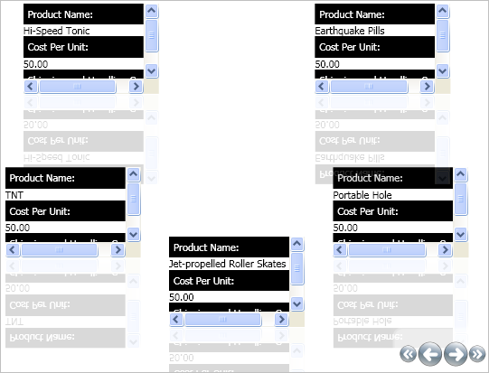

////

|metadata|
{
    "name": "xamcarousellistbox-working-with-the-itemtemplate",
    "controlName": ["xamCarouselListBox"],
    "tags": ["Data Presentation","Editing","Templating"],
    "guid": "{1047D5DF-DFDC-4A58-B338-7F1A80FE456D}",  
    "buildFlags": [],
    "createdOn": "2012-01-30T19:39:52.0607653Z"
}
|metadata|
////

= Working with the ItemTemplate

With xamCarouselListBox™, you can lay out items with DataTemplates and then assign the DataTemplate to the ItemTemplate property. By using the DataTemplate, you can specify how you want your data to display.

.Note
[NOTE]
====
This topic assumes you have completed the tasks in link:xamcarousellistbox-getting-started-with-xamcarousellistbox.html[Adding xamCarouselListBox to Your Application].
====

[start=1]
. Create a DataTemplate in the Resources area. The following code causes each item to display three elements from the underlying data. Place a Label above each element. Give the DataTemplate a Key. You will use this Key in the next step to assign the DataTemplate to xamCarouselListBox.

*Warning:* Be sure to assign a Key to the DataTemplate to prevent compile-time errors.

Specify a Background and Foreground color for each of the Labels to differentiate the Labels from the content.

*In XAML:*

----
<DataTemplate x:Key="SimpleDataTemplate">
        <StackPanel>
                <Label Content="Product Name:" Background="Black" Foreground="White"/>
                <ContentPresenter Content="{Binding XPath=ProductName}" />
                <Label Content="Cost Per Unit:" Background="Black" Foreground="White"/>
                <ContentPresenter Content="{Binding XPath=CostPerUnit}" />
                <Label Content="Shipping and Handling Costs:" Background="Black" 
                  Foreground="White"/>
                <ContentPresenter Content="{Binding XPath=ShipAndHandle}" />
        </StackPanel>
</DataTemplate>
----

[start=2]
. Set the ItemTemplate property of the xamCarouselListBox to a StaticResource, the DataTemplate created in the previous step.

*In XAML:*

----
<igWindows:XamCarouselListBox 
  ItemsSource="{Binding Source={StaticResource OrderData}, XPath=Order}"
  ItemTemplate="{StaticResource SimpleDataTemplate}"/>
----

[start=3]
. Build and run the project. You will see each item in xamCarouselListBox displaying black labels similar to the image below.

