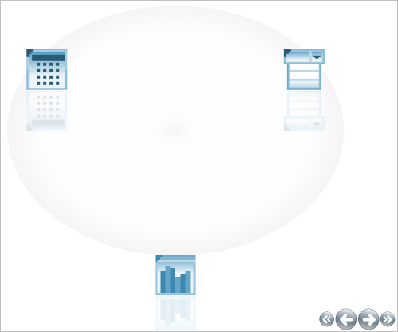

////

|metadata|
{
    "name": "xamcarouselpanel-limiting-the-number-of-items-viewed-on-xamcarouselpanels-path",
    "controlName": ["xamCarouselPanel"],
    "tags": ["How Do I"],
    "guid": "{BA8DC2AF-99DC-46EE-9D6E-F638D537B37E}",  
    "buildFlags": [],
    "createdOn": "2012-01-30T19:39:52.0767685Z"
}
|metadata|
////

= Limiting the Number of Items Viewed on xamCarouselPanel's Path

The xamCarouselPanel™ control displays a number of items along a path. You can change the number of items displayed along the path by modifying the link:{ApiPlatform}v{ProductVersion}~infragistics.windows.controls.carouselviewsettings~itemsperpage.html[ItemsPerPage] property of the link:{ApiPlatform}v{ProductVersion}~infragistics.windows.controls.carouselviewsettings.html[CarouselViewSettings] object.

The following code displays three items at a time.

*In XAML:*

----
<igWindows:XamCarouselPanel.ViewSettings>
        <igWindows:CarouselViewSettings ItemsPerPage="3" />
</igWindows:XamCarouselPanel.ViewSettings>
----

Placing this code inside the opening XamCarouselPanel tag in link:xamcarouselpanel-getting-started-with-xamcarouselpanel.html[Adding xamCarouselPanel to Your Page] will produce a result similar to the image below.

