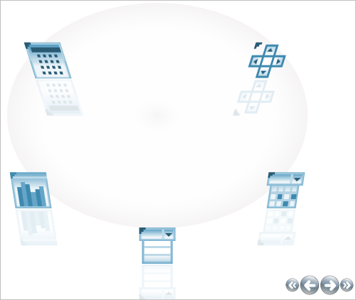
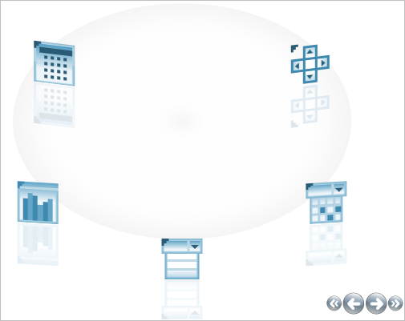

////

|metadata|
{
    "name": "xamcarouselpanel-modifying-the-skew-effect-of-items-on-xamcarouselpanels-path",
    "controlName": ["xamCarouselPanel"],
    "tags": ["How Do I","Styling"],
    "guid": "{0388B60F-5794-4E30-9184-D273AB3FE765}",  
    "buildFlags": [],
    "createdOn": "2012-01-30T19:39:52.0857703Z"
}
|metadata|
////

= Modifying the Skew Effect of Items on xamCarouselPanel's Path

The xamCarouselPanel™ control can skew items on the path. You can set the skewing effect on either the X or Y axis independently. Similar to other Path effects (Opacity, Scale, Z-Order), the link:{RootAssembly}{ApiVersion}~infragistics.windows.controls.carouselviewsettings.html[CarouselViewSettings] object exposes the link:{RootAssembly}{ApiVersion}~infragistics.windows.controls.skewanglexeffectstopcollection.html[SkewAngleXEffectStopCollection] and link:{RootAssembly}{ApiVersion}~infragistics.windows.controls.skewangleyeffectstopcollection.html[SkewAngleYEffectStopCollection]. In addition, also similar to the other effects, you need to set the direction of the effect as either Horizontal, Vertical, or UseItemPath for both the X and Y skew by setting the link:{RootAssembly}{ApiVersion}~infragistics.windows.controls.carouselviewsettings~skewanglexeffectstopdirection.html[SkewAngleXEffectStopDirection] and link:{RootAssembly}{ApiVersion}~infragistics.windows.controls.carouselviewsettings~skewangleyeffectstopdirection.html[SkewAngleYEffectStopDirection] properties. The skew's values deal with the rotation of an object and are valid from -360 to +360.

.Note
[NOTE]
====
This topic assumes you have completed the tasks in link:xamcarouselpanel-getting-started-with-xamcarouselpanel.html[Adding xamCarouselPanel to Your Page].
====

== Modifying the Skew-X

The following code skews objects along the X axis in relation to the path. The first link:{RootAssembly}{ApiVersion}~infragistics.windows.controls.skewanglexeffectstop.html[SkewAngleXEffectStop] is skewing items 25 degrees at the beginning of the path (offset 0). Items at the half way point (offset .5) are not skewed. Items at the end of the path (offset 1) are skewed -25 degrees.

*In XAML:*

----
<igWindows:XamCarouselPanel.ViewSettings>
        <igWindows:CarouselViewSettings SkewAngleXEffectStopDirection="UseItemPath" 
          UseSkewing="True">
                <igWindows:CarouselViewSettings.SkewAngleXEffectStops>
                        <igWindows:SkewAngleXEffectStopCollection>
                                <igWindows:SkewAngleXEffectStop Offset="0" Value="25" />
                                <igWindows:SkewAngleXEffectStop Offset=".5" Value="0" />
                                <igWindows:SkewAngleXEffectStop Offset="1" Value="-25" />
                        </igWindows:SkewAngleXEffectStopCollection>
                </igWindows:CarouselViewSettings.SkewAngleXEffectStops>
        </igWindows:CarouselViewSettings>
</igWindows:XamCarouselPanel.ViewSettings>
----

== Modifying the Skew-Y

The following code skews objects along the Y axis in relation to the path. The first link:{RootAssembly}{ApiVersion}~infragistics.windows.controls.skewangleyeffectstop.html[SkewAngleYEffectStop] skews items 10 degrees at the beginning of the path (offset 0). Items at the half-way point (offset .5) are not skewed. Items at the end of the path (offset 1) are skewed -10 degrees.

*In XAML:*

----
<igWindows:XamCarouselPanel.ViewSettings>
        <igWindows:CarouselViewSettings SkewAngleYEffectStopDirection="UseItemPath" 
          UseSkewing="True">
                <igWindows:CarouselViewSettings.SkewAngleYEffectStops>
                        <igWindows:SkewAngleYEffectStopCollection>
                                <igWindows:SkewAngleYEffectStop Offset="0" Value="10" />
                                <igWindows:SkewAngleYEffectStop Offset=".5" Value="0" />
                                <igWindows:SkewAngleYEffectStop Offset="1" Value="-10" />
                        </igWindows:SkewAngleYEffectStopCollection>
                </igWindows:CarouselViewSettings.SkewAngleYEffectStops>
        </igWindows:CarouselViewSettings>
</igWindows:XamCarouselPanel.ViewSettings>
----

