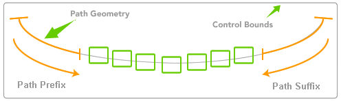

////

|metadata|
{
    "name": "xamcarouselpanel-setting-padding-on-xamcarouselpanels-path",
    "controlName": ["xamCarouselPanel"],
    "tags": ["How Do I"],
    "guid": "{6FD4CB38-4137-490E-8B84-571E6EA51C2A}",  
    "buildFlags": [],
    "createdOn": "2012-01-30T19:39:52.0897711Z"
}
|metadata|
////

= Setting Padding on xamCarouselPanel's Path

You can place buffer zones before and after xamCarouselPanel's™ path. The xamCarouselPanel uses this buffer zone, or padding, when it calculates the control's layout along the path.

The following image demonstrates the Path prefix and suffix functionality.

Use the following code to specify the link:{ApiPlatform}v{ProductVersion}~infragistics.windows.controls.carouselviewsettings~itempathprefixpercent.html[ItemPathPrefixPercent] and link:{ApiPlatform}v{ProductVersion}~infragistics.windows.controls.carouselviewsettings~itempathsuffixpercent.html[ItemPathSuffixPercent] properties off the link:{ApiPlatform}v{ProductVersion}~infragistics.windows.controls.carouselviewsettings.html[CarouselViewSettings].

*In XAML:*

----
<igWindows:XamCarouselPanel.ViewSettings>
        <igWindows:CarouselViewSettings ItemPathPrefixPercent=".2" 
          ItemPathSuffixPercent=".4" />
</igWindows:XamCarouselPanel.ViewSettings>
----

Applying this code to the link:xamcarouselpanel-getting-started-with-xamcarouselpanel.html[Adding xamCarouselPanel to Your Page] topic results in a larger amount of padding applied after last image and before first image.

