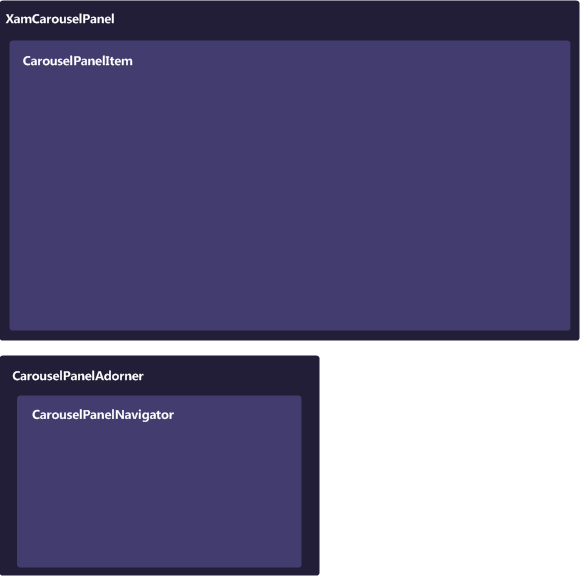

////

|metadata|
{
    "name": "xamcarouselpanel-understanding-xamcarouselpanel",
    "controlName": ["xamCarouselPanel"],
    "tags": ["Getting Started"],
    "guid": "{9B8EB8A7-89B8-44AE-BE9A-6CFCCCD79138}",  
    "buildFlags": [],
    "createdOn": "2012-01-30T19:39:52.0927717Z"
}
|metadata|
////

= About xamCarouselPanel

The xamCarouselPanel™ control is a derived Panel that positions its elements along a set link:xamcarousel-path.html[Path]. You can create the path using either procedural code or XAML, or you can use Microsoft® Expression® Blend to draw a path visually. The xamCarouselPanel control has a Children collection so you can easily add child elements in procedural code. Once populated, the child elements travel along the designated path.

* link:xamcarousel-path-effects.html[Path Effects] – You can use several effects along xamCarouselPanel's path that will grant items a certain visual flare that normally wouldn't be possible. These path effects can give the path itself a three-dimensional look by scaling items, or perhaps you would like for only one item to stand out at a time with an opacity effect, or maybe a skew effect can give your items the feel of motion.
* Item Templates – Each item in xamCarouselPanel is contained within a special container - CarouselPanelItem. By setting a visual style for this one container, each item will display with the same style.
* link:xamcarousel-terms-carousel-panel-navigator.html[CarouselPanelNavigator] – In the lower-right corner of the xamCarouselPanel control is a set of four buttons known collectively as the CarouselPanelNavigator. The two large buttons in the center of the cluster are used to scroll backwards or forwards in the path by one item. The smaller two buttons on either end of the two large buttons will scroll to the first or last items in the path, respectively.

== Composition Diagram

The xamCarouselPanel™ control is comprised of various elements. The following illustration depicts the relationship between the elements, so that you can gain a better understanding of the overall composition of xamCarouselPanel.

== Terms and Concepts

This section defines the major elements that constitute xamCarouselPanel™. Click the following links to explore these elements and see how they relate to xamCarouselPanel.

* link:xamcarousel-terms-architecture.html[Architecture]
* link:xamcarousel-terms-carousel-panel-navigator.html[CarouselPanelNavigator]
* link:xamcarousel-path.html[Path]
* link:xamcarousel-path-effects.html[Path Effects]
* link:xamdata-terms-views.html[Views]
* link:xamdata-terms-themepacks.html[ThemePacks]