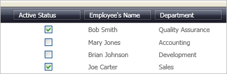

////
|metadata|
{
    "name": "xamcheckeditor-using-xamcheckeditor-as-a-field-in-xamdatagrid",
    "controlName": ["xamCheckEditor"],
    "tags": ["Getting Started","How Do I"],
    "guid": "{B5D11E18-6334-4FA2-9A02-737ABB9107D2}",
    "buildFlags": [],
    "createdOn": "2012-09-05T19:05:30.0589781Z"
}
|metadata|
////

= Using xamCheckEditor as a Field in xamDataGrid

An important feature of the xamCheckEditor™ control is its ability to be embedded in a xamDataGrid™ Field. This feature allows your end user to take advantage of the editor's full potential while modifying a cell's value. The xamCheckEditor control is also more visually appealing than just using the words True and False.

XamDataGrid will automatically use xamCheckEditor as the default editor for boolean type fields. However for fields of other types, follow these steps to display a xamCheckEditor in a link:{ApiPlatform}datapresenter.v{ProductVersion}~infragistics.windows.datapresenter.field.html[Field] of xamDataGrid.

[start=1]
. Create a Microsoft® Windows® Presentation Foundation Window or Page project.

[start=2]
. Place the following namespace declarations inside the opening Page or Window tag. These declarations allow you to reference xamDataGrid, xamCheckEditor, and to define types (i.e. Int32, Boolean).
+
*In XAML:*
+
[source,xaml]
----
xmlns:igDP="http://infragistics.com/DataPresenter"
xmlns:igEditors="http://infragistics.com/Editors"
xmlns:sys="clr-namespace:System;assembly=mscorlib"
----

[start=3]
. Create a resource section defining an XmlDataProvider. The XmlDataProvider references the link:resources-employees.html[Employees] XML file. Place the following XAML inside the Grid Panel.
+
*In XAML:*
+
[source,xaml]
----
<Grid.Resources>
    <XmlDataProvider Source="../Data/Employees.xml" 
        x:Key="EmployeeData" XPath="/employees" />
</Grid.Resources>
----

[start=4]
. Create an instance of XamDataGrid, name it, and set the DataSource property to the XmlDataProvider created in the previous step.
+
*In XAML:*
+
[source,xaml]
----
<igDP:XamDataGrid x:Name="XamDataGrid1" 
    DataSource="{Binding Source={StaticResource EmployeeData}, XPath=employee}">
        ...
</igDP:XamDataGrid>
----

[start=5]
. Set the link:{ApiPlatform}datapresenter.v{ProductVersion}~infragistics.windows.datapresenter.fieldlayoutsettings~autogeneratefields.html[AutoGenerateFields] property off the link:{ApiPlatform}datapresenter.v{ProductVersion}~infragistics.windows.datapresenter.fieldlayoutsettings.html[FieldLayoutSettings] object to False. Place the following XAML between the tags created in the previous step.
+
*In XAML:*
+
[source,xaml]
----
...
<igDP:XamDataGrid.FieldLayoutSettings>
    <igDP:FieldLayoutSettings AutoGenerateFields="False" />
</igDP:XamDataGrid.FieldLayoutSettings>
...
----

[start=6]
. Set a link:{ApiPlatform}datapresenter.v{ProductVersion}~infragistics.windows.datapresenter.fielditem~label.html[Label] for each Field. If you don't provide a Label, the link:{ApiPlatform}datapresenter.v{ProductVersion}~infragistics.windows.datapresenter.fielditem~name.html[Name] of the Field is used. Create three Fields. For the first field, set the link:{ApiPlatform}datapresenter.v{ProductVersion}~infragistics.windows.datapresenter.fieldsettings.html[FieldSettings] link:{ApiPlatform}datapresenter.v{ProductVersion}~infragistics.windows.datapresenter.fieldsettings~editastype.html[EditAsType] and link:{ApiPlatform}datapresenter.v{ProductVersion}~infragistics.windows.datapresenter.fieldsettings~editortype.html[EditorType] properties. The EditAsType property defines a Type for the Field. In this case, you want the Field to display Booleans. The EditorType property sets the Type of link:{ApiPlatform}editors.v{ProductVersion}~infragistics.windows.editors.valueeditor.html[ValueEditor] to use. In this case, you are using the XamCheckEditor. Place this code below the code in the previous step.
+
*In XAML:*
+
[source,xaml]
----
...
<igDP:XamDataGrid.FieldLayouts>
    <igDP:FieldLayout>
        <igDP:FieldLayout.Fields>
            <igDP:Field Name="active" Label="Active Status" >
                <igDP:Field.Settings>
                    <igDP:FieldSettings 
                        EditAsType="{x:Type sys:Boolean}" 
                        EditorType="{x:Type igEditors:XamCheckEditor}" />
                </igDP:Field.Settings>
            </igDP:Field>
            <igDP:Field Name="name" Label="Employee's Name" />
            <igDP:Field Name="department" Label="Department" />
        </igDP:FieldLayout.Fields>
    </igDP:FieldLayout>
</igDP:XamDataGrid.FieldLayouts>
...
----

[start=7]
. Build and run the project. You should see a xamCheckEditor in the first field of xamDataGrid similar to the image below.
+
