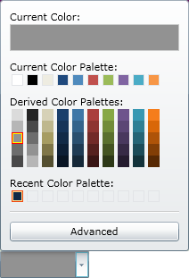

////
|metadata|
{
    "name": "xamcolorpicker-adding-xamcolorpicker-to-your-page",
    "controlName": ["xamColorPicker"],
    "tags": ["Getting Started"],
    "guid": "4993c8ab-d3e9-4517-a579-cc4f51cf8b33",
    "buildFlags": [],
    "createdOn": "2016-05-25T18:21:54.6420987Z"
}
|metadata|
////

= Adding xamColorPicker to Your Page

== Before You Begin

The xamColorPicker™ control is a simple editor control that allows your end users to select a color value from a pre-defined palette of colors.

== What You Will Accomplish

This topic will demonstrate how to add a xamColorPicker control to your page using XAML and procedural code.

== Follow These Steps

[start=1]
. Create a {PlatformName} project.

[start=2]
. In the Solution Explorer, add the following references to your project:

.. {ApiPlatform}v{ProductVersion}.dll
.. {ApiPlatform}Controls.Editors.XamColorPicker.v{ProductVersion}.dll
.. {ApiPlatform}Controls.Editors.XamSlider.v{ProductVersion}.dll

[start=3]
. Add the following namespace declarations for xamColorPicker:
+
*In XAML:*
+
[source,xaml]
----
xmlns:ig="http://schemas.infragistics.com/xaml"
----
+
*In Visual Basic:*
+
[source,vb]
----
Imports Infragistics.Controls.Editors
----
+
*In C#:*
+
[source,csharp]
----
using Infragistics.Controls.Editors;
----

[start=4]
. Add a xamColorPicker control to your page. Set the following properties:
+
--
.. X:Name – MyColorPicker
.. link:{ApiPlatform}controls.editors.xamcolorpicker.v{ProductVersion}~infragistics.controls.editors.xamcolorpicker~derivedpalettescount.html[DerivedPalettesCount] – 5
.. link:{ApiPlatform}controls.editors.xamcolorpicker.v{ProductVersion}~infragistics.controls.editors.xamcolorpicker~selectedcolor.html[SelectedColor] – Black
.. Width – 100
.. Height – 20
--
+
*In XAML:*
+
[source,xaml]
----
<ig:XamColorPicker x:Name="MyColorPicker"  
                   DerivedPalettesCount="10" 
                   Width="100" Height="20" SelectedColor="Black">
</ig:XamColorPicker>
----
+
*In Visual Basic:*
+
[source,vb]
----
Dim MyColorPicker As New XamColorPicker()
MyColorPicker.DerivedPalettesCount = 10
MyColorPicker.Width = 100
MyColorPicker.Height = 20
MyColorPicker.SelectedColor = Colors.Black
----
+
*In C#:*
+
[source,csharp]
----
XamColorPicker MyColorPicker = new XamColorPicker();
MyColorPicker.DerivedPalettesCount = 10;
MyColorPicker.Width = 100;
MyColorPicker.Height = 20;
MyColorPicker.SelectedColor = Colors.Black;
----

[start=5]
. Save and run your application.
+

== Related Topics

link:xamcolorpicker-about-xamcolorpicker.html[About xamColorPicker]

link:xamcolorpicker-adding-xamcolorpicker-to-your-grid.html[Adding xamColorPicker to Your Grid]

link:xamcolorpicker-using-xamcolorpicker.html[Configuring xamColorPicker]