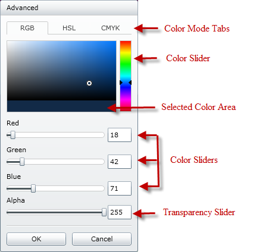

////

|metadata|
{
    "name": "xamcolorpicker-advanced-editor",
    "controlName": ["xamColorPicker"],
    "tags": ["Editing","How Do I"],
    "guid": "f2ca39d7-2bb8-4633-98d1-a35655003ea7",  
    "buildFlags": [],
    "createdOn": "2016-05-25T18:21:54.6540899Z"
}
|metadata|
////

= Configuring Advanced Editor (xamColorPicker)

The advanced editor section of the xamColorPicker control allows your end user to select a color that is not available in the palette that is supplied.

*Color Mode Tabs* – Your end users can avail of three different color modes within the advanced editor area:

* *RGB* – this model is an additive color model, where three primary colors, Red, Green and Blue are used together to create colors.
* *HSL* – this model defines colors based on the hue, the saturation of the color and the brightness of the color.
* *CMYK* – this model is a subtractive color model, where the colors cyan, magenta, yellow and key(black) are used to create colors.

*Color Slider* – This slider allows your end users to pick a particular color. This particular color’s range from dark to bright is then displayed in the color area

*Color Area* – This area displays the range of a particular color that your end user selected from the slider.

*Selected Color Area* – This area displays two colors, the previously selected color and the current color selected in the color area.

*Color Sliders* – Based on the model selected from the color mode tabs, these sliders will display the RGB value, the CMKY value or the HSL value. The last slider in each model displays the Transparency of the color.

When your end user chooses a color from the advanced editor area, the xamColorPicker control’s SelectedColor property will be set to that particular color.

The advanced editor can be hidden from your end user by setting the xamColorPicker control’s link:{ApiPlatform}controls.editors.xamcolorpicker.v{ProductVersion}~infragistics.controls.editors.xamcolorpicker~showadvancededitorbutton.html[ShowAdvancedEditorButton] property to false, as demonstrated in the following code.

*In XAML:*

----
<ig:XamColorPicker x:Name="MyColorPicker"  DerivedPalettesCount="10" Width="100"  
                   Height="20" ShowAdvancedEditorButton=" 
                   ShowDerivedColorPalettes=">
</ig:XamColorPicker>
----

*In Visual Basic:*

----
MyColorPicker.ShowAdvancedEditorButton = False
----

*In C#:*

----
MyColorPicker.ShowAdvancedEditorButton = false;
----

== *Related Topics*

link:xamcolorpicker-palettes.html[Configuring Palettes]

link:xamcolorpicker-create-a-custom-palette.html[Configuring Custom Palette]

link:xamcolorpicker-selected-color.html[Configuring Selected Color]