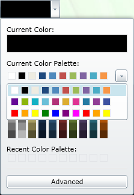

////

|metadata|
{
    "name": "xamcolorpicker-create-a-custom-palette",
    "controlName": ["xamColorPicker"],
    "tags": ["How Do I","Styling"],
    "guid": "afa23127-dfa7-4c9f-9100-319f7bfc86b1",  
    "buildFlags": [],
    "createdOn": "2016-05-25T18:21:54.6660906Z"
}
|metadata|
////

= Configuring Custom Palette (xamColorPicker)

In some situations when the pre-defined palette does not suit your needs, you can expand the available palettes.

You can easily add your own custom palette to the xamColorPicker control by adding it to the link:{ApiPlatform}controls.editors.xamcolorpicker{ApiVersion}~infragistics.controls.editors.xamcolorpicker~colorpalettes.html[ColorPalettes] collection.

The following code demonstrates how to achieve this.

*In XAML:*

----
<ig:XamColorPicker x:Name="MyColorPicker" DerivedPalettesCount="10" Width="100"   
                   Height="30" >
   <ig:XamColorPicker.ColorPalettes>
      <!-- Create Custom Palette -->
      <ig:ColorPalette>
         <ig:ColorPalette.Colors>
            <ig:ColorPatchCollection>
               <ig:ColorPatch Color="Red"/>
               <ig:ColorPatch Color="Orange"/>
               <ig:ColorPatch Color="Yellow"/>
               <ig:ColorPatch Color="Green"/>
               <ig:ColorPatch Color="Blue"/>
               <ig:ColorPatch Color="Indigo"/>
               <ig:ColorPatch Color="Violet"/>
               <ig:ColorPatch Color="Red"/>
               <ig:ColorPatch Color="Orange"/>
               <ig:ColorPatch Color="Yellow"/>
            </ig:ColorPatchCollection>
         </ig:ColorPalette.Colors>
      </ig:ColorPalette>
   </ig:XamColorPicker.ColorPalettes>
</ig:XamColorPicker>
----

*In Visual Basic:*

----
Dim MyColorPalette As New ColorPalette()
MyColorPalette.Colors.Add(Colors.Red)
MyColorPalette.Colors.Add(Colors.Orange)
MyColorPalette.Colors.Add(Colors.Yellow)
MyColorPalette.Colors.Add(Colors.Green)
MyColorPalette.Colors.Add(Colors.Blue)
MyColorPalette.Colors.Add(Colors.Purple) 
MyColorPalette.Colors.Add(Colors.Magenta)
MyColorPalette.Colors.Add(Colors.Red)
MyColorPalette.Colors.Add(Colors.Orange)
MyColorPalette.Colors.Add(Colors.Yellow)
MyColorPicker.ColorPalettes.Add(MyColorPalette)
----

*In C#:*

----
ColorPalette MyColorPalette = new ColorPalette();
MyColorPalette.Colors.Add(Colors.Red);
MyColorPalette.Colors.Add(Colors.Orange);
MyColorPalette.Colors.Add(Colors.Yellow);
MyColorPalette.Colors.Add(Colors.Green);
MyColorPalette.Colors.Add(Colors.Blue);
MyColorPalette.Colors.Add(Colors.Purple);
MyColorPalette.Colors.Add(Colors.Magenta);
MyColorPalette.Colors.Add(Colors.Red);
MyColorPalette.Colors.Add(Colors.Orange);
MyColorPalette.Colors.Add(Colors.Yellow);
this.MyColorPicker.ColorPalettes.Add(MyColorPalette);
----

The following screenshot displays the xamColorPicker control with two custom palettes added.

== *Related Topics*

link:xamcolorpicker-advanced-editor.html[Configuring Advanced Editor]

link:xamcolorpicker-palettes.html[Configuring Palettes]

link:xamcolorpicker-selected-color.html[Configuring Selected Color]