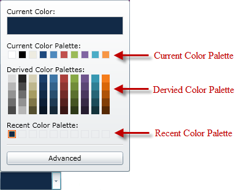

////

|metadata|
{
    "name": "xamcolorpicker-palettes",
    "controlName": ["xamColorPicker"],
    "tags": ["Getting Started"],
    "guid": "0a3c5d99-9ba2-4a59-b62d-440e5fd15b90",  
    "buildFlags": [],
    "createdOn": "2016-05-25T18:21:54.6600902Z"
}
|metadata|
////

= Configuring Palettes (xamColorPicker)

Palettes are a fundamental part of the xamColorPicker control; without them your end user would not be able to interact with the control.

Within the xamColorPicker control there are three different palettes:

*Current Color Palette* – This palette display the professionally designed palette available with the control, or your own custom palettes. Selecting the drop-down button to the right of the current color palette displays a list of all your custom palettes. Selecting one of these palettes from the drop-down will change the current color palette to that selected palette.

*Derived Color Palette* – This palette displays increasingly darker shades of the colors displayed in the current palette. You can set the number of shades displayed by setting the xamColorPicker control’s DerivedPalettesCount property.

*Recent Color Palette* – This palette displays the colors that have been selected recently by your end user.

You can show or hide the Derived Color Palette and the Recent Color Palette by setting the xamColorPicker control’s ShowDerivedColorPalette and RecentColorPalette properties as demonstrated in the following code.

*In XAML:*

----
<ig:XamColorPicker ShowDerivedColorPalettes=" ShowRecentColorsPalette="   
                   x:Name="MyColorPicker"  Width="100" Height="20">
</ig:XamColorPicker>
----

*In Visual Basic:*

----
MyColorPicker.ShowDerivedColorPalettes = False
MyColorPicker.ShowRecentColorsPalette = False
----

*In C#:*

----
MyColorPicker.ShowDerivedColorPalettes = false;
MyColorPicker.ShowRecentColorsPalette = false;
----

The captions displayed with each of the palettes are fully customizable and you can set them to suit your own application. This can be achieved by setting the following properties on the xamColorPicker control:

* link:{ApiPlatform}controls.editors.xamcolorpicker.v{ProductVersion}~infragistics.controls.editors.xamcolorpicker~currentcolorcaption.html[CurrentColorCaption]
* link:{ApiPlatform}controls.editors.xamcolorpicker.v{ProductVersion}~infragistics.controls.editors.xamcolorpicker~currentpalettecaption.html[CurrentPaletteCaption]
* link:{ApiPlatform}controls.editors.xamcolorpicker.v{ProductVersion}~infragistics.controls.editors.xamcolorpicker~derivedcolorpalettescaption.html[DerivedColorPalettesCaption]
* link:{ApiPlatform}controls.editors.xamcolorpicker.v{ProductVersion}~infragistics.controls.editors.xamcolorpicker~recentcolorpalettecaption.html[RecentColorPalettesCaption]

The following code demonstrates how to set these properties.

*In XAML:*

----
<ig:XamColorPicker x:Name="MyColorPicker"  DerivedPalettesCount="10" Width="100"  
                   Height="20"CurrentColorCaption = "New Current Color Caption"
                   CurrentPaletteCaption = "New Current Palette Caption"
                   DerivedColorPalettesCaption = "New Derived Palette Caption"
                   RecentColorPaletteCaption = "New Recent Color Palette Caption">
</ig:XamColorPicker>
----

*In Visual Basic:*

----
MyColorPicker.CurrentColorCaption = "New Current Color Caption"
MyColorPicker.CurrentPaletteCaption = "New Current Palette Caption"
MyColorPicker.DerivedColorPalettesCaption = "New Derived Palette Caption"
MyColorPicker.RecentColorPaletteCaption = "New Recent Color Palette Caption"
----

*In C#:*

----
MyColorPicker.CurrentColorCaption = "New Current Color Caption";
MyColorPicker.CurrentPaletteCaption = "New Current Palette Caption";
MyColorPicker.DerivedColorPalettesCaption = "New Derived Palette Caption";
MyColorPicker.RecentColorPaletteCaption = "New Recent Color Palette Caption";
----

== *Related Topics*

link:xamcolorpicker-advanced-editor.html[Configuring Advanced Editor]

link:xamcolorpicker-create-a-custom-palette.html[Configuring Custom Palette]

link:xamcolorpicker-selected-color.html[Configuring Selected Color]