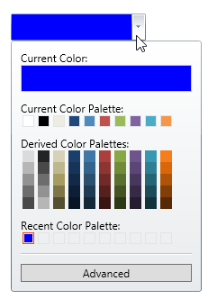

////

|metadata|
{
    "name": "xamcolorpicker-selected-color",
    "controlName": ["xamColorPicker"],
    "tags": ["How Do I","Selection"],
    "guid": "4d8419fc-75c6-4de5-9805-56f04dbc8ba4",  
    "buildFlags": [],
    "createdOn": "2016-05-25T18:21:54.6720909Z"
}
|metadata|
////

= Configuring Selected Color (xamColorPicker)

== Topic Overview

=== Purpose

This topic describes how to identify and modify the selected color in the  _xamColorPicker_™ control.

=== Required background

The following topics are prerequisites to understanding this topic:

[options="header", cols="a,a"]
|====
|Topic|Purpose

| link:xamcolorpicker-adding-xamcolorpicker-to-your-page.html[Adding xamColorPicker to Your Page]
|This topic describes how to add a _xamColorPicker_ control to your page using XAML and procedural code.

|====

=== In this topic

This topic contains the following sections:

* <<_Ref394388221, User Interactions and Usability >>
* <<_Ref394388226, Configuring the Selected Color >>
* <<_Ref394388230, Using the SelectedColorChanged Event >>
* <<_Ref394389905, Previewing the Selected Color >>
* <<_Ref394388241, Related Content >>

** <<_Ref394388245,Topics>>

ifdef::sl[]
** <<_Ref394388249,Samples>>

endif::sl[]

[[_Ref394388221]]
== User Interactions and Usability

=== User interactions summary chart

The following table summarizes the user interaction capabilities of the  _xamColorPicker_   control related to the color selection.

[options="header", cols="a,a,a"]
|====
|The user can…|Using…|Configurable?

|[[_Hlk377147553]] 

Select a color from the Current Color Palette, the Derived Color Palette or the Recent Color Palette
|Mouse click
|image::images/No.png[]

|[[_Hlk377147649]] 

Preview a color from the Current Color Palette, the Derived Color Palette or the Recent Color Palette
|Hover over a color
|image::images/No.png[]

|Select a color from the Advanced editor and click the `OK` button
|Mouse click
|image::images/Yes.png[] 

* link:xamcolorpicker-advanced-editor.html[Configuring Advanced Editor] 

|Restore the previous selected color
|`ESC` key
|image::images/No.png[]

|Restore the previous selected color
|Mouse click outside of the editor
|image::images/No.png[]

|====

[[_Ref394388226]]
== Configuring the Selected Color

[[_Hlk368069110]]

=== Overview

Use the  _xamColorPicker_   `SelectedColor` property to get/set the currently selected color.

.Note
[NOTE]
====
After selecting a particular color, this color is added to the Recent Color Palette.
====

=== Property settings

The following table maps the desired configuration to the property settings that manage it.

[options="header", cols="a,a,a"]
|====
|In order to:|Use this property:|And set it to:

|Specify the selected color
| link:{ApiPlatform}controls.editors.xamcolorpicker{ApiVersion}~infragistics.controls.editors.xamcolorpicker~selectedcolor.html[SelectedColor]
|`Color?`

|====

[[_Hlk337817761]]

=== Example

The screenshot below demonstrates how the  _xamColorPicker_   would look as a result of the following settings:

[options="header", cols="a,a"]
|====
|Property|Value

| link:{ApiPlatform}controls.editors.xamcolorpicker{ApiVersion}~infragistics.controls.editors.xamcolorpicker~selectedcolor.html[SelectedColor]
| _Blue_ 

|====

Following is the code that implements this example.

*In XAML:*

[source,xaml]
----
<ig:XamColorPicker SelectedColor="Blue" Height="30" Width="150" />
----

*In C#:*

[source,csharp]
----
var colorPicker = new XamColorPicker {SelectedColor = Colors.Blue, Height = 30, Width = 150};
----

*In Visual Basic:*

[source,vb]
----
Dim colorPicker = New XamColorPicker() With 
{
            .SelectedColor = Colors.Blue,
            .Height = 30,
            .Width = 150
}
----

[[_Ref394388230]]
== Using the SelectedColorChanged Event

=== Overview

The `SelectedColorChanged` event is fired when the selected color within the  _xamColorPicker_   is changed.

It is fired when a user clicks on a specific color in some of the  _xamColorPicker_   Palettes.

This event receives an argument of type link:{ApiPlatform}controls.editors.xamcolorpicker{ApiVersion}~infragistics.controls.editors.selectedcolorchangedeventargs_members.html[SelectedColorChangedEventArgs] that provides information about the new and previous selected color.

[[_Ref393992051]]
[[_Ref394389905]]
== Previewing the Selected Color

Use the  _xamColorPicker_   `SelectedColorPreview` property to identify the color that is currently being hovered.

This property is updated every time a user hovers over a color from the Current Color Palette, the Derived Color Palette, the Recent Color Palette or the palette in the Advanced editor.

In case the user isn’t hovering over colors, the `SelectedColorPreview` value is the same as the `SelectedColor` value.

=== Property settings

The following table maps the desired behavior to the property settings that manage it.

[options="header", cols="a,a,a"]
|====
|In order to:|Use this property:|And set it to:

|Preview the selected color on mouse hover
| link:{ApiPlatform}controls.editors.xamcolorpicker{ApiVersion}~infragistics.controls.editors.xamcolorpicker~selectedcolorpreview.html[SelectedColorPreview]
|`Color?`

|====

[[_Ref394388241]]
== Related Content

[[_Ref394388245]]

=== Topics

The following topics provide additional information related to this topic.

[options="header", cols="a,a"]
|====
|Topic|Purpose

| link:xamcolorpicker-advanced-editor.html[Configuring Advanced Editor]
|This topic describes the advanced editor section of the _xamColorPicker_ control that allows the user to select a color that is not available in the palette that is supplied.

| link:xamcolorpicker-palettes.html[Configuring Palettes]
|This topic describes the palettes in the _xamColorPicker_ control.

| link:xamcolorpicker-create-a-custom-palette.html[Configuring Custom Palette]
|This topic describes how to create a custom palette in the _xamColorPicker_ control.

|====

ifdef::sl[]

[[_Ref394388249]]

=== Samples

The following samples provide additional information related to this topic.

[options="header", cols="a,a"]
|====
|Sample|Purpose

| link:{SamplesURL}/color-picker/#/events[Events]
|This sample demonstrates the _xamColorPicker_ control's events as well as the usage of the SelectedColorPreview property.

| link:{SamplesURL}/color-picker/#/xamcolorpicker-and-xamgrid[Using the xamColorPicker in the xamGrid]
|This sample demonstrates how to change the color of a _xamGrid_ cell based on the selected color from the _xamColorPicker_ control.

| link:{SamplesURL}/color-picker/#/xamcolorpicker-as-editor[Using the xamColorPicker as an Editor]
|This sample demonstrates how to change the color of the text using the _xamColorPicker_ control.

|====

endif::sl[]