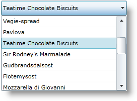

////
|metadata|
{
    "name": "xamcomboeditor-adding-xamcomboeditor-to-your-page",
    "controlName": ["xamComboEditor"],
    "tags": ["Data Binding","Getting Started","How Do I"],
    "guid": "011b3aa0-5629-4f81-bd4d-922a4fd9e577",
    "buildFlags": ["WPF"],
    "createdOn": "2016-05-25T18:21:54.7411054Z"
}
|metadata|
////

= Adding xamComboEditor to Your Page

== Before You Begin

The following code will show you how to bind to data and display the xamComboEditor™ control. It uses the link:resources-datautil.html[DataUtil] class provided for you.

.Note
[NOTE]
====
The _xamComboEditor_ control does not have an unbound mode. You must bind it to a data source.
====

== What You Will Accomplish

This topic will walk you through how to get started with the xamComboEditor control and how to add it to your page using procedural code.

== Follow these Steps

[start=1]
. Create a Microsoft® {PlatformName}™ project.

[start=2]
. In the Solution Explorer, add the following references to your project:
** {ApiPlatform}v{ProductVersion}.dll
** {ApiPlatform}Controls.Editors.XamComboEditor.v{ProductVersion}.dll
** {ApiPlatform}DataManager.v{ProductVersion}.dll

[start=3]
. Add the following using/Import directives in the code-behind and a namespace declaration in the opening UserControl tag.
+
*In XAML:*
+
[source,xaml]
----
xmlns:ig="http://schemas.infragistics.com/xaml"
----
+
*In Visual Basic:*
+
[source,vb]
----
Imports Infragistics.Controls.Editors
----
+
*In C#:*
+
[source,csharp]
----
using Infragistics.Controls.Editors;
----

[start=4]
. Add the xamComboEditor control to a Grid container named LayoutRoot.

** Set the xamComboЕditor control’s link:{ApiPlatform}controls.editors.xamcomboeditor.v{ProductVersion}~infragistics.controls.editors.comboeditorbase`2~itemssource.html[ItemsSource] property to the ObservableCollection of Product objects.
** Set the link:{ApiPlatform}controls.editors.xamcomboeditor.v{ProductVersion}~infragistics.controls.editors.comboeditorbase`2~displaymemberpath.html[DisplayMemberPath] property. It specifies the path to a data property of your business object that will be visually displayed in the xamComboEditor items drop-down list.
** Set the link:{ApiPlatform}controls.editors.xamcomboeditor.v{ProductVersion}~infragistics.controls.editors.comboeditorbase`2~emptytext.html[EmptyText] property to specify the text that will be displayed when no item is selected.
** Set the link:{ApiPlatform}controls.editors.xamcomboeditor.v{ProductVersion}~infragistics.controls.editors.xamcomboeditor~iseditable.html[IsEditable] property to false to create a read-only xamComboEditor. By default the control is editable and this property is set to true.
** Set the xamComboEditor control’s Height and Width properties.
** Set the link:{ApiPlatform}controls.editors.xamcomboeditor.v{ProductVersion}~infragistics.controls.editors.comboeditorbase`2~maxdropdownheight.html[MaxDropDownHeight] property. This property limits the height of the xamComboEditor drop-down list. Otherwise, the available space above and below the control is estimated. By default, the list is displayed below the control. If there is not enough space below, the list is displayed above the control. The drop-down list is restricted within the available height of your {PlatformName} application.
** Adjust the link:{ApiPlatform}controls.editors.xamcomboeditor.v{ProductVersion}~infragistics.controls.editors.comboeditorbase`2~dropdownbuttondisplaymode.html[DropDownButtonDisplayMode] property. This property configures the drop down button visibility. The possible options are - Always (default), MouseOver, Focused, Never.
+
.Note
[NOTE]
====
Do not use this property when the link:{ApiPlatform}controls.editors.xamcomboeditor.v{ProductVersion}~infragistics.controls.editors.xamcomboeditor~iseditable.html[IsEditable] property is set to false.
====
** Add the newly created control as a child of the Grid container.
+
*In XAML:*
+
[source,xaml]
----
<UserControl.Resources>
    <local:DataUtil x:Key="DataUtil" />
</UserControl.Resources>
<Grid x:Name="LayoutRoot">
<ig:XamComboEditor 
    ItemsSource="{Binding Source={StaticResource DataUtil}, Path=Products}"
    DisplayMemberPath="ProductName"
    EmptyText="Choose Product ..."
    IsEditable="False" 
    Height="30" Width="250"    
    MaxDropDownHeight="150" />
</Grid>
----
+
Create an instance of the xamComboEditor control in the page constructor after the InitializeComponent method.
+
*In Visual Basic:*
+
[source,vb]
----
Dim xamComboEditor As New XamComboEditor()
xamComboEditor.ItemsSource = DataUtil.Products
xamComboEditor.DisplayMemberPath = "ProductName"
xamComboEditor.EmptyText = "Choose Product ..."
xamComboEditor.IsEditable = False
xamComboEditor.Height = 30
xamComboEditor.Width = 250
xamComboEditor.MaxDropDownHeight = 150
LayoutRoot.Children.Add(xamComboEditor)
----
+
*In C#:*
+
[source,csharp]
----
XamComboEditor xamComboEditor = new XamComboEditor();
xamComboEditor.ItemsSource = DataUtil.Products;
xamComboEditor.DisplayMemberPath = "ProductName";
xamComboEditor.EmptyText = "Choose Product ...";
xamComboEditor.IsEditable = false;
xamComboEditor.Height = 30;
xamComboEditor.Width = 250;
xamComboEditor.MaxDropDownHeight = 150;
LayoutRoot.Children.Add(xamComboEditor);
----

[start=5]
. Save and run your {PlatformName} application.

== *Related Topics*

link:xamcomboeditor-about-xamcomboeditor.html[About xamComboEditor]

link:xamcomboeditor-using-xamcomboeditor.html[Configuring xamComboEditor]