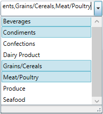
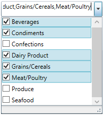

////

|metadata|
{
    "name": "xamcomboeditor-configuring-multiple-selection",
    "tags": ["How Do I","Selection"],
    "controlName": ["xamComboEditor"],
    "guid": "eece5f2a-71ce-47bd-bfc4-1dae0145539f",  
    "buildFlags": ["WPF"],
    "createdOn": "2016-05-25T18:21:54.7631047Z"
}
|metadata|
////

= Configuring Multiple Selection (xamComboEditor)

== Topic Overview

=== Purpose

This topic describes how to configure the multiple selection option in the  _xamComboEditor_™ control.

=== Required background

The following topic is a prerequisite to understanding this topic:

[options="header", cols="a,a"]
|====
|Topic|Purpose

| link:xamcomboeditor-adding-xamcomboeditor-to-your-page.html[Adding xamComboEditor to Your Page]
|This topic describes how to get started with the _xamComboEditor_ control and how to add it to your page using procedural code.

|====

=== In this topic

This topic contains the following sections:

* <<_Ref381977598,Multiple Selection Configuration Summary>>
* <<_EnablingMultipleSelection,Enabling Multiple Items selection>>
* <<_Ref381977332,Enabling Items Check Boxes>>
* <<_Ref381977616,Related Content>>

** <<_Ref381977623,Topics>>

[[_Ref381977598]]
== Multiple Selection Configuration Summary

=== Multiple selection configuration summary chart

The following table briefly explains the configurable aspects of multiple selection in the  _xamComboEditor_   control and maps them to the properties that configure them. Further details are available after the table.

[options="header", cols="a,a,a"]
|====
|Configurable aspect|Details|Properties

|<<_EnablingMultipleSelection,Enabling Multiple Items selection>>
|Enable Multiple selection to allow selecting many _xamComboEditor_ items at the same time.
| link:{ApiPlatform}controls.editors.xamcomboeditor{ApiVersion}~infragistics.controls.editors.comboeditorbase`2~allowmultipleselection.html[AllowMultipleSelection]

|<<_Ref381977332,Enabling Items Check Boxes>>
|Facilitate Multiple selection by enabling the _xamComboEditor_ items check boxes visibility.
| link:{ApiPlatform}controls.editors.xamcomboeditor{ApiVersion}~infragistics.controls.editors.comboeditorbase`2~checkboxvisibility.html[CheckBoxVisibility]

|====

[[_EnablingMultipleSelection]]
== Enabling Multiple Items selection

=== Overview

Enable multiple items selection in the  _xamComboEditor_   through the link:{ApiPlatform}controls.editors.xamcomboeditor{ApiVersion}~infragistics.controls.editors.comboeditorbase`2~allowmultipleselection.html[AllowMultipleSelection] property.

Select the various  _xamComboEditor_   items by holding the `CTRL` keyboard key while using the mouse’s left button clicks or by checking the items check boxes.

=== Property settings

The following table maps the desired configuration to the property settings that manage it.

[options="header", cols="a,a,a"]
|====
|In order to:|Use this property:|And set it to:

|Enable multiple items selection
| link:{ApiPlatform}controls.editors.xamcomboeditor{ApiVersion}~infragistics.controls.editors.comboeditorbase`2~allowmultipleselection.html[AllowMultipleSelection]
|`true`

|====

=== Example

The screenshot below demonstrates how the  _xamComboEditor_   behaves as a result of the following settings:

[options="header", cols="a,a"]
|====
|Property|Value

| link:{ApiPlatform}controls.editors.xamcomboeditor{ApiVersion}~infragistics.controls.editors.comboeditorbase`2~allowmultipleselection.html[AllowMultipleSelection]
| _true_ 

|====

Following is the code that implements this example.

*In XAML:*

[source,xaml]
----
<ig:XamComboEditor x:Name="ComboEditor"
                   ItemsSource="{Binding Path=Categories}"
                   AllowMultipleSelection="True"                              
                   DisplayMemberPath="CategoryName"
                   Height="30" Width="200"/>
----

[[_Ref381977332]]
== Enabling Items Check Boxes Visibility

=== Overview

Perform multiple selection in the  _xamComboEditor_   by checking the items check boxes. In order for the user to perform this, the items check boxes must be visible.

The  _xamComboEditor_   link:{ApiPlatform}controls.editors.xamcomboeditor{ApiVersion}~infragistics.controls.editors.comboeditorbase`2~checkboxvisibility.html[CheckBoxVisibility] property configures the visibility of the items check boxes.

=== Property settings

The following table maps the desired configuration to the property settings that manage it.

[options="header", cols="a,a,a"]
|====
|In order to:|Use this property:|And set it to:

|Enable selection through items check boxes
| link:{ApiPlatform}controls.editors.xamcomboeditor{ApiVersion}~infragistics.controls.editors.comboeditorbase`2~checkboxvisibility.html[CheckBoxVisibility]
|`Visible`

|====

=== Example

The screenshot below demonstrates how the  _xamComboEditor_   looks as a result of the following settings:

[options="header", cols="a,a"]
|====
|Property|Value

| link:{ApiPlatform}controls.editors.xamcomboeditor{ApiVersion}~infragistics.controls.editors.comboeditorbase`2~allowmultipleselection.html[AllowMultipleSelection]
| _True_ 

| link:{ApiPlatform}controls.editors.xamcomboeditor{ApiVersion}~infragistics.controls.editors.comboeditorbase`2~checkboxvisibility.html[CheckBoxVisibility]
| _Visible_ 

|====

Following is the code that implements this example.

*In XAML:*

[source,xaml]
----
<ig:XamComboEditor x:Name="ComboEditor"
                   ItemsSource="{Binding Path=Categories}"
                   AllowMultipleSelection="True"     
                   CheckBoxVisibility="Visible"
                   DisplayMemberPath="CategoryName"
                   Height="30" Width="200"/>
----

[[_Ref381977616]]
== Related Content

[[_Ref381977623]]

=== Topics

The following topics provide additional information related to this topic.

[options="header", cols="a,a"]
|====
|Topic|Purpose

| link:xamcomboeditor-selection-overview.html[User Selection Interactions and Usability]
|This topic describes user selection interactions in the _xamComboEditor_ control.

| link:xamcomboeditor-performing-selection-programmatically.html[Performing Selection Programmatically]
|This topic describes how to programmatically perform selection in the _xamComboEditor_ control.

|====