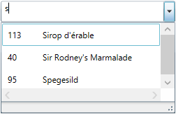
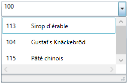

////
|metadata|
{
    "name": "xamcomboeditor-custom-filtering",
    "controlName": ["xamComboEditor"],
    "tags": ["Filtering","Getting Started","How Do I"],
    "guid": "{921BF9DE-7AA8-4C3B-A5A6-5B1A5633D4AD}",
    "buildFlags": ["WPF"],
    "createdOn": "2016-05-25T18:21:54.7241333Z"
}
|metadata|
////

= Configuring Item Filtering (xamComboEditor)

== Topic Overview

=== Purpose

This topic describes how to configure items filtering in the  _xamComboEditor_™ control.

=== Required background

The following topic is a prerequisite to understanding this topic:

[options="header", cols="a,a"]
|====
|Topic|Purpose

| link:xamcomboeditor-adding-xamcomboeditor-to-your-page.html[Adding xamComboEditor to Your Page]
|This topic describes how to get started with the _xamComboEditor_ control and how to add it to your page using procedural code.

|====

=== In this topic

This topic contains the following sections:

* <<_Ref380247491,Filtering Configuration Summary>>
* <<_Ref379990516,Enabling/Disabling Filtering>>
* <<_Ref380075017,Configuring Custom Filters>>
* <<_Ref380247512,Related Content>>

** <<_Ref380247517,Topics>>
** <<_Ref380247522,Samples>>

[[_Ref380247491]]
== Filtering Configuration Summary

=== Filtering configuration summary chart

The following table briefly explains the configurable aspects of the  _xamComboEditor_   filtering feature and maps them to the properties that configure them. Further details are available after the table.

[options="header", cols="a,a,a"]
|====
|Configurable aspect|Details|Properties

|<<_Ref379990516,Enabling/Disabling Filtering>>
|Configures if filtering is Enabled/Disabled
| link:{ApiPlatform}controls.editors.xamcomboeditor{ApiVersion}~infragistics.controls.editors.xamcomboeditor~allowfiltering.html[AllowFiltering]

|<<_Ref380075017,Configuring Custom Filters>>
|Configures a collection of custom filters applied when filtering the _xamComboEditor_ data items
| link:{ApiPlatform}controls.editors.xamcomboeditor{ApiVersion}~infragistics.controls.editors.comboeditorbase`2~itemfilters.html[ItemFilters]

|====

[[_Ref379990516]]
== Enabling/Disabling Filtering

[[_Hlk368069110]]

=== Overview

The  _xamComboEditor_   provides filtering on the items in the control’s Drop-Down when the user starts to type in the input text field. The data items are filtered according to the filters specified in the  _xamComboEditor_  .

By default, this feature is enabled, and filtering executed on the data model property specified through the  _xamComboEditor_   link:{ApiPlatform}controls.editors.xamcomboeditor{ApiVersion}~infragistics.controls.editors.comboeditorbase`2~displaymemberpath.html[DisplayMemberPath] property and using the comparison operator  pick:[wpf=" link:{ApiPlatform}datamanager{ApiVersion}~infragistics.comparisonoperator.html[StartsWith]"]  pick:[sl=" link:{RootAssembly}{ApiVersion}~infragistics.comparisonoperator.html[StartsWith]"] .

=== Property settings

The following table maps the desired configuration to the property settings that manage it.

[options="header", cols="a,a,a"]
|====
|In order to:|Use this property:|And set it to:

|Enable/Disable filtering in the _xamComboEditor_
| link:{ApiPlatform}controls.editors.xamcomboeditor{ApiVersion}~infragistics.controls.editors.xamcomboeditor~allowfiltering.html[AllowFiltering]
|`bool`

|Specify on which data model property the filtering is performed
| link:{ApiPlatform}controls.editors.xamcomboeditor{ApiVersion}~infragistics.controls.editors.comboeditorbase`2~displaymemberpath.html[DisplayMemberPath]
|`string`

|====

[[_Ref380075017]]
== Configuring Custom Filters

=== Overview

The  _xamComboEditor_   control provides functionality for customizing the item filtering.

This is achieved by using the  _xamComboEditor_   link:{ApiPlatform}controls.editors.xamcomboeditor{ApiVersion}~infragistics.controls.editors.comboeditorbase`2~itemfilters.html[ItemFilters] property. An `ObservableCollection` of link:{ApiPlatform}controls.editors.xamcomboeditor{ApiVersion}~infragistics.controls.editors.comboitemfilter_members.html[ComboItemFilter] objects is set to this property to provide custom items filtering.

The Default/Custom filtering will not work in the case that the  _xamComboEditor_   `AllowFiltering` property is set to `False`.

.Note
[NOTE]
====
When creating a custom `ComboItemFilter`, the `ComboItemFilter` link:{ApiPlatform}controls.editors.xamcomboeditor{ApiVersion}~infragistics.controls.editors.comboitemfilter~fieldname.html[FieldName] property must be set to the name of the data property to be filtered. If `FieldName` property is not set, an exception is thrown.
====

.Note
[NOTE]
====
You cannot use the link:{ApiPlatform}datamanager{ApiVersion}~infragistics.comparisoncondition_members.html[ComparisonCondition] link:{ApiPlatform}datamanager{ApiVersion}~infragistics.comparisoncondition~filtervalue.html[FilterValue] property in code to preset the filter value. The _xamComboEditor_ uses `FilterValue` property internally, and it is set to the text typed in the control input field.
====

=== Property settings

The following table maps the desired configuration to the property settings that manage it.

[options="header", cols="a,a,a"]
|====
|In order to:|Use this property:|And set it to:

|Create a collection of custom filters
| link:{ApiPlatform}controls.editors.xamcomboeditor{ApiVersion}~infragistics.controls.editors.comboeditorbase`2~itemfilters.html[ItemFilters]
|`ObservableCollection<ComboItemFilter>`

|Specify on which data model property the item filtering is performed
| link:{ApiPlatform}controls.editors.xamcomboeditor{ApiVersion}~infragistics.controls.editors.comboitemfilter_members.html[ComboItemFilter] link:{ApiPlatform}controls.editors.xamcomboeditor{ApiVersion}~infragistics.controls.editors.comboitemfilter~fieldname.html[FieldName]
|`string`

|Specify the logical operator used for combining all filter conditions
| link:{ApiPlatform}controls.editors.xamcomboeditor{ApiVersion}~infragistics.controls.editors.comboitemfilter_members.html[ComboItemFilter] link:{ApiPlatform}controls.editors.xamcomboeditor{ApiVersion}~infragistics.controls.editors.comboitemfilter~logicaloperator.html[LogicalOperator]
| link:{ApiPlatform}controls.editors.xamcomboeditor{ApiVersion}~infragistics.controls.editors.comboitemfilter~logicaloperator.html[LogicalOperator]

|Specify a collection of conditions to be applied
| link:{ApiPlatform}controls.editors.xamcomboeditor{ApiVersion}~infragistics.controls.editors.comboitemfilter_members.html[ComboItemFilter] link:{ApiPlatform}controls.editors.xamcomboeditor{ApiVersion}~infragistics.controls.editors.comboitemfilter~conditions.html[Conditions]
| pick:[wpf=" link:{ApiPlatform}datamanager{ApiVersion}~infragistics.conditioncollection_members.html[ConditionCollection]"] pick:[sl=" link:{RootAssembly}{ApiVersion}~infragistics.conditioncollection_members.html[ConditionCollection]"] 

|Specify a comparison condition operator
|pick:[wpf=" link:{ApiPlatform}datamanager{ApiVersion}~infragistics.comparisoncondition.html[ComparisonCondition]"] pick:[sl=" link:{RootAssembly}{ApiVersion}~infragistics.comparisoncondition_members.html[ComparisonCondition]"] pick:[wpf=" link:{ApiPlatform}datamanager{ApiVersion}~infragistics.comparisoncondition~operator.html[Operator]"] pick:[sl=" link:{RootAssembly}{ApiVersion}~infragistics.comparisoncondition~operator.html[Operator]"]
| pick:[wpf=" link:{ApiPlatform}datamanager{ApiVersion}~infragistics.comparisonoperator.html[ComparisonOperator]"] pick:[sl=" link:{RootAssembly}{ApiVersion}~infragistics.comparisonoperator.html[ComparisonOperator]"] 

|====

=== Example

The following screenshots demonstrate how the filtering in the  _xamComboEditor_   works as a result of the following code:

[start=1]
. Typing 's' in the  _xamComboEditor_   text input field:
+

[start=2]
. Typing '100' in the  _xamComboEditor_   text input field:
+

Following is the code that implements this example.

*In XAML:*

[source,xaml]
----
<ig:XamComboEditor x:Name="ComboEditor"
                   ItemsSource="{Binding Path=Products}" 
                   Height="30" Width="250"
                   AutoComplete="False">
    <ig:XamComboEditor.ItemTemplate>
        <DataTemplate>
            <Grid>
                <Grid.ColumnDefinitions>
                    <ColumnDefinition Width="50" />
                    <ColumnDefinition />
                </Grid.ColumnDefinitions>
                <TextBlock Text="{Binding ProductName}" Grid.Column="1" Margin="5" />
                <TextBlock Text="{Binding UnitsInStock}" Margin="5" />
            </Grid>
        </DataTemplate>
    </ig:XamComboEditor.ItemTemplate>
    <!-- Add custom filters --> 
    <ig:XamComboEditor.ItemFilters>
        <!-- Create filter for the data model property ProductName -->
        <ig:ComboItemFilter FieldName="ProductName" LogicalOperator="And">
            <ig:ComboItemFilter.Conditions>
                <ig:ComparisonCondition Operator="Contains" />
                <ig:ComparisonCondition Operator="StartsWith"/>
            </ig:ComboItemFilter.Conditions>
        </ig:ComboItemFilter>
        <!-- Create filter for the data model property UnitsInStock -->
        <ig:ComboItemFilter FieldName="UnitsInStock">
            <ig:ComboItemFilter.Conditions>
                <ig:ComparisonCondition Operator="GreaterThan"/>
            </ig:ComboItemFilter.Conditions>
        </ig:ComboItemFilter>
    </ig:XamComboEditor.ItemFilters>
</ig:XamComboEditor>
----

[[_Ref380247512]]
== Related Content

[[_Ref380247517]]

=== Topics

The following topics provide additional information related to this topic.

[options="header", cols="a,a"]
|====
|Topic|Purpose

| link:xamcomboeditor-autocomplete.html[Configuring Autocomplete]
|This topic describes the auto complete feature available in editable mode in the _xamComboEditor_ .

| link:xamcomboeditor-using-customvalueenteredaction.html[Configuring the Behavior on User Input]
|This topic describes how to specify the _xamComboEditor_ behavior when typing in the control’s text box.

| link:xamcomboeditor-dropdown-resizing.html[Configuring the Drop-Down Size]
|This topic explains how to Enable/Disable resizing of the _xamComboEditor_ Drop-Down from the UI, as well as how to set the Drop-Down’s minimum and maximum widths and maximum height in code.

| link:xamcomboeditor-working-with-itemtemplate.html[Configuring Item Template]
|This topic describes how to use the _xamComboEditor_ ItemTemplate property to customize the visualization of the items.

| link:xamcomboeditor-selection-overview.html[Selection]
|This topic describes selection in the _xamComboEditor_ control.

|====

[[_Ref380247522]]

=== Samples

The following sample provides additional information related to this topic.

[options="header", cols="a,a"]
|====
|Sample|Purpose

| pick:[sl=" link:{SamplesURL}/combo-box/#/specify-a-custom-filter-for-combo-editor[Custom Filters]"] pick:[wpf=" link:{SamplesURL}/combo-box/specify-a-custom-filter-for-combo-editor[Custom Filters]"] 
|This sample demonstrates configuring custom filters in the _xamComboEditor_ control.

|====