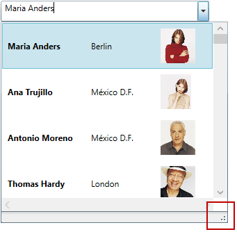
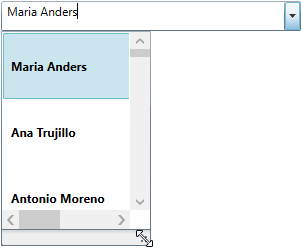

////

|metadata|
{
    "name": "xamcomboeditor-dropdown-resizing",
    "tags": ["Getting Started","How Do I"],
    "controlName": ["xamComboEditor"],
    "guid": "92b880e3-55bc-4e60-8bfe-73fb01a92131",  
    "buildFlags": ["WPF"],
    "createdOn": "2016-05-25T18:21:54.7471039Z"
}
|metadata|
////

= Configuring the Drop-Down Size (xamComboEditor)

== Topic Overview

=== Purpose

This topic explains how to Enable/Disable resizing of the  _xamComboEditor_™ Drop-Down from the UI, as well as how to set the Drop-Down’s minimum and maximum widths and heights in code.

=== Required background

The following topic is a prerequisite to understanding this topic:

[options="header", cols="a,a"]
|====
|Topic|Purpose

| link:xamcomboeditor-adding-xamcomboeditor-to-your-page.html[Adding xamComboEditor to Your Page]
|This topic describes how to get started with the _xamComboEditor_ control and how to add it to your page using procedural code.

|====

=== In this topic

This topic contains the following sections:

* <<_Ref378177714,Drop-Down Resizing Configuration Summary>>
* <<_Ref378174923,Enabling/Disabling Users to Resize the Drop-Down>>
* <<_Ref378177126,Configuring the Minimum Drop-Down Width>>
* <<_Ref378177235,Configuring the Maximum Drop-Down Width>>
* <<_Ref408577946,Configuring the Minimum Drop-Down Height>>
* <<_Ref378177842,Configuring the Maximum Drop-Down Height>>
* <<_Ref378177847,Related Content>>

** <<_Ref378177852,Topics>>
** <<_Ref378177855,Samples>>

[[_Ref378177714]]
== Drop-Down Resizing Configuration Summary

=== Drop-Down resizing configuration summary chart

The following table briefly explains the configurable aspects of the  _xamComboEditor_   Drop-Down resizing functionality and maps them to the properties that configure them. Further details are available after the table.

[options="header", cols="a,a,a"]
|====
|Configurable aspect|Details|Properties

|<<_Ref379990395,Enabling/Disabling Users to Resize the Drop-Down>>
|Configures if the Drop-Down is resizable via a resize handle.
|
* link:{ApiPlatform}controls.editors.xamcomboeditor.v{ProductVersion}~infragistics.controls.editors.comboeditorbase`2~allowdropdownresizing.html[AllowDropDownResizing] 

|<<_Ref378177126,Configuring the Minimum Drop-Down Width>>
|Configures the minimum width of the Drop-Down.
|
* link:{ApiPlatform}controls.editors.xamcomboeditor.v{ProductVersion}~infragistics.controls.editors.comboeditorbase`2~mindropdownwidth.html[MinDropDownWidth] 

|<<_Ref378177235,Configuring the Maximum Drop-Down Width>>
|Configures the maximum width of the Drop-Down.
|
* link:{ApiPlatform}controls.editors.xamcomboeditor.v{ProductVersion}~infragistics.controls.editors.comboeditorbase`2~maxdropdownwidth.html[MaxDropDownWidth] 

|<<_Ref408577946,Configuring the Minimum Drop-Down Height>>
|Configures the minimum height of the Drop-Down.
|
* link:{ApiPlatform}controls.editors.xamcomboeditor.v{ProductVersion}~infragistics.controls.editors.comboeditorbase`2~mindropdownheight.html[MinDropDownHeight] 

|<<_Ref378177842,Configuring the Maximum Drop-Down Height>>
|Configures the maximum height of the Drop-Down.
|
* link:{ApiPlatform}controls.editors.xamcomboeditor.v{ProductVersion}~infragistics.controls.editors.comboeditorbase`2~maxdropdownheight.html[MaxDropDownHeight] 

|====

[[_Ref378174923]]
[[_Ref379990395]]
== Enabling/Disabling Users to Resize the Drop-Down

=== Overview

The  _xamComboEditor_   Drop-Down is resizable in order to view all the items information using a resize handle.

The  _xamComboEditor_   Drop-Down resizing feature is enabled by default.

=== Property settings

The following table maps the desired configuration to the property settings that manage it.

[options="header", cols="a,a,a"]
|====
|In order to:|Use this property:|And set it to:

|Enable/Disable the _xamComboEditor_ drop-down resizing feature
| link:{ApiPlatform}controls.editors.xamcomboeditor.v{ProductVersion}~infragistics.controls.editors.comboeditorbase`2~allowdropdownresizing.html[AllowDropDownResizing]
|`bool`

|====

=== Example

The screenshot below demonstrates how the  _xamComboEditor_   would look as a result of the following settings:

[options="header", cols="a,a"]
|====
|Property|Value

| link:{ApiPlatform}controls.editors.xamcomboeditor.v{ProductVersion}~infragistics.controls.editors.comboeditorbase`2~allowdropdownresizing.html[AllowDropDownResizing]
| _true_ 

|====

Following is the code that implements this example.

*In XAML:*

[source,xaml]
----
<ig:XamComboEditor x:Name="ComboEditor" 
                   DisplayMemberPath="ContactName"
                   AllowDropDownResizing="True" />
----

[[_Ref378177126]]
== Configuring the Minimum Drop-Down Width

=== Overview

Specify the minimum Drop-Down width using the  _xamComboEditor_   link:{ApiPlatform}controls.editors.xamcomboeditor.v{ProductVersion}~infragistics.controls.editors.comboeditorbase`2~mindropdownwidth.html[MinDropDownWidth] property.

The property’s default value is `double.NaN`.

If the `MinDropDownWidth` property’s value is not set, the minimum width of the Drop-Down is limited to the width of the  _xamComboEditor_   control text input field.

If the `MinDropDownWidth` value is greater than the `MaxDropDownWidth` value, the Drop-Down is no longer resizable horizontally and its width is fixed to the `MinDropDownWidth` value.

.Note
[NOTE]
====
If a negative value is set to the `MinDropDownWidth` property, a `System.ArgumentException` is thrown.
====

=== Property settings

The following table maps the desired configuration to the property settings that manage it.

[options="header", cols="a,a,a"]
|====
|In order to:|Use this property:|And set it to:

|Limit the minimum Drop-Down width during resizing
| link:{ApiPlatform}controls.editors.xamcomboeditor.v{ProductVersion}~infragistics.controls.editors.comboeditorbase`2~mindropdownwidth.html[MinDropDownWidth]
|`double`

|====

=== Example

The screenshot below demonstrates how the  _xamComboEditor_   Drop-Down behaves as a result of the following settings:

[options="header", cols="a,a"]
|====
|Property|Value

| link:{ApiPlatform}controls.editors.xamcomboeditor.v{ProductVersion}~infragistics.controls.editors.comboeditorbase`2~mindropdownwidth.html[MinDropDownWidth]
| _150_ 

|====

Following is the code that implements this example.

*In XAML:*

[source,xaml]
----
<ig:XamComboEditor x:Name="ComboEditor" 
                   DisplayMemberPath="ContactName" MinDropDownWidth="150" />
----

[[_Ref378177235]]
== Configuring the Maximum Drop-Down Width

=== Overview

Specify the maximum Drop-Down width using the  _xamComboEditor_   link:{ApiPlatform}controls.editors.xamcomboeditor.v{ProductVersion}~infragistics.controls.editors.comboeditorbase`2~maxdropdownwidth.html[MaxDropDownWidth] property.

The property’s default value is `double.PositiveInfinity`.

.Note
[NOTE]
====
If a negative value is set to the `MaxDropDownWidth` property, a `System.ArgumentException` is thrown.
====

=== Property settings

The following table maps the desired configuration to the property settings that manage it.

[options="header", cols="a,a,a"]
|====
|In order to:|Use this property:|And set it to:

|Limit the maximum Drop-Down width during resizing
| link:{ApiPlatform}controls.editors.xamcomboeditor.v{ProductVersion}~infragistics.controls.editors.comboeditorbase`2~maxdropdownwidth.html[MaxDropDownWidth]
|`double`

|====

=== Example

The screenshot below demonstrates how the  _xamComboEditor_   Drop-Down behaves as a result of the following settings:

[options="header", cols="a,a"]
|====
|Property|Value

| link:{ApiPlatform}controls.editors.xamcomboeditor.v{ProductVersion}~infragistics.controls.editors.comboeditorbase`2~maxdropdownwidth.html[MaxDropDownWidth]
| _350_ 

|====

Following is the code that implements this example.

*In XAML:*

[source,xaml]
----
<ig:XamComboEditor x:Name="ComboEditor" 
                   DisplayMemberPath="ContactName" MaxDropDownWidth="350" />
----

[[_Ref408577946]]
== Configuring the Minimum Drop-Down Height

=== Overview

Specify the minimum Drop-Down height using the  _xamComboEditor_   link:{ApiPlatform}controls.editors.xamcomboeditor.v{ProductVersion}~infragistics.controls.editors.comboeditorbase`2~mindropdownheight.html[MinDropDownHeight] property.

The property’s default value is 0.0.

If the `MinDropDownHeight` property’s value is not set, the minimum height of the Drop-Down is limited to 20px.

If the `MinDropDownHeight` value is greater than the `MaxDropDownHeight` value, the Drop-Down is no longer resizable vertically and its height is fixed to the `MinDropDownHeight` value.

.Note
[NOTE]
====
If a negative value is set to the `MinDropDownHeight` property, a `System.ArgumentException` is thrown.
====

=== Property settings

The following table maps the desired configuration to the property settings that manage it.

[options="header", cols="a,a,a"]
|====
|In order to:|Use this property:|And set it to:

|Limit the minimum Drop-Down height during resizing and filtering
| link:{ApiPlatform}controls.editors.xamcomboeditor.v{ProductVersion}~infragistics.controls.editors.comboeditorbase`2~mindropdownheight.html[MinDropDownHeight]
|`double`

|====

=== Example

The screenshot below demonstrates how the  _xamComboEditor_   Drop-Down behaves as a result of the following settings:

[options="header", cols="a,a"]
|====
|Property|Value

| link:{ApiPlatform}controls.editors.xamcomboeditor.v{ProductVersion}~infragistics.controls.editors.comboeditorbase`2~mindropdownheight.html[MinDropDownHeight]
|_70_

|====

Following is the code that implements this example.

*In XAML:*

[source,xaml]
----
<ig:XamComboEditor x:Name="ComboEditor" DisplayMemberPath="ContactName"
                   MinDropDownHeight="70" />
----

[[_Ref378177842]]
== Configuring the Maximum Drop-Down Height

=== Overview

Specify the maximum Drop-Down height using the  _xamComboEditor_   link:{ApiPlatform}controls.editors.xamcomboeditor.v{ProductVersion}~infragistics.controls.editors.comboeditorbase`2~maxdropdownheight.html[MaxDropDownHeight] property.

The property’s default value is `double.PositiveInfinity`.

Failure to set this property results in the available space above and below the control being estimated. The Drop-Down list is restricted within the available height of the application.

.Note
[NOTE]
====
Setting the `MaxDropDownHeight` property to a negative value causes a `System.ArgumentException` to be thrown.
====

=== Property settings

The following table maps the desired configuration to the property settings that manage it.

[options="header", cols="a,a,a"]
|====
|In order to:|Use this property:|And set it to:

|Limit the maximum Drop-Down height during resizing and filtering
| link:{ApiPlatform}controls.editors.xamcomboeditor.v{ProductVersion}~infragistics.controls.editors.comboeditorbase`2~maxdropdownheight.html[MaxDropDownHeight]
|`double`

|====

=== Example

The screenshot below demonstrates how the  _xamComboEditor_   Drop-Down behaves as a result of the following settings:

[options="header", cols="a,a"]
|====
|Property|Value

| link:{ApiPlatform}controls.editors.xamcomboeditor.v{ProductVersion}~infragistics.controls.editors.comboeditorbase`2~maxdropdownheight.html[MaxDropDownHeight]
| _200_ 

|====

Following is the code that implements this example.

*In XAML:*

[source,xaml]
----
<ig:XamComboEditor x:Name="ComboEditor" 
                   DisplayMemberPath="ContactName"
                   MaxDropDownHeight="200" />
----

[[_Ref378177847]]
== Related Content

[[_Ref378177852]]

=== Topics

The following topics provide additional information related to this topic.

[options="header", cols="a,a"]
|====
|Topic|Purpose

| link:xamcomboeditor-autocomplete.html[Configuring Autocomplete]
|This topic describes the auto complete feature available in editable mode in the _xamComboEditor_ .

| link:xamcomboeditor-using-customvalueenteredaction.html[Configuring the Behavior on User Input]
|This topic describes how to specify the _xamComboEditor_ behavior when typing in the control’s text box.

| link:xamcomboeditor-custom-filtering.html[Configuring Item Filtering]
|This topic describes how to configure items filtering in the _xamComboEditor_ control.

| link:xamcomboeditor-working-with-itemtemplate.html[Configuring Item Template]
|This topic describes how to use the _xamComboEditor_ ItemTemplate property to customize the visualization of the items.

| link:xamcomboeditor-selection.html[Selection]
|This topic describes selection in the _xamComboEditor_ control.

|====

[[_Ref378177855]]

=== Samples

The following sample provides additional information related to this topic.

[options="header", cols="a,a"]
|====
|Sample|Purpose

| pick:[sl=" link:{SamplesURL}/combo-box/#/manipulating-dropdown-size[Configuring the Drop-Down Size]"] pick:[wpf=" link:{SamplesURL}/combo-box/manipulating-dropdown-size[Configuring the Drop-Down Size]"] 
|This sample demonstrates how to configure the min/max drop-down size of the _xamComboEditor_, as well as how to enable/disable the drop-down resizing via the resize handle in the UI.

|====