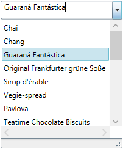
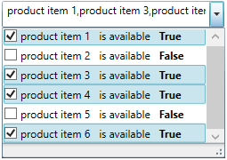
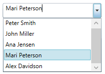
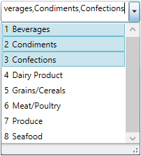

////

|metadata|
{
    "name": "xamcomboeditor-performing-selection-programmatically",
    "tags": ["Getting Started","How Do I","Selection"],
    "controlName": ["xamComboEditor"],
    "guid": "5a6ac02e-cdfb-4fdc-9b98-f93452d83dea",  
    "buildFlags": ["WPF"],
    "createdOn": "2016-05-25T18:21:54.7581042Z"
}
|metadata|
////

= Performing Selection Programmatically (xamComboEditor)

== Topic Overview

=== Purpose

This topic describes how to programmatically perform a selection in the  _xamComboEditor_™ control.

=== Required background

The following topic is a prerequisite to understanding this topic:

[options="header", cols="a,a"]
|====
|Topic|Purpose

| link:xamcomboeditor-adding-xamcomboeditor-to-your-page.html[Adding xamComboEditor to Your Page]
|This topic describes how to get started with the _xamComboEditor_ control and how to add it to your page using procedural code.

|====

=== In this topic

This topic contains the following sections:

* <<_Ref381950066,Programmatic Selection Summary>>
* <<_Ref382398018,Configuring the Selected Combo Editor Item>>
* <<_Ref382400374,Configuring the Selected Combo Item through its Index>>
* <<_Ref382398058,Configuring a Single Selected Data Item>>
* <<_Ref382398065,Configuring a Collection of Selected Data Items>>
* <<_Ref382398071,Modifying the Selected Data Items Collection via a Data Model Boolean Property’s Value>>
* <<_Ref382398076,Configuring a Single Selected Value>>
* <<_Ref382398080,Configuring a Collection of Selected Values>>
* <<_Ref382398087,Related Content>>

** <<_Ref381950109,Topics>>
** <<_Ref381950112,Samples>>

[[_Ref381950066]]
== Programmatic Selection Summary

=== Programmatic selection summary chart

The following table briefly explains the configurable aspects of the programmatic selection in the  _xamComboEditor_   control and maps them to properties that configure them. Further details are available after the table.

[options="header", cols="a,a,a"]
|====
|Programmatic selection task|Details|Properties

|<<_Ref382398018,Configuring the Selected Combo Editor Item>>
|While working with the link:{ApiPlatform}controls.editors.xamcomboeditor{ApiVersion}~infragistics.controls.editors.xamcomboeditor.html[XamComboEditor] link:{ApiPlatform}controls.editors.xamcomboeditor{ApiVersion}~infragistics.controls.editors.comboeditorbase`2~items.html[Items] collection, configure a particular link:{ApiPlatform}controls.editors.xamcomboeditor{ApiVersion}~infragistics.controls.editors.comboeditoritem_members.html[ComboEditorItem] to be selected using the link:{ApiPlatform}controls.editors.xamcomboeditor{ApiVersion}~infragistics.controls.editors.comboeditoritembase`1~isselected.html[IsSelected] property.
| link:{ApiPlatform}controls.editors.xamcomboeditor{ApiVersion}~infragistics.controls.editors.comboeditoritembase`1~isselected.html[IsSelected]

|<<_Ref382400374,Configuring the Selected Combo Item through its Index>>
|Configure the selected xamComboEditor item using the link:{ApiPlatform}controls.editors.xamcomboeditor{ApiVersion}~infragistics.controls.editors.comboeditorbase`2~selectedindex.html[SelectedIndex] property.
| link:{ApiPlatform}controls.editors.xamcomboeditor{ApiVersion}~infragistics.controls.editors.comboeditorbase`2~selectedindex.html[SelectedIndex]

|<<_Ref382398058,Configuring a Single Selected Data Item>>
|Configure the selected _xamComboEditor_ data item using the link:{ApiPlatform}controls.editors.xamcomboeditor{ApiVersion}~infragistics.controls.editors.comboeditorbase`2~selecteditem.html[SelectedItem] property. 

In case a multiple selection is enabled, the `SelectedItem` returns the last user selected item.
| link:{ApiPlatform}controls.editors.xamcomboeditor{ApiVersion}~infragistics.controls.editors.comboeditorbase`2~selecteditem.html[SelectedItem]

|<<_Ref382398065,Configuring a Collection of Selected Data Items>>
|Configure the selected data items collection using the link:{ApiPlatform}controls.editors.xamcomboeditor{ApiVersion}~infragistics.controls.editors.comboeditorbase`2~selecteditems.html[SelectedItems] property.
| link:{ApiPlatform}controls.editors.xamcomboeditor{ApiVersion}~infragistics.controls.editors.comboeditorbase`2~selecteditems.html[SelectedItems]

|<<_Ref382398071,Modifying the Selected Data Items Collection via a Data Model Boolean Property’s Value>>
|Configure the Selected/Unselected data items using an underlying data model’s property which boolean value determines the items’ current state in the _xamComboEditor_ .
| link:{ApiPlatform}controls.editors.xamcomboeditor{ApiVersion}~infragistics.controls.editors.comboeditorbase`2~isselectedmemberpath.html[IsSelectedMemberPath]

|<<_Ref382398076,Configuring a Single Selected Value>>
|Configure the value of the selected item using the link:{ApiPlatform}controls.editors.xamcomboeditor{ApiVersion}~infragistics.controls.editors.comboeditorbase`2~selectedvalue.html[SelectedValue] property. 

The path to the data item property used for selection is specified by the `SelectedValuePath`.
|
* link:{ApiPlatform}controls.editors.xamcomboeditor{ApiVersion}~infragistics.controls.editors.comboeditorbase`2~selectedvaluepath.html[SelectedValuePath] 

* link:{ApiPlatform}controls.editors.xamcomboeditor{ApiVersion}~infragistics.controls.editors.comboeditorbase`2~selectedvalue.html[SelectedValue] 

|<<_Ref382398080,Configuring a Collection of Selected Values>>
|Configure a collection of selected items values using the link:{ApiPlatform}controls.editors.xamcomboeditor{ApiVersion}~infragistics.controls.editors.comboeditorbase`2~selectedvalues.html[SelectedValues] property. 

The path to the data item property used for selection is specified by the `SelectedValuePath`.
|
* link:{ApiPlatform}controls.editors.xamcomboeditor{ApiVersion}~infragistics.controls.editors.comboeditorbase`2~selectedvaluepath.html[SelectedValuePath] 

* link:{ApiPlatform}controls.editors.xamcomboeditor{ApiVersion}~infragistics.controls.editors.comboeditorbase`2~selectedvalues.html[SelectedValues] 

|====

[[_Ref381885797]]
[[_Ref382323081]]

[[_Ref382398018]]
== Configuring the Selected Combo Editor Item

[[_Hlk368069110]]

=== Overview

Configure the selected  _xamComboEditor_   link:{ApiPlatform}controls.editors.xamcomboeditor{ApiVersion}~infragistics.controls.editors.comboeditoritem_members.html[ComboEditorItem] using the `bool` link:{ApiPlatform}controls.editors.xamcomboeditor{ApiVersion}~infragistics.controls.editors.comboeditoritembase`1~isselected.html[IsSelected] property.

=== Property settings

The following table maps the desired configuration to the property settings that manage it.

[options="header", cols="a,a,a"]
|====
|In order to:|Use this property:|And set it to:

|Configure the selected combo editor item
| link:{ApiPlatform}controls.editors.xamcomboeditor{ApiVersion}~infragistics.controls.editors.comboeditoritembase`1~isselected.html[IsSelected]
|`bool`

|====

[[_Hlk337817761]]

=== Example

The screenshot below demonstrates how the  _xamComboEditor_   would behave as a result of the following settings:

[options="header", cols="a,a"]
|====
|Property|Value

| link:{ApiPlatform}controls.editors.xamcomboeditor{ApiVersion}~infragistics.controls.editors.comboeditoritembase`1~isselected.html[IsSelected]
| _true_ 

|====

Following is the code that implements this example.

*In XAML:*

[source,xaml]
----
<ig:XamComboEditor x:Name="ComboEditor"
                   ItemsSource="{Binding Path=Products}"
                   DisplayMemberPath="ProductName"                 
                   Height="30" Width="200">
</ig:XamComboEditor>
----

*In C#:*

[source,csharp]
----
ComboEditor.Items[2].IsSelected = true;
----

*In Visual Basic:*

[source,vb]
----
ComboEditor.Items(2).IsSelected = True
----

[[_Ref381947051]]
[[_Ref382388014]]

[[_Ref382400374]]
== Configuring the Selected Combo Item through its Index

=== Overview

Configure the selected  _xamComboEditor_   item through its index and using the link:{ApiPlatform}controls.editors.xamcomboeditor{ApiVersion}~infragistics.controls.editors.comboeditorbase`2~selectedindex.html[SelectedIndex] property.

The default value of the `SelectedIndex` property is -1, and there is no selected item.

When multiple selection is enabled, the `SelectedIndex` returns the index of the last user selected combo item.

=== Property settings

The following table maps the desired configuration to the property settings that manage it.

[options="header", cols="a,a,a"]
|====
|In order to:|Use this property:|And set it to:

|Configure the selected combo item using its index
| link:{ApiPlatform}controls.editors.xamcomboeditor{ApiVersion}~infragistics.controls.editors.comboeditorbase`2~selectedindex.html[SelectedIndex]
|`int`

|====

=== Example

The screenshot below demonstrates how the  _xamComboEditor_   would behave as a result of the following settings:

[options="header", cols="a,a"]
|====
|Property|Value

| link:{ApiPlatform}controls.editors.xamcomboeditor{ApiVersion}~infragistics.controls.editors.comboeditorbase`2~selectedindex.html[SelectedIndex]
| _2_ 

|====

Following is the code that implements this example.

*In XAML:*

[source,xaml]
----
<ig:XamComboEditor x:Name="ComboEditor"
                   ItemsSource="{Binding Path=Products}"
                   DisplayMemberPath="ProductName" 
                   SelectedIndex="2"                
                   Height="30" Width="200">
</ig:XamComboEditor>
----

[[_Ref382398058]]
== Configuring a Single Selected Data Item

=== Overview

Configure the selected data item using the  _xamComboEditor_   link:{ApiPlatform}controls.editors.xamcomboeditor{ApiVersion}~infragistics.controls.editors.comboeditorbase`2~selecteditem.html[SelectedItem] property. This item is a reference to the item within the used data model.

Selecting an item in the  _xamComboEditor_   triggers the link:{ApiPlatform}controls.editors.xamcomboeditor{ApiVersion}~infragistics.controls.editors.comboeditorbase`2~selectionchanged_ev.html[SelectionChanged] event. This event has an event argument link:{ApiPlatform}controls.editors.xamcomboeditor{ApiVersion}~infragistics.controls.editors.selectionchangedeventargs_members.html[SelectionChangedEventArgs] which exposes the link:{ApiPlatform}controls.editors.xamcomboeditor{ApiVersion}~infragistics.controls.editors.selectionchangedeventargs~addeditems.html[AddedItems]/ link:{ApiPlatform}controls.editors.xamcomboeditor{ApiVersion}~infragistics.controls.editors.selectionchangedeventargs~removeditems.html[RemovedItems] In/From the selection.

If the  _xamComboEditor_   link:{ApiPlatform}controls.editors.xamcomboeditor{ApiVersion}~infragistics.controls.editors.comboeditorbase`2~allowmultipleselection.html[AllowMultipleSelection] property is set to true:

• the `SelectedItem` returns the last user selected item

• setting the `SelectedItem` to a new data object clears the existing selected items collection

.Note
[NOTE]
====
An exception is thrown if more than one item is set in runtime to the `SelectedItem` property when the `AllowMultipleSelection` property is set to `false`.
====

=== Property settings

The following table maps the desired configuration to the property settings that manage it.

[options="header", cols="a,a,a"]
|====
|In order to:|Use this property:|And set it to:

|Configure the selected data item
| link:{ApiPlatform}controls.editors.xamcomboeditor{ApiVersion}~infragistics.controls.editors.comboeditorbase`2~selecteditem.html[SelectedItem]
|`object`

|====

=== Example

Following is the code that implements this example.

*In XAML:*

[source,xaml]
----
<ig:XamComboEditor x:Name="ComboEditor" 
                   ItemsSource="{Binding Path=Products}"
                   DisplayMemberPath="ProductName"
                   Height="30" Width="200" 
                   SelectionChanged="ComboEditor_OnSelectionChanged"/>
----

*In C#:*

[source,csharp]
----
private void ComboEditor_OnSelectionChanged(object sender, SelectionChangedEventArgs e)
{
    if (ComboEditor.SelectedItem != null)
    {
        var selectedItem = ComboEditor.SelectedItem as Product;
        System.Diagnostics.Debug.WriteLine(String.Format("Product info: {0} {1}", selectedItem.ProductID, selectedItem.ProductName));
    }
}
----

*In Visual Basic:*

[source,vb]
----
Private Sub ComboEditor_OnSelectionChanged(sender As Object, e As SelectionChangedEventArgs)
    If ComboEditor.SelectedItem IsNot Nothing Then
        Dim selectedItem = TryCast(ComboEditor.SelectedItem, Product)
       System.Diagnostics.Debug.WriteLine([String].Format("Product info: {0} {1}", selectedItem.ProductID, selectedItem.ProductName))
      End If
End Sub
----

[[_Ref381947376]]
[[_Ref382388032]]

[[_Ref382398065]]
== Configuring a Collection of Selected Data Items

=== Overview

Configure the selected data items collection using the  _xamComboEditor_   link:{ApiPlatform}controls.editors.xamcomboeditor{ApiVersion}~infragistics.controls.editors.comboeditorbase`2~selecteditems.html[SelectedItems] property. This property is extremely useful in case multiple selection is enabled in the control.

As this is a Two-Way bindable dependency property, additionally a collection of items can be set to the  _xamComboEditor_  . This collection has to be of type `ObservableCollection<object>`.

.Note
[NOTE]
====
Multiple selection has to be enabled in the  _xamComboEditor_  control.
====

=== Property settings

The following table maps the desired configuration to the property settings that manage it.

[options="header", cols="a,a,a"]
|====
|In order to:|Use this property:|And set it to:

|Set a collection of selected data items
| link:{ApiPlatform}controls.editors.xamcomboeditor{ApiVersion}~infragistics.controls.editors.comboeditorbase`2~selecteditems.html[SelectedItems]
|`ObservableCollection<object>`

|====

[[_Ref381948563]]
[[_Ref382388082]]

[[_Ref382398071]]
== Modifying the Selected Data Items Collection via a Data Model Boolean Property’s Value

=== Overview

Configure the Selected/Unselected data items using an underlying data model’s property which boolean value determines the items’ current state in the  _xamComboEditor_  . The underlying data model’s property name is set to the link:{ApiPlatform}controls.editors.xamcomboeditor{ApiVersion}~infragistics.controls.editors.comboeditorbase`2~isselectedmemberpath.html[IsSelectedMemberPath] property.

Once the `IsSelectedMemberPath` is set to a data model property path; the link:{ApiPlatform}controls.editors.xamcomboeditor{ApiVersion}~infragistics.controls.editors.comboeditorbase`2~selecteditems.html[SelectedItems] collection is populated with the data items that have the specified property value set to `true`. If the underlying data model supports the `INotifyPropertyChanged` interface, modifications over the specified property values reflect over the  _xamComboEditor_   items’ selection state.

.Note
[NOTE]
====
The data model’s property that determines the Selected/Unselected state of the data item in the  _xamComboEditor_   has to be of type `bool`.
====

.Note
[NOTE]
====
If you enable the multiple selection and specify an `IsSelectedMemberPath`; the `AllowMultipleSelection` property should be defined in XAML first.
====

.Note
[NOTE]
====
Using the `IsSelectedMemberPath` property has an impact over the performance of the  _xamComboEditor_   control depending on the size of the data source bound to it.
====

=== Property settings

The following table maps the desired configuration to the property settings that manage it.

[options="header", cols="a,a,a"]
|====
|In order to:|Use this property:|And set it to:

|Configure items selection depending on the underlying data model’s property boolean value
| link:{ApiPlatform}controls.editors.xamcomboeditor{ApiVersion}~infragistics.controls.editors.comboeditorbase`2~isselectedmemberpath.html[IsSelectedMemberPath]
|`string`

|====

=== Example

The screenshot below demonstrates how the  _xamComboEditor_   looks as a result of the following settings:

[options="header", cols="a,a"]
|====
|Property|Value

| link:{ApiPlatform}controls.editors.xamcomboeditor{ApiVersion}~infragistics.controls.editors.comboeditorbase`2~isselectedmemberpath.html[IsSelectedMemberPath]
| _IsAvailable_ 

|====

Following is the code that implements this example.

*In XAML:*

[source,xaml]
----
<Grid>
    <Grid.DataContext>
        <local:DataProvider />
    </Grid.DataContext>
    <ig:XamComboEditor x:Name="DataCombo" Height="30" Width="250" 
                       ItemsSource="{Binding Path=ProductItems}"
                       CheckBoxVisibility="Visible"
                       AllowMultipleSelection="True"                          
                       IsSelectedMemberPath="IsAvailable">
        <ig:XamComboEditor.ItemTemplate>
            <DataTemplate>
                <Grid>
                    <Grid.ColumnDefinitions>
                        <ColumnDefinition />
                        <ColumnDefinition />
                    </Grid.ColumnDefinitions>
                    <TextBlock Text="{Binding Path=ProductName}" />
                    <StackPanel Orientation="Horizontal" 
                                Margin="10,0,0,0"
                                Grid.Column="1">
                        <TextBlock Text="is available" />
                            <TextBlock Text="{Binding Path=IsAvailable}"
                                       Margin="10,0,0,0"
                                       FontWeight="Bold"/>
                    </StackPanel>
                </Grid>                    
            </DataTemplate>
        </ig:XamComboEditor.ItemTemplate>
    </ig:XamComboEditor>
</Grid>
----

The following class is the data model used in the example:

*In C#:*

[source,csharp]
----
public class ProductItem : INotifyPropertyChanged
    {
        public ProductItem(string name, bool isAvailable)
        {
            _productName = name;
            _isAvailable = isAvailable;
        }
        private string _productName;
        public string ProductName
        {
            get { return this._productName; }
            set
            {
                if (this._productName != value)
                {
                    this._productName = value;
                    this.OnPropertyChanged("ProductName");
                }
            }
        }
        private bool _isAvailable;
        public bool IsAvailable
        {
            get { return this._isAvailable; }
            set
            {
                if (this._isAvailable != value)
                {
                    this._isAvailable = value;
                    this.OnPropertyChanged("IsAvailable");
                }
            }
        }
        public event PropertyChangedEventHandler PropertyChanged;
        protected void OnPropertyChanged(object sender, PropertyChangedEventArgs e)
        {
            PropertyChangedEventHandler handler = this.PropertyChanged;
            if (handler != null)
                handler(sender, e);
        }
        protected void OnPropertyChanged(string propertyName)
        {
            OnPropertyChanged(this, new PropertyChangedEventArgs(propertyName));
        }
    }
----

*In C#:*

[source,csharp]
----
public class DataProvider : INotifyPropertyChanged
    {
        public DataProvider()
        {
            DownloadDataSource();
        }
        private ObservableCollection<ProductItem> _productItems = null;
        public ObservableCollection<ProductItem> ProductItems
        {
            get { return this._productItems; }
            set
            {
                if (this._productItems != value)
                {
                    this._productItems = value;
                    this.OnPropertyChanged("ProductItems");
                }
            }
        }
        private void DownloadDataSource()
        {
            var data = new ObservableCollection<ProductItem>();
            data.Add(new ProductItem("product item 1", true));
            data.Add(new ProductItem("product item 2", false));
            data.Add(new ProductItem("product item 3", true));
            data.Add(new ProductItem("product item 4", true));
            data.Add(new ProductItem("product item 5", false));
            data.Add(new ProductItem("product item 6", true));
            this._productItems = data;
        }
        public event PropertyChangedEventHandler PropertyChanged;
        protected void OnPropertyChanged(object sender, PropertyChangedEventArgs e)
        {
            PropertyChangedEventHandler handler = this.PropertyChanged;
            if (handler != null)
                handler(sender, e);
        }
        protected void OnPropertyChanged(string propertyName)
        {
            OnPropertyChanged(this, new PropertyChangedEventArgs(propertyName));
        }
    }
----

[[_Ref381949728]]
[[_Ref382397118]]

[[_Ref382398076]]
== Configuring a Single Selected Value

=== Overview

Configure the value of the selected item using the  _xamComboEditor_   link:{ApiPlatform}controls.editors.xamcomboeditor{ApiVersion}~infragistics.controls.editors.comboeditorbase`2~selectedvalue.html[SelectedValue] property along with the link:{ApiPlatform}controls.editors.xamcomboeditor{ApiVersion}~infragistics.controls.editors.comboeditorbase`2~selectedvaluepath.html[SelectedValuePath] to specify the path to the link:{ApiPlatform}controls.editors.xamcomboeditor{ApiVersion}~infragistics.controls.editors.comboeditorbase`2~selecteditem.html[SelectedItem] member used for selection.

If there are several values in the data items collection that are equal to the specified `SelectedValue`, the item to be selected is the first one discovered.

.Note
[NOTE]
====
The `SelectedValuePath` property needs to be set prior to the setting of the `SelectedValue` property.
====

=== Property settings

The following table maps the desired configuration to the property settings that manage it.

[options="header", cols="a,a,a"]
|====
|In order to:|Use this property:|And set it to:

|Configure the path to the data item property used for selection
| link:{ApiPlatform}controls.editors.xamcomboeditor{ApiVersion}~infragistics.controls.editors.comboeditorbase`2~selectedvaluepath.html[SelectedValuePath]
|`string`

|Configure the selected data item property’s value
| link:{ApiPlatform}controls.editors.xamcomboeditor{ApiVersion}~infragistics.controls.editors.comboeditorbase`2~selectedvalue.html[SelectedValue]
|`object`

|====

=== Example

Assume that the  _xamComboEditor_   contains a collection of data items of type `Person` and this data type has two properties – `ID` and `Name`. The  _xamComboEditor_   can display the people’s names and selection to operate on people’s ids.

The screenshot below demonstrates how the  _xamComboEditor_   control behaves as a result of the following settings:

[options="header", cols="a,a"]
|====
|Property|Value

| link:{ApiPlatform}controls.editors.xamcomboeditor{ApiVersion}~infragistics.controls.editors.comboeditorbase`2~selectedvaluepath.html[SelectedValuePath]
| _ID_ 

| link:{ApiPlatform}controls.editors.xamcomboeditor{ApiVersion}~infragistics.controls.editors.comboeditorbase`2~selectedvalue.html[SelectedValue]
| _4_ 

| link:{ApiPlatform}controls.editors.xamcomboeditor{ApiVersion}~infragistics.controls.editors.comboeditorbase`2~displaymemberpath.html[DisplayMemberPath]
| _Name_ 

|====

Following is the code that implements this example.

*In XAML:*

[source,xaml]
----
<ig:XamComboEditor x:Name="ComboEditor" 
                   ItemsSource="{Binding Path=People}"
                   SelectedValuePath="ID"                         
                   SelectedValue="4"
                   DisplayMemberPath="Name"
                   Height="30" Width="200"/>
----

[[_Ref381949993]]
[[_Ref382397405]]

[[_Ref382398080]]
== Configuring a Collection of Selected Values

=== Overview

Configure a collection of selected items values using the link:{ApiPlatform}controls.editors.xamcomboeditor{ApiVersion}~infragistics.controls.editors.comboeditorbase`2~selectedvalues.html[SelectedValues] property. It is extremely useful in case multiple selection is enabled in the control.

The path to the data item property used for selection is specified by the `SelectedValuePath`.

.Note
[NOTE]
====
The data item property specified by the `SelectedValuePath` is expected to hold unique values. If there are several values in the data items collection that are equal to any of the specified `SelectedValues`, only the first one discovered will be selected.
====

=== Property settings

The following table maps the desired configuration to the property settings that manage it.

[options="header", cols="a,a,a"]
|====
|In order to:|Use this property:|And set it to:

|Configure the path to the data item property used for selection
| link:{ApiPlatform}controls.editors.xamcomboeditor{ApiVersion}~infragistics.controls.editors.comboeditorbase`2~selectedvaluepath.html[SelectedValuePath]
|`string`

|Configure the selected data item property’s value
| link:{ApiPlatform}controls.editors.xamcomboeditor{ApiVersion}~infragistics.controls.editors.comboeditorbase`2~selectedvalues.html[SelectedValues]
|`object[]`

|====

=== Example

The screenshot below demonstrates how the  _xamComboEditor_   looks as a result of the following settings:

[options="header", cols="a,a"]
|====
|Property|Value

| link:{ApiPlatform}controls.editors.xamcomboeditor{ApiVersion}~infragistics.controls.editors.comboeditorbase`2~selectedvalues.html[SelectedValues]
| _new object[] { 1, 2, 3 }_ 

| link:{ApiPlatform}controls.editors.xamcomboeditor{ApiVersion}~infragistics.controls.editors.comboeditorbase`2~allowmultipleselection.html[AllowMultipleSelection]
| _True_ 

|====

Following is the code that implements this example.

*In XAML:*

[source,xaml]
----
<ig:XamComboEditor x:Name="ComboEditor"
                   ItemsSource="{Binding Path=Categories}"
                   AllowMultipleSelection="True"
                   SelectedValuePath="CategoryID"
                   Height="30" Width="200">                     
    <ig:XamComboEditor.ItemTemplate>
        <DataTemplate>
            <StackPanel Orientation="Horizontal">
                <TextBlock Text="{Binding CategoryID}" Margin="0,0,5,0"/>
                    <TextBlock Text="{Binding CategoryName}" />
            </StackPanel>
        </DataTemplate>
    </ig:XamComboEditor.ItemTemplate>
</ig:XamComboEditor>
----

*In C#:*

[source,csharp]
----
ComboEditor.SelectedValues = new object[] {1, 2, 3};
----

*In Visual Basic:*

[source,vb]
----
ComboEditor.SelectedValues = New Object() {1, 2, 3}
----

[[_Ref381950104]]

[[_Ref382398087]]
== Related Content

[[_Ref381950109]]

=== Topics

The following topics provide additional information related to this topic.

[options="header", cols="a,a"]
|====
|Topic|Purpose

| link:xamcomboeditor-selection-overview.html[User Selection Interactions and Usability]
|This topic describes user selection interactions in the _xamComboEditor_ control.

| link:xamcomboeditor-configuring-multiple-selection.html[Configuring Multiple Selection]
|This topic describes how to configure multiple selection in the _xamComboEditor_ control.

|====

[[_Ref381950112]]

=== Samples

The following samples provide additional information related to this topic.

[options="header", cols="a,a"]
|====
|Sample|Purpose

| pick:[sl=" link:{SamplesURL}/combo-box/#/using-selected-value-property[Using SelectedValue/SelectedValuePath Properties]"] pick:[wpf=" link:{SamplesURL}/combo-box/using-selected-value-property[Using SelectedValue/SelectedValuePath Properties]"] 
|This sample demonstrates how a _xamComboEditor_ item selection is performed using the SelectedValue, SelectedValuePath and SelectedItem properties.

| pick:[sl=" link:{SamplesURL}/combo-box/#/items-selection[Using SelectedItems/IsSelectedMemberPath Properties]"] pick:[wpf=" link:{SamplesURL}/combo-box/items-selection[Using SelectedItems/IsSelectedMemberPath Properties]"] 
|This sample demonstrates how a _xamComboEditor_ items selection is performed using the SelectedItems and IsSelectedMemberPath properties.

| pick:[sl=" link:{SamplesURL}/combo-box/#/using-selectionchanged-event[Using the SelectionChanged Event]"] pick:[wpf=" link:{SamplesURL}/combo-box/using-selectionchanged-event[Using the SelectionChanged Event]"] 
|This sample demonstrates how the SelectionChanged event is used in the _xamComboEditor_ .

|====