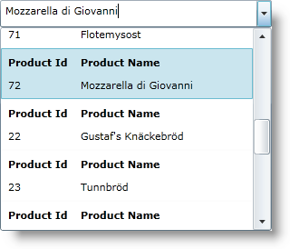

////
|metadata|
{
    "name": "xamcomboeditor-working-with-itemtemplate",
    "controlName": ["xamComboEditor"],
    "tags": ["Getting Started","How Do I"],
    "guid": "{7A318C3D-1394-4222-9AF4-1BEE064B090E}",
    "buildFlags": ["WPF"],
    "createdOn": "2016-05-25T18:21:54.735134Z"
}
|metadata|
////

= Configuring Item Template (xamComboEditor)

A DataTemplate enables you to customize how the items will be displayed in the control. You can create a DataTemplate that will be applied to each link:{ApiPlatform}controls.editors.xamcomboeditor.v{ProductVersion}~infragistics.controls.editors.comboeditoritem.html[ComboEditorItem]. This can be achieved with the xamComboEditor™ control’s ItemTemplate property.

This topic assumes that you have a xamComboEditor bound to data. For more information, see the link:xamcomboeditor-adding-xamcomboeditor-to-your-page.html[Adding xamComboEditor to Your Page] topic.

The following example shows the DataTemplate definition.

*In XAML:*

----
<ig:XamComboEditor
  ItemsSource="{Binding Source={StaticResource DataUtil}, Path=Products}"
  DisplayMemberPath="ProductName"
  EmptyText="Choose Product ..."
  Height="30" Width="300">
    <ig:XamComboEditor.ItemTemplate>
      <DataTemplate>
        <Grid ToolTipService.ToolTip="Product Info">
          <Grid.ColumnDefinitions>
            <ColumnDefinition Width="80" />
            <ColumnDefinition Width="180" />
          </Grid.ColumnDefinitions>
          <Grid.RowDefinitions>
            <RowDefinition Height="25" />
            <RowDefinition Height="25" />
          </Grid.RowDefinitions>
          <TextBlock Text="Product Id" Margin="5"
            Grid.Column="0" Grid.Row="0" FontWeight="Bold" />
          <TextBlock Text="Product Name" Margin="5"
            Grid.Column="1" Grid.Row="0" FontWeight="Bold" />
          <TextBlock Text="{Binding Path=ProductID}"
            Margin="5" Grid.Column="0" Grid.Row="1" />
          <TextBlock Text="{Binding Path=ProductName}"
            Margin="5" Grid.Column="1" Grid.Row="1" />
        </Grid>
      </DataTemplate>
    </ig:XamComboEditor.ItemTemplate>
</ig:XamComboEditor>
----

== *Related Topics*

link:xamcomboeditor-autocomplete.html[Configuring Autocomplete (xamComboEditor)]

link:xamcomboeditor-using-customvalueenteredaction.html[Configuring the Behavior on User Input (xamComboEditor)]

link:xamcomboeditor-dropdown-resizing.html[Configuring the Drop-Down Size (xamComboEditor)]

link:xamcomboeditor-custom-filtering.html[Configuring Item Filtering (xamComboEditor)]

link:xamcomboeditor-selection.html[Selection (xamComboEditor)]