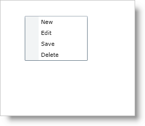

////

|metadata|
{
    "name": "xamcontextmenu-about-xamcontextmenu",
    "controlName": ["xamContextMenu"],
    "tags": ["Getting Started"],
    "guid": "{649F91A6-5CDA-454D-98D4-18FE8BCB304A}",  
    "buildFlags": [],
    "createdOn": "2016-05-25T18:21:54.7830975Z"
}
|metadata|
////

= About xamContextMenu

The xamContextMenu™ control allows you to create context menus for your Microsoft® {PlatformName}™ applications. Since the xamContextMenu control and the xamMenu control both share a common base class (xamMenuBase), you can leverage many of the same practices across both controls.

Just like the xamMenu control, the xamContextMenu control displays a list of items that represent application-specific commands or tasks. Typically, clicking a menu item opens a submenu or executes application logic.

Some of the important features for this control are listed below.

* *Check Boxes* - Add check boxes to allow end users to select multiple items.
* *Configurable* - You can configure xamContextMenu so that it opens when your end users right or left-click. You can even use the Infragistics Commanding Framework to open xamContextMenu.
* *Hierarchical Menu Items* - Bind to hierarchical data or add menu items to display hierarchical menu items.
* *Icons* - Add icons to help illustrate the purpose of each menu item.
* *Placement* - You can set the context menu's placement so that it appears in the specified location when your end users open the context menu.

== Related Topics

link:xamcontextmenu-getting-started-with-xamcontextmenu.html[Adding xamContextMenu to Your Page]

link:xamcontextmenu-using-xamcontextmenu.html[Using xamContextMenu]