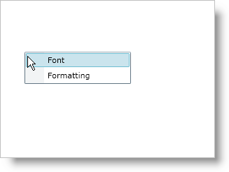

////

|metadata|
{
    "name": "xamcontextmenu-getting-started-with-xamcontextmenu",
    "controlName": ["xamContextMenu"],
    "tags": ["Getting Started"],
    "guid": "{722F008E-C781-42F6-A3B3-3EF1B7225973}",  
    "buildFlags": [],
    "createdOn": "2016-05-25T18:21:54.7890975Z"
}
|metadata|
////

= Adding xamContextMenu to Your Page

== Before You Begin

You can use the xamContextMenu™ control to create a context-sensitive menu for the different controls in your application. For example, you can create a context menu for a TextBox control that features undo or redo functionality and a context menu for a xamGrid control that features add or delete functionality.

== What You Will Accomplish

You will learn how to add a xamContextMenu control to a text box. When you run the finished project and right-click the text box, you should see a context menu in your browser that looks similar to the screen shot below.

== Follow these Steps

[start=1]
. Create a Microsoft® {PlatformName}™ application.
[start=2]
. In the Solution Explorer, add the following references to your project:

** {ApiPlatform}v{ProductVersion}.dll
** {ApiPlatform}Controls.Menus.XamMenu.v{ProductVersion}.dll

[start=3]
. Place using/Imports directives in your code-behind or add an XML namespace declaration for xamContextMenu.

*In XAML:*

[source]
----
xmlns:ig="http://schemas.infragistics.com/xaml"
----

*In Visual Basic:*

[source]
----
Imports Infragistics.Controls.Menus
----

*In C#:*

[source]
----
using Infragistics.Controls.Menus;
----

[start=4]
. Add a TextBox control to the default Grid layout panel named LayoutRoot. If you are doing this in procedural code, you can handle the user control's Loaded event and place the code in the event handler.

*In XAML:*

[source]
----
<TextBox Name="textBox1">
    <!--TODO: Declare tags for the ContextMenuService class' attached Manager property-->
</TextBox>
----

*In Visual Basic:*

----
Dim textbox1 As TextBox
Private Sub UserControl_Loaded(ByVal sender As Object, ByVal e As RoutedEventArgs)
    textBox1 = New TextBox()
    Me.LayoutRoot.Children.Add(textBox1)
    'TODO: Instantiate a ContextMenuManager object and attach it to the TextBox control
    'TODO: Instantiate a xamContextMenu control
    'TODO: Add MenuItem objects to the xamContextMenu control
End Sub
----

*In C#:*

[source]
----
private TextBox textBox1;
private void UserControl_Loaded(object sender, RoutedEventArgs e)
{
    textBox1 = new TextBox();
    this.LayoutRoot.Children.Add(textBox1);
    //TODO: Instantiate a ContextMenuManager object and attach it to the TextBox control
    //TODO: Instantiate a xamContextMenu control
    //TODO: Add MenuItem objects to the xamContextMenu control
}
----

[start=5]
. Declare tags for the link:{ApiPlatform}controls.menus.xammenu{ApiVersion}~infragistics.controls.menus.contextmenuservice.html[ContextMenuService] class' Manager property if you are doing this in XAML. However, if you are doing this in code, you have to instantiate a link:{ApiPlatform}controls.menus.xammenu{ApiVersion}~infragistics.controls.menus.contextmenumanager.html[ContextMenuManager] object and attach it to a control using the ContextMenuService class' static link:{ApiPlatform}controls.menus.xammenu{ApiVersion}~infragistics.controls.menus.contextmenuservice~setmanager.html[SetManager] method.

*In XAML:*

[source]
----
<ig:ContextMenuService.Manager>
    <ig:ContextMenuManager>
        <ig:ContextMenuManager.ContextMenu>
            <!--TODO: Add a xamContextMenu control here-->
        </ig:ContextMenuManager.ContextMenu>
    </ig:ContextMenuManager>
</ig:ContextMenuService.Manager>
----

*In Visual Basic:*

[source]
----
Dim contextMenuManager1 As New ContextMenuManager()
ContextMenuService.SetManager(textBox1, contextMenuManager1)
'TODO: Set the ContextMenuManager object's ContextMenu property
----

*In C#:*

[source]
----
ContextMenuManager contextMenuManager1 = new ContextMenuManager();
ContextMenuService.SetManager(textBox1, contextMenuManager1);
//TODO: Set the ContextMenuManager object's ContextMenu property
----

[start=6]
. Create a xamContextMenu control. If you are doing this in code, make sure you set the ContextMenuManager object's link:{ApiPlatform}controls.menus.xammenu{ApiVersion}~infragistics.controls.menus.contextmenumanager~contextmenu.html[ContextMenu] property.

*In XAML:*

[source]
----
<ig:XamContextMenu>
    <!--TODO: Add XamMenuItem objects here-->
</ig:XamContextMenu>
----

*In Visual Basic:*

[source]
----
Dim xamContextMenu1 As New XamContextMenu()
contextMenuManager1.ContextMenu = xamContextMenu1
----

*In C#:*

[source]
----
XamContextMenu xamContextMenu1 = new XamContextMenu();
contextMenuManager1.ContextMenu = xamContextMenu1;
----

[start=7]
. Add two link:{ApiPlatform}controls.menus.xammenu{ApiVersion}~infragistics.controls.menus.xammenuitem.html[XamMenuItem] objects to the xamContextMenu control. In XAML, you do not have to declare tags for xamContextMenu's Items collection.

** Set the first XamMenuItem object's link:{ApiPlatform}controls.menus.xammenu{ApiVersion}~infragistics.controls.menus.primitives.xamheadereditemscontrol~header.html[Header] property to "Font".
** Set the second XamMenuItem object's Header property to "Formatting".

*In XAML:*

[source]
----
<ig:XamMenuItem Header="Font" />
<ig:XamMenuItem Header="Formatting" />
----

*In Visual Basic:*

[source]
----
Dim menuItemFont As New XamMenuItem With {.Header = "Font"}
Dim menuItemFormatting As New XamMenuItem With {.Header = "Formatting"}
xamContextMenu1.Items.Add(menuItemFont)
xamContextMenu1.Items.Add(menuItemFormatting)
----

*In C#:*

[source]
----
XamMenuItem menuItemFont = new XamMenuItem
{
    Header = "Font"
};
XamMenuItem menuItemFormatting = new XamMenuItem
{
    Header = "Formatting"
};
xamContextMenu1.Items.Add(menuItemFont);
xamContextMenu1.Items.Add(menuItemFormatting);
----

[start=8]
. Run the application. You can handle the XamMenuItem objects' link:{ApiPlatform}controls.menus.xammenu{ApiVersion}~infragistics.controls.menus.xammenuitem~click_ev.html[Click] events to add functionality.

== Related Topics

link:xamcontextmenu-about-xamcontextmenu.html[About xamContextMenu]

link:xamcontextmenu-using-xamcontextmenu.html[Using xamContextMenu]