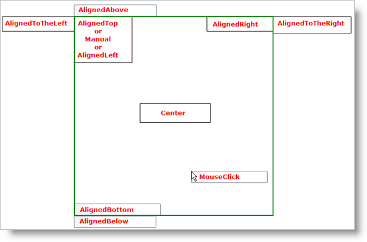

////

|metadata|
{
    "name": "xamcontextmenu-set-xamcontextmenus-location",
    "controlName": ["xamContextMenu"],
    "tags": ["Getting Started","How Do I","Layouts"],
    "guid": "{3EA876B1-A547-402E-8730-54D674A67D01}",  
    "buildFlags": [],
    "createdOn": "2016-05-25T18:21:54.8120989Z"
}
|metadata|
////

= Set xamContextMenu's Location

The xamContextMenu™ control exposes several properties that emulate the placement of a ContextMenu control in Microsoft® {PlatformName}™. The xamContextMenu control's placement is determined by a combination of the following placement-related properties:

* link:{ApiPlatform}controls.menus.xammenu{ApiVersion}~infragistics.controls.menus.xamcontextmenu~placement.html[Placement] - Determines the alignment of xamContextMenu relative to its placement target. However, if you do not explicitly set this property, it will default to MouseClick and ignore the PlacementTarget and PlacementRectangle properties. The screen shot below illustrates the locations for the different PlacementMode enum values. The green square in the screen shot represents the placement target.

ifdef::sl[]
.Note:
[NOTE]
====
If the Silverlight Plug-in Object will clip the xamContextMenu control when your end users open it, the xamContextMenu control will automatically positions itself so all its menu items are visible.
====
endif::sl[]

* link:{ApiPlatform}controls.menus.xammenu{ApiVersion}~infragistics.controls.menus.xamcontextmenu~placementtarget.html[PlacementTarget] - Determines the UIElement that xamContextMenu uses as its starting location before it applies the other placement-related properties. If you do not explicitly set this property, the control you attach xamContextMenu to will be the default placement target.
* link:{ApiPlatform}controls.menus.xammenu{ApiVersion}~infragistics.controls.menus.xamcontextmenu~placementrectangle.html[PlacementRectangle] - You can set this property to a Rect structure to define a rectangular area relative to the placement target that the context menu uses for alignment. In XAML, you can set this property to a comma-delimited string of values where the first value is the left x-coordinate, the second value is the top y-coordinate, the third value is the width, and the fourth value is the height.
* link:{ApiPlatform}controls.menus.xammenu{ApiVersion}~infragistics.controls.menus.xamcontextmenu~horizontaloffset.html[HorizontalOffset] - You can set this property to a positive numeric value to determine the horizontal distance between the context menu and its placement. The horizontal offset is applied after the Placement, PlacementTarget, and PlacementRectangle properties have been applied.
* link:{ApiPlatform}controls.menus.xammenu{ApiVersion}~infragistics.controls.menus.xamcontextmenu~verticaloffset.html[VerticalOffset] - You can set this property to a positive numeric value to determine the vertical distance between the context menu and its placement. The vertical offset is applied after the Placement, PlacementTarget, and PlacementRectangle properties have been applied.

The following example code demonstrates how to set the placement of xamContextMenu. The code to attach xamContextMenu has been omitted to keep the example concise. For a code example on attaching xamContextMenu to a control, read link:xamcontextmenu-getting-started-with-xamcontextmenu.html[Adding xamContextMenu to Your Page].

*In XAML:*

----
<ig:XamContextMenu Placement="AlignedBottom">
    <!--TODO: Add XamMenuItem objects here-->
</ig:XamContextMenu>
----

*In Visual Basic:*

----
Dim xamContextMenu1 As New XamContextMenu With {.Placement = PlacementMode.AlignedBottom}
'TODO: Add XamMenuItem objects to the context menu
----

*In C#:*

----
XamContextMenu xamContextMenu1 = new XamContextMenu
{
    Placement = PlacementMode.AlignedBottom
};
//TODO: Add XamMenuItem objects to the context menu
----

== Related Topics

link:xamcontextmenu-opening-and-showing-xamcontextmenu.html[Opening and Showing xamContextMenu]

link:xamcontextmenu-set-xamcontextmenus-location.html[Set xamContextMenu's Location]

link:xammenu-binding-to-data.html[Binding to Data]

link:xammenu-adding-and-removing-items.html[Adding and Removing Items]

link:xammenu-adding-separators-between-xammenuitems.html[Adding Separators between XamMenuItems]

link:xammenu-adding-icons-to-xammenuitems.html[Adding Icons to XamMenuItems]

link:xammenu-adding-check-boxes-to-xammenuitems.html[Adding Check Boxes to XamMenuItems]