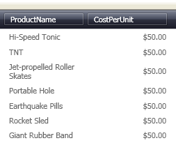

////
|metadata|
{
    "name": "xamcurrencyeditor-using-xamcurrencyeditor-as-a-field-in-xamdatagrid",
    "controlName": ["xamCurrencyEditor"],
    "tags": ["How Do I"],
    "guid": "{C9AE328B-8A80-4FFC-9906-52CC00AFB733}",
    "buildFlags": [],
    "createdOn": "2012-09-05T19:05:30.1339781Z"
}
|metadata|
////

= Using xamCurrencyEditor as a Field in xamDataGrid

An important feature of the xamCurrencyEditor™ control is its ability to be embedded in a xamDataGrid™ link:{ApiPlatform}datapresenter.v{ProductVersion}~infragistics.windows.datapresenter.field.html[Field]. This feature allows your end user to take advantage of the editor's full potential while modifying a cell's value. The xamCurrencyEditor is also more visually appealing because it formats values with a mask and can add currency symbols.

Follow these steps to display xamCurrencyEditor in a Field of xamDataGrid.

[start=1]
. Create a Microsoft® Windows® Presentation Foundation Window or Page project.

[start=2]
. Place the following namespace declarations inside the opening Page or Window tag. These declarations allow you to reference xamDataGrid, xamCheckEditor, and to define types (i.e. Int32, Boolean).
+
*In XAML:*
+
[source,xaml]
----
xmlns:igDP="http://infragistics.com/DataPresenter"
xmlns:igEditors="http://infragistics.com/Editors"
xmlns:sys="clr-namespace:System;assembly=mscorlib"
----

[start=3]
. Create a resource section defining an XmlDataProvider. The XmlDataProvider references the link:resources-orders.html[Orders] XML file. Place the following XAML inside the Grid Panel.
+
*In XAML:*
+
[source,xaml]
----
<Grid.Resources>
    <XmlDataProvider Source="../Data/Orders.xml" 
        x:Key="OrderData" XPath="/Orders" />
</Grid.Resources>
----

[start=4]
. Create an instance of XamDataGrid, name it, and set the DataSource property to the XmlDataProvider created in the previous step.
+
*In XAML:*
+
[source,xaml]
----
<igDP:XamDataGrid x:Name="XamDataGrid1" 
  DataSource="{Binding Source={StaticResource OrderData}, XPath=Order}">
        ...      
</igDP:XamDataGrid>
----

[start=5]
. Set the link:{ApiPlatform}datapresenter.v{ProductVersion}~infragistics.windows.datapresenter.fieldlayoutsettings~autogeneratefields.html[AutoGenerateFields] property off the link:{ApiPlatform}datapresenter.v{ProductVersion}~infragistics.windows.datapresenter.fieldlayoutsettings.html[FieldLayoutSettings] object to False. Place the following XAML between the tags created in the previous step.
+
*In XAML:*
+
[source,xaml]
----
...
<igDP:XamDataGrid.FieldLayoutSettings>
  <igDP:FieldLayoutSettings AutoGenerateFields="False" />
</igDP:XamDataGrid.FieldLayoutSettings>
...
----

[start=6]
. When defining a custom editor for a Field, you may need to set the link:{ApiPlatform}datapresenter.v{ProductVersion}~infragistics.windows.datapresenter.fieldsettings~editorstyle.html[EditorStyle] property to specify a style for that editor. Doing this allows you to also set properties on the editor such as a mask. The XAML below sets a Style that targets an instance of XamCurrencyEditor and sets it to the EditorStyle. Use a setter to set the link:{ApiPlatform}editors.v{ProductVersion}~infragistics.windows.editors.xammaskededitor~mask.html[Mask] property off the editor. Place this code below the code in the previous step.
+
.Note
[NOTE]
====
When specifying a Mask you need to escape the {...} with {}.
====
+
*In XAML:*
+
[source,xaml]
----
...
<igDP:XamDataGrid.FieldLayouts>
    <igDP:FieldLayout>
        <igDP:FieldLayout.Fields> 
            <igDP:Field Name="ProductName" />
            <igDP:Field Name="CostPerUnit" >
                <igDP:Field.Settings>
                    <igDP:FieldSettings 
                        EditAsType="{x:Type sys:Double}">
                        <igDP:FieldSettings.EditorStyle>
                            
                        </igDP:FieldSettings.EditorStyle>
                    </igDP:FieldSettings>                
                </igDP:Field.Settings>
            </igDP:Field>
        </igDP:FieldLayout.Fields>
    </igDP:FieldLayout>
</igDP:XamDataGrid.FieldLayouts>
...
----

[start=7]
. Build and run the project. You should see the values in the CostPerUnit column formatted with a currency mask similar to the image below.
+
