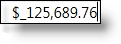

////

|metadata|
{
    "name": "xamcurrencyinput-about",
    "controlName": ["xamInputs"],
    "tags": ["Editing"],
    "guid": "ac866318-508d-41cb-867a-6805f9b4cc4e",  
    "buildFlags": [],
    "createdOn": "2016-05-25T18:21:56.9572192Z"
}
|metadata|
////

= About xamCurrencyInput

== Topic Overview

The xamCurrencyInput control is a simple text box control that uses a mask to display numeric values as a type of currency. Using this mask, you can prepend a value with a given culture's currency symbol. You can also ensure that the fraction portion of the value remains intact up to the hundredths place, even if there is no remainder. You can use the xamCurrencyInput control either link:xamcurrencyinput-using.html[as a stand-alone text box]  pick:[sl,wpf,win-rt="or"]   pick:[sl,wpf,win-rt=" link:xaminputs-using-xaminput-controls-in-xamgrid-cells-for-data-editing.html[in a cell of the xamGrid™ control]"] .

ifdef::sl,wpf,win-phone[]

endif::sl,wpf,win-phone[]

ifdef::win-rt[]

endif::win-rt[]

== Related Topics

Following are some other topics you may find useful.

* link:xamcurrencyinput-using.html[Using xamCurrencyInput]
* link:xaminputs-masks.html[Masks]
* link:xaminputs-overview-of-the-valueinput-class.html[Overview of the ValueInput Class]

ifdef::sl,wpf,win-rt[]
* link:xaminputs-using-xaminput-controls-in-xamgrid-cells-for-data-editing.html[Using xamInput Controls in xamGrid Cells for Data Editing]

endif::sl,wpf,win-rt[]